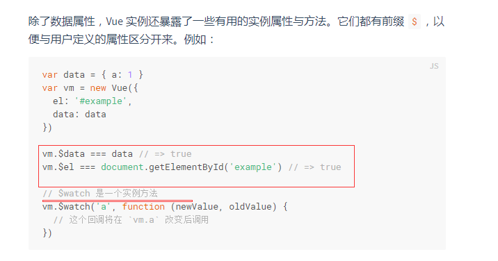

# vue文档阅读

1，声明式渲染

> 这个例子演示了我们不仅可以把数据绑定到 DOM 文本或特性，还可以绑定到 DOM **结构**。此外，Vue 也提供一个强大的过渡效果系统，可以在 Vue 插入/更新/移除元素时自动应用[过渡效果](https://cn.vuejs.org/v2/guide/transitions.html)。


2，与自定义元素的关系

首先html中也可以自定义元素，并且可以为它定义样式和事件

但是自定义元素并没有完全被浏览器支持，而vue组件在浏览器中表现一致。

Vue 组件提供了纯自定义元素所不具备的一些重要功能，最突出的是跨组件数据流、自定义事件通信以及构建工具集成。


## vue实例

### 数据和方法

只有当实例被创建时 `data` 中存在的属性才是**响应式**的。也就是说如果你添加一个新的属性，比如：

```
vm.b = 'hi'
```

那么对 `b` 的改动将不会触发任何视图的更新。如果你知道你会在晚些时候需要一个属性，但是一开始它为空或不存在，那么你仅需要设置一些初始值。比如：

```
data: {
  newTodoText: '',
}
```

这里唯一的例外是使用 `Object.freeze()`，这会阻止修改现有的属性，也意味着响应系统无法再*追踪*变化。

> **Object.freeze()** 方法可以**冻结**一个对象。一个被冻结的对象再也不能被修改；冻结了一个对象则不能向这个对象添加新的属性，不能删除已有属性，不能修改该对象已有属性的可枚举性、可配置性、可写性，以及不能修改已有属性的值。此外，冻结一个对象后该对象的原型也不能被修改。`freeze()` 返回和传入的参数相同的对象。

注意 `const object2 = Object.freeze(object1);`是使object1这个对象不可修改，并且返回object1，所以object2指向object1



vue实例中有些静态属性，也有实例方法

### 实例生命周期钩子

注意：生命周期钩子函数中的this指向调用他的vm实例

在生命周期钩子函数中使用箭头函数和回调函数会改变这一点


## 模板语法

### 文本

通过使用 [v-once 指令](https://cn.vuejs.org/v2/api/#v-once)，你也能执行一次性地插值，当数据改变时，插值处的内容不会更新。但请留心这会影响到该节点上的其它数据绑定：

```
<span v-once>这个将不会改变: {{ msg }}</span>
```

### 原始html


### 特性

加了v-bind的布尔属性

```
<button v-bind:disabled="isButtonDisabled">Button</button>
```

如果 `isButtonDisabled` 的值是 `null`、`undefined` 或 `false`，则 `disabled` 特性甚至不会被包含在渲染出来的 `<button>` 元素中。

### 在花括号中使用js表达式

在花括号中使用js表达式时，可以使用表达式

重要：这些表达式会在所属**vue实例的数据域下作为js被解析**  但花括号中只能有单个表达式

这就是在花括号中引用vm的data变量不用this的原因

> 模板表达式都被放在沙盒中，只能访问全局变量的一个白名单，如 `Math` 和 `Date` 。你不应该在模板表达式中试图访问用户定义的全局变量。
>
> ????????????????????????????????????????

### 指令

#### 动态参数

也就是说v-bind指令不单单只绑定已经写好的属性，而是可以绑定一个动态变量，这个变量变了之后指令绑定的变量也就改变了


看到修饰符


