# 现代js教程

## 基础知识

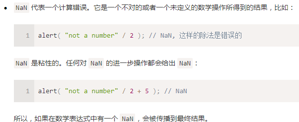

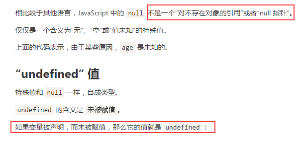

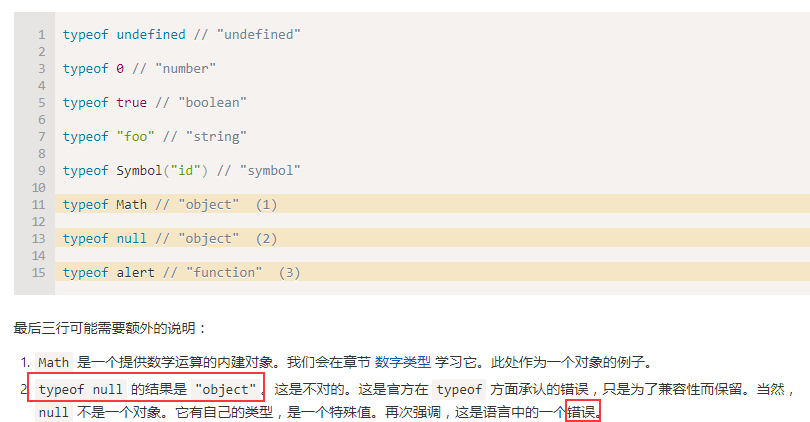

----

类型转换

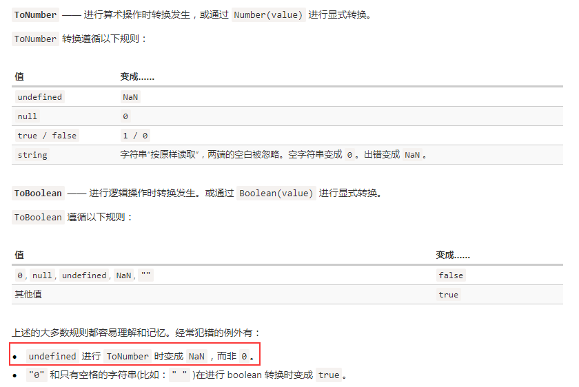

转数字: 去除空格后是纯数字则为该数字,如果为空字符串则转换为0


```javascript
" -9\n" - 5 = -14
7 / 0 = Infinity  Infinity 代表数学概念中的无穷大 ∞。是一个比任何数字都大的特殊值。
```

----

值比较

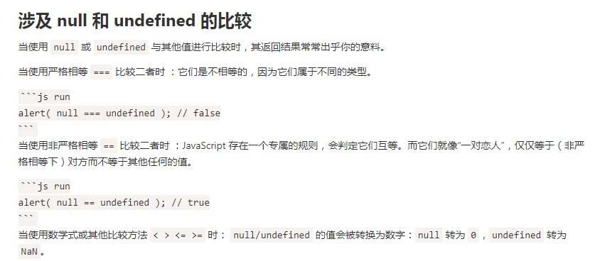

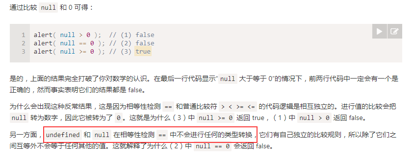

----

## 对象基础

判断属性是否存在

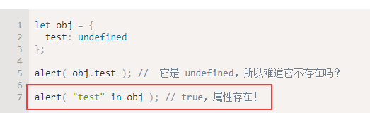

计算属性

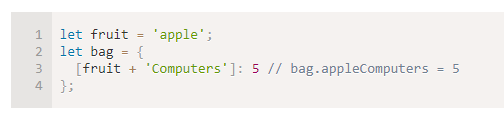

遍历对象的顺序

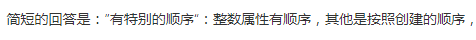

对象的复制

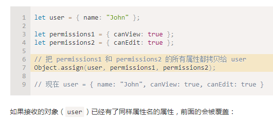

深拷贝,就是复制一个属性,如果是对象,将这个对象的子属性一起再拷贝一份

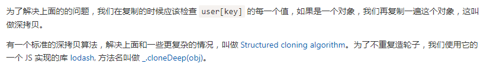

判断是否为数组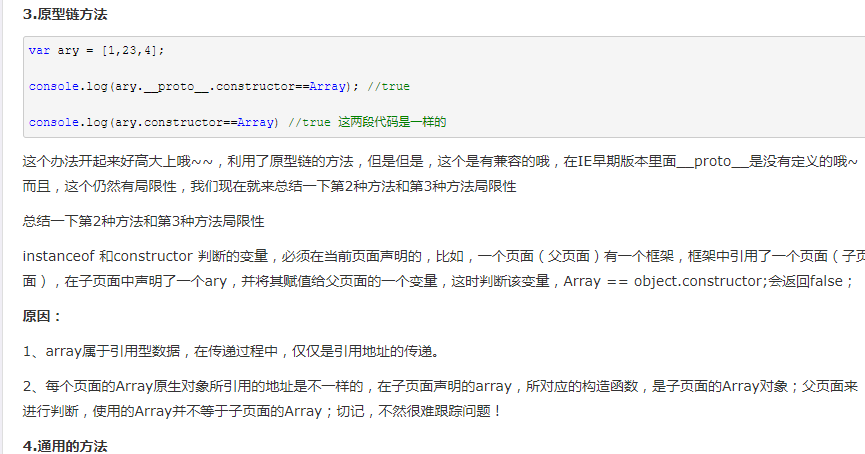

>  return Object.prototype.toString.call(o)== '[object Array]';

----

#### symbol

对象的键，只能为两种类型，string和symbol。

symbol会让同样的字符串变成唯一的   （下拉的时候多选按钮的时候就能用上）

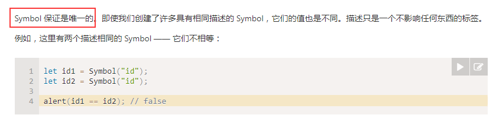

symbol这个类型不能隐式转换为string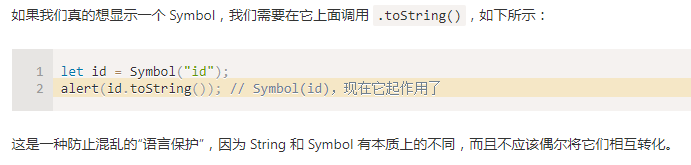

对象原始值的转换（了解）

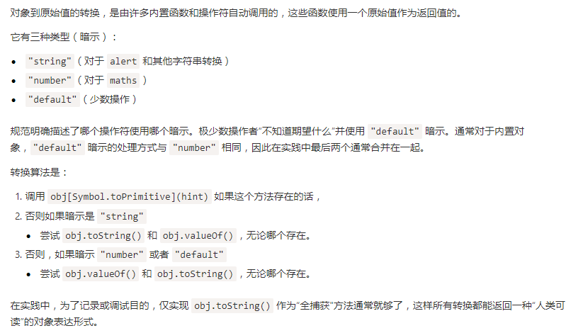

-----

#### 垃圾回收（重点）

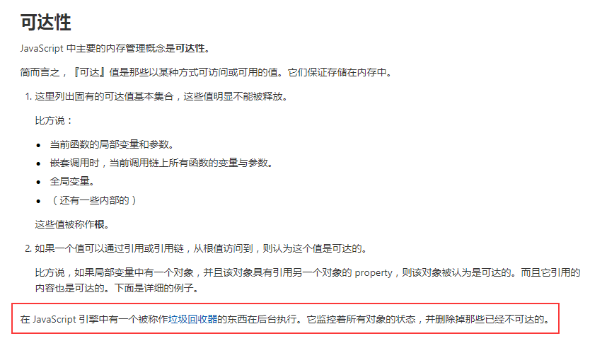

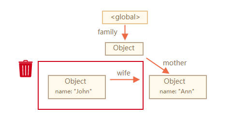

从跟变量可到达才不会被回收，所以上图对象john被回收

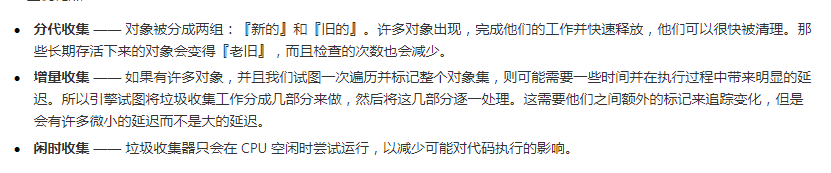

没讲清楚

---

丢失this

说明js中用点的方式，会让函数的this传递，如果点的属性为函数的时候，如果将这个函数地址赋值，会把整体丢失，只把值进行了传递。

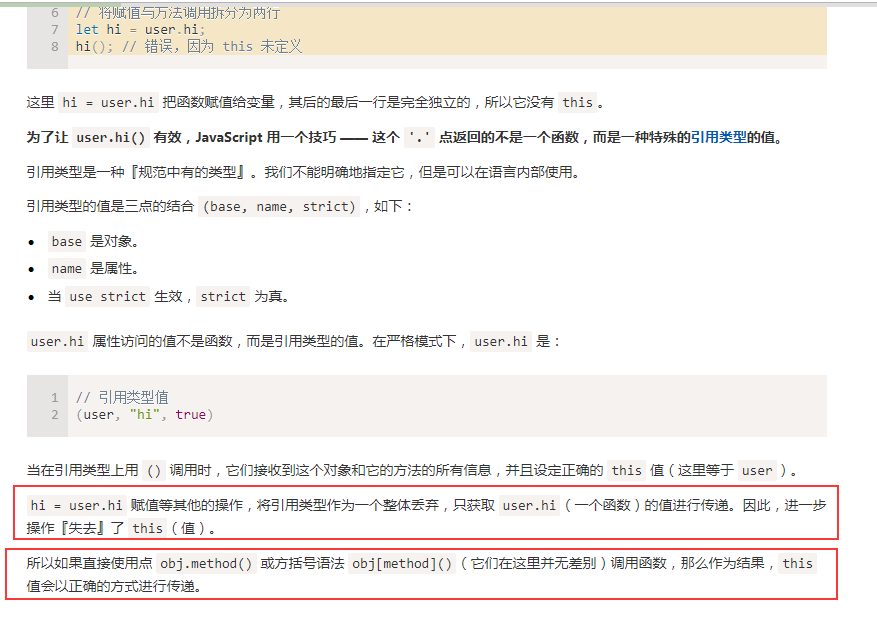

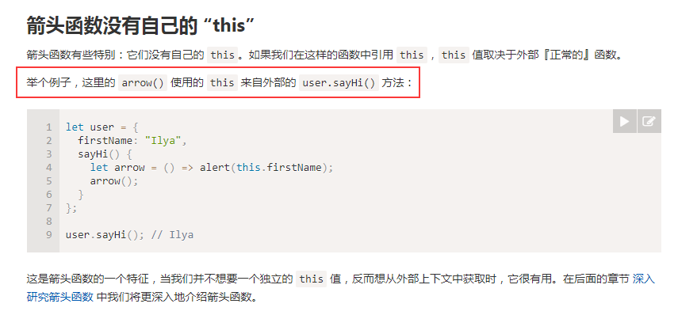

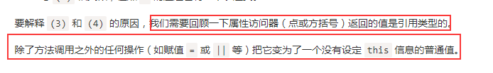

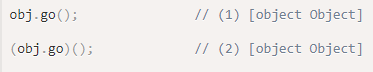

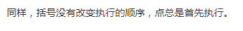

注意到: 类似将函数地址赋值的操作，都会导致这个变量变成一个没有特定this的普通值

----

构造函数和new

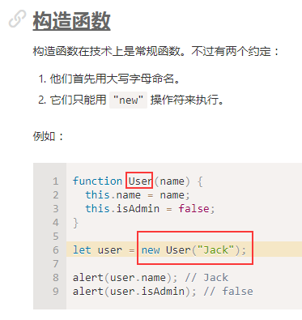

首字母大写是约定

了解，不看了很多废话

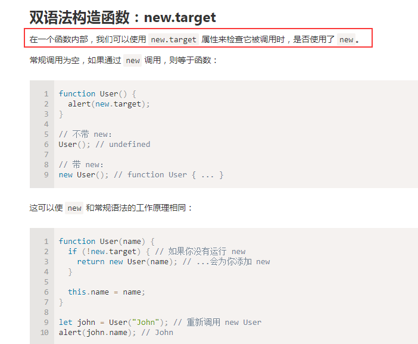

