# Node.js基础知识

node.js是一个能够在服务器端运行javascript的开放源代码，跨平台javascript运行环境。

node.js创建起初（Ryan Dahl）是为了实现高性能的web服务器。后来逐渐发展成为了一个生态圈。有很多工具

node.js是单线程的，处理请求比较快，但是还是做不来高并发的，阿里服务器是用java写的，但是中间搭了一层node服务器用来渲染页面，因为js渲染页面特别快

node版本奇数版是开发版，偶数版是稳定版(2017node8发布)

**用文本编辑器写JavaScript程序，然后保存为后缀为`.js`的文件，就可以用node直接运行这个程序了**

## commonjs规范，模块化

没有模块化的项目就没有复用

### 引入其他模块

> 在node中，通过require（）函数来引入外部的模块
>
> ​	require（）可以传递一个文件的路径作为参数，node将会自动根据该路径来引入外部模块，这里的路径，如果使用相对路径，必须以.或者..开头。当前目录不能省略写成文件名，需要加上./
>
> 使用require（）引入模块以后，该函数会返回一个对象，这个对象代表的是引入的模块（类似jquery中的$）

```javascript
var md = require("./hello.js");
console.log(md.x);//打印hello模块里面的x变量(undefine)
```


> 模块化
>
>  	- 在node中，**一个js文件就是一个模块**（一个js就是封装在一个函数中，存在arguments.callee（当前执行的函数对象））
>
> ​	- 在node中，每一个js文件中的js代码都是独立运行在一个函数中，而不是全局作用域，所以一个模块中的变量和函数在其他模块中无法访问。
>
> 我们可以通过exports来向外部暴露变量和方法
>
> ​	只需要将需要暴露给外部的变量或方法设置为exports的属性即可

```js
exports.x = "我是模块hello中的x";
exports.fn = function(){};
var a=10;//在其他模块中为undefine
```

> 4模块分为两大类
>
> ​	核心模块
>
> ​		-由node引擎提供的模块
>
> ​		**-核心模块的标识就是，模块的名字**
>
> ​	文件模块
>
> ​		- 由用户自己创建的模块
>
> ​		-文件模块的标识符就是文件的路径

```js
var math = require("./math");
var fs = require("fs");
```

> 在node中有一个全局对象global，它的作用和网页中window类似
>
> ​	在全局中创建的变量都会作为global的属性保存
>
> ​	在全局中创建的函数都会作为global的方法保存
>
> 当node在执行模块的代码时，它会首先在代码的最顶部，添加如下代码
>
> function(exports,require,module,`__filename`,`__dirname`){
> }
>
> **实际上模块中的代码都是包装在一个函数中执行，并且在函数执行时，同时传递了5个实参**
>
> **module代表的是当前模块本身  exports就是module的属性 既可以使用exports导出，也可以使用module.exports导出**
>
> **后面两个分别表示 当前模块的完整路径 和 当前模块所在文件加的完整路径**

#### exports和module.exports

var exports = module.exports

**也就是exports中存的是module.exports的地址**，当直接给exports赋新值，那么并不会修改module中的exports。而是把变量exports换成别的值。

通过exports只能使用.的方法来向外暴露内部变量，而module.exports既可以通过.的形式，也可以直接赋值。

## 包 package（增强的模块）

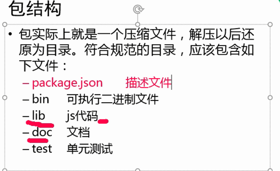

唯一必须的就是package.json 描述文件

里面就是一个json

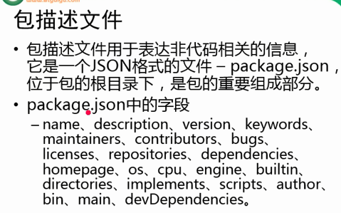

注意json文件不能写注释

## npm

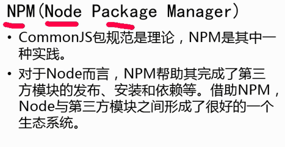

- npm的命令
    - npm -v 查看npm的版本

    - npm version 查看所有模块的版本

    - npm search 包名 搜索包

    - npm install / i 包名 安装包

    - npm remove / r 包名 删除包

    - npm install 包名 --save 安装包并添加到依赖中 *****

      **安装的同时会在package.json中添加依赖属性。传到git上不会传模块，根据package.json中的依赖来下来。**

    - npm install 下载当前项目所依赖的包

    - npm install 包名 -g 全局安装包（全局安装的包一般都是一些工具）

在下载包之前使用npm init会带领我们创建package.json（name属性值不能为大写也就是模块名不能大写）

## npm包的搜索

通过npm下载的包都放到node_modules文件夹中

​	我们通过npm下载的包，直接通过报名引入即可

node在使用模块名字来引入模块时，它会首先在当前目录的node_modules中寻找是否含有该模块，

​	**如果有则直接使用，如果没有则去上一级目录的mode_modules中寻找**

​	如果有则直接使用，如果没有则再去上一级目录寻找，直到找到为止

​	直到找到磁盘的根目录，如果依然没有，则报错

## Buffer缓冲区（放二进制的数组）

- Buffer的结构和数组很像，操作的方法也和数组类似

- 数组中不能存储二进制的文件（图片和视频），而buffer就是专门用来存储二进制数据

- 使用buffer不需要引入模块，直接使用
- 在buffer中存储的都是二进制数据，但是在显示时用16进制显示

buffer中的一个元素暂用内存的一个字节八位0-255

buffer中的length属性表示的是占用内存的大小

```js
//创建一个指定大小的buffer
var buf2 = new Buffer(10);//具体方法参照官网
//注意：buffer构造函数都是不推荐使用
//创建一个10个字节的buffer
var buf2 = Buffer.alloc(10);
buf2[0] = 88;
//只要数字在控制台或页面中输出一定是10进制
```

- buffer的大小一旦确定，则不能修改，Buffer实际上是对底层内存的直接操作

  创建一个指定大小的buffer，但是buffer中可能含有敏感数据（创建不会清空这个内存），这个性能更好

```js
Buffer.allocUnsafe(size)
```

​	将一个字符串转换为buffer

```js
Buffer.from(str)
buff.toString()
```

## fs文件系统

文件系统（file system）

​	文件系统简单来说就是通过node来操作系统的而文件

​	使用文件系统，需要先引入fs模块，fs是核心模块，直接引入不需要下载

### 同步文件写入


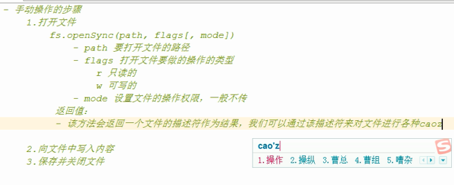

position，开始写的位置，encoding写入的编码，一般不传

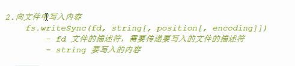

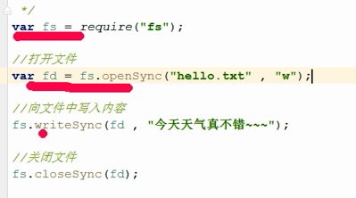

### 异步文件写入

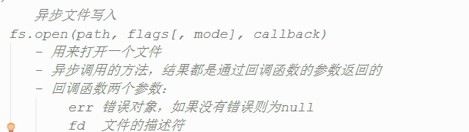

异步文件写入

fs.open中的callback是完成动作之后调用，这个回调函数有两个参数

1，err错误对象，没有错误则为null

2，fd文件的描述符

写出

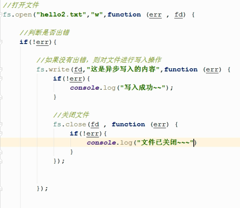

异步写起来麻烦但是性能好

### 简单文件写入

和之前的同步异步原理一样，只不过封装了

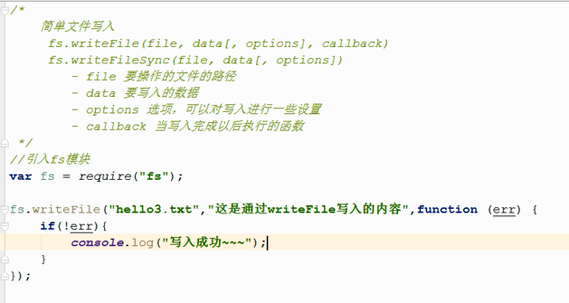

### 流式文件写入

前面的写入方法，是将文件中全部的东西拿出放在内存中，再移到另一个文件

只要流存在就可以一直写下去


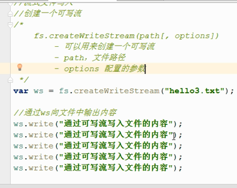

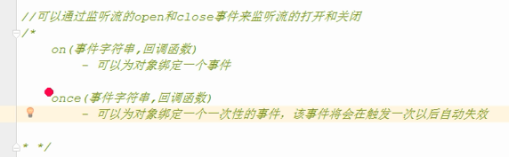

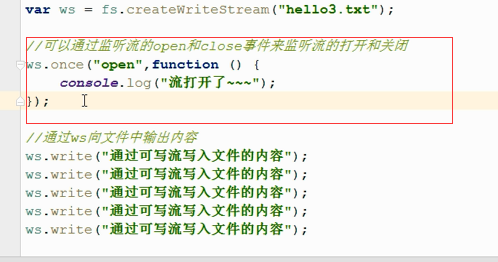

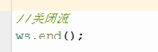

### 简单文件读取

封装了异步或同步文件读取

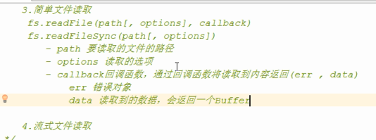

返回的是一个buffer，因为读取的未必是文字可能是图片或者音频，通用性高。

### 流式文件读取

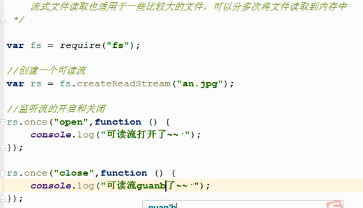

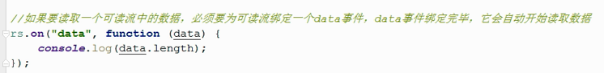

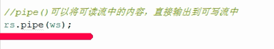

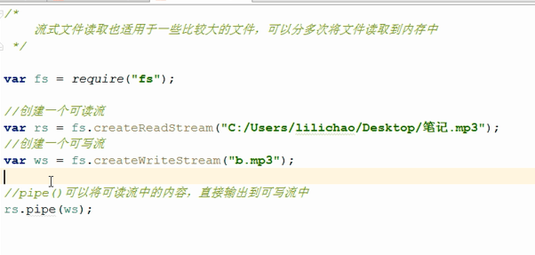

### fs模块的其他方法

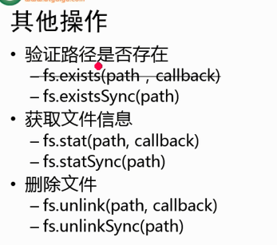

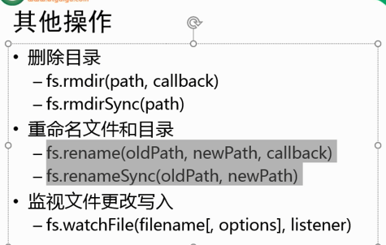