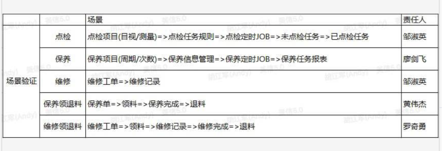

 

工作上，对分配的任务认真负责，按质按量按时，按时和并且自测完成工作。

重点就是，在工作时间内将任务全部完成，尽快完成，做完了就看自己的学习视频

我想要的是：每天6点前把工作做完，坚持学习，去寻找自己喜欢的管理模式和业务

**每隔25分钟休息30秒**

能做的事情就赶紧做了

10.18.2.199
/apps/cloud/front
apps/sc$Da20demo

下周二或者下周三弄好这个。

15个文件可以试着翻译

前端：设备添加设备设备代码中

-----

[^\x00-\xff]{1,50}

-----

 ?userName=huozj&token=WnLptF3eYCULnWUnT-G848lvKR3Ik7fg&appId=null&projectId=8d741ba46bb948359e60f17aee244fd6&tenantId=6a0751c77dcb45cf89fefc85dcd76a24&lang=en

apps/sc$Da20demo

10.18.2.199
/apps/cloud/front

Request URL: 

----

https://kdocs.cn/l/soW5khJH0?f=501

地址：10.17.162.100
用户：root
密码：dC@2019Innov

----

1，设备保养拉通，保养信息引用不成功

2，保养信息设备管理接口

http://10.18.2.199:4000/api/dc/product_model/product?tenantId=877ecc5e42d74f6a8a3cfb9d6826e1f8&pageSize=1000

浏览器卡顿

3，新增后，没有新添加一条记录

-----

1，维修记录--开始维修-点击确认接口500

http://10.18.2.199:4000/api/dc/product_model/repair_bill_detail

-----

