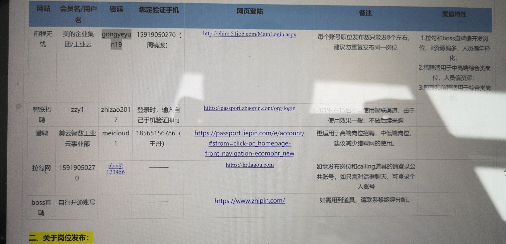
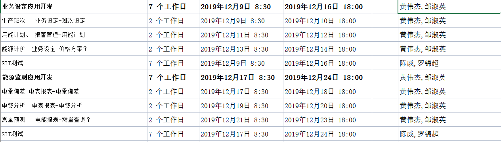
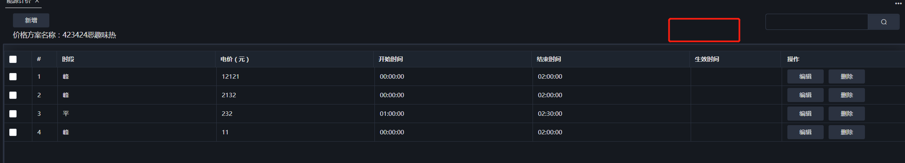

# scada

```
云能效

dalaolu 1234
```

sit环境上传文件

```
{
  "name": "My Server",
  "host": "10.17.164.213",
  "protocol": "sftp",
  "port": 22,
  "username": "root",
  "password": "Sit@Sc2da#",
  "context": "dashboard/dist",
  "remotePath": "/home/apps/app/data/nginx/wwd/panel",
  "uploadOnSave": false
}
```

```
 https://10.17.164.213:9001
  http://120.237.142.25:9198/
  http://120.237.142.25:9198/headBuild/
  http://scadatst.midea.com:12500/scada.html#/execution_configuration
```

```
scada上传主机
http://10.17.162.100:3000/login?redirect=%2F
服务10.17.162.100 目录/apps/cloud/front
地址：http://10.17.162.100
账/密:root/dC@2019Innov
{
  "name": "uat",
  "host": "10.18.22.132",
  "protocol": "sftp",
  "port": 22,
  "username": "root",
  "password": "Eps#201t906As",
  "context": "../build/uat/",
  "remotePath": "/apps/devicecloud/www/",
  "uploadOnSave": false
}
```




----

POST https://test.someapi.com/v1/account/user/login/ Content-Type: application/json  { "email": "someemail@gmail.com", "password": 1 }

---

Azxs1234.

powershell ./build.ps1 sit energy-manage energy-sh energy-sy iot device-manage

---

能源管理

sit：	   http://femssit.midea.com
uat: 	   http://femsuat.midea.com
pro: 	   http://fems.midea.com

---

1，页面不应滑动，应该用百分比布局fle布局

2，侧边栏触发时机不明确



业务设定 business-setting

/shifts_setting

/plan

/energy-price

能源监测 energy-monitor

/electricity_differ

/report-charge

/report-demand

Ibt@1234!

---

今天把静态页面做出来，

明天上午： 两个页面交互添加（交互，添加仪表组弹窗），联调，

今天晚上做下转正ppt，

明天做好页面交互之后去推进接口。

先不做页面了，下周做，先搞定所有能搞的接口和页面，搞一顿之后再来。保证周三出三个任务

****

```
价格方案
/meter_group_type?energyType=2&groupType=3  左边的仪表分组（没有，找方杨）

/price_plan?start_page=1&page_size=10&condition=&meterGroupId=558 （待调）

/meter_group_meters?start_page=1&page_size=10&condition=&meterGroupId=557分组的 （交互逻辑改了，周一看剑飞怎么调的）
用能计划
/ems/ems/meter_group_type  左边仪表分组，调通了
http://10.16.101.182:20173/ems-report/ems/energy_plan  （可调，现在）
http://10.16.101.182:20173/ems-report/ems/alarm-method?energyType=1、已调

电费分析（页面未做）
/ems/meter
ems/ems/meter_group_type?groupType=1
/ems-report/ems/shifts?startTime=2019-12-01&endTime=2020-01-31（可调，现在）
ems-meter/ems/page_params_plan（代办）

电量偏差
r/ems/meter（现在可搞）搞了
/ems/MeterReading （杰峰）
能源监测-电费分析-选择班次功能未联调（无数据）
能源监测-电费分析-查询右边数据展示不同表格及表格头，接口未联调
能源监测-电费分析-保存预案功能未联调（添加，修改，删除三个方法）
```

---

1，页面（基本写好了，后续可能要改）

2，联调写逻辑

2，联调

3，优化代码，不要的删除，要的代码更少


vue最佳实践 webpack vue-cli

----

why：留下一个好印象，靠谱，有价值

what：讲下自己做了什么，有什么感悟，对以后工作有什么安排

how：再找两张图

今天过后就是背稿子，背完之后再

导师，，下午好，我是来自。在试用期的这几个月里我参与了三个项目，第一个就是永辉商旅项目，做的就是财务报销那块，一共参与了四次迭代，完成了四个模块的开发，四次迭代在最后两次迭代bug率减少到了4%。由于是填写单据，数据和交互都比较复杂，对刚入职的我是个挑战也带来了成长。这个就是我做的其中一个动态表格组件，填写费用归属主体，选择不同的主体表头和填写规则都会相应变化。

从永辉项目撤出来之后我参与了云能效项目，在这个项目上，完成了执行器模块的开发，首页应用市场解决方案的开发 地图优化和改善需求开发，每周周上线支持，https部署前端发版，buglist的全部修复，

第三个就是我现在在做的项目，设备云能源管理开发，主要负责业务设定和能源监测两个模块开发。主要是将原来代码抽离出来规格化标准化。目前正在按计划进行中，


经过这些项目的锻炼，我主要有这四点心得。。第一个是，要增加对技术的理解和熟悉，对工具的熟悉可以提高开发效率。第二个是，要把前端工作做好，不仅要把相关技术学好，也要了解后端，了解基本的业务。这样才能更高效。第三个是，在于同事协作工作时，应该先倾听对方的需求之后，针对双方需求解决问题。第四个是，多接触不同的任务，每个不同的任务都能学到不同的东西，学的东西多了，成长就快了


在试用期中，我发现了这两个小问题，一个是需求做不是很细，可能只是明白了大概要做什么，越细的需求，说明考虑的越清楚全面，返工的概率就小很多。还有就是技术交流比较少，以后可以增加几次培训交流


最后，这是我之后的职业规划，在之后的工作中，首先加强自身技术水平能力训练，熟悉系统业务逻辑及背景，多思考多学习提高工作效率，之后，独立进行功能开发，同时提高对业务系统的逻辑的理解。然后就是，通过学习文档，提高技术的深度和广度，同时增强对业务逻辑的分析能力。


我的答辩就到这里为止，感谢各位的聆听，请导师和领导批评指正，谢谢。

----

****



****

1，右边查询时间变了就请求班次

2，切换预案的时候，将数据，左边及查询选择全部更换，1）total查询请求右边table数据，2）请求班次 3）请求tree

3，查询就是total查询

object。freeaz（）问题，复习双向数据绑定+输出掘金文档

----

1，完成单台能耗，综合查询的联调

2，写好12月绩效自评，写好周五早上提

----


工厂设备云业务设定模块开发


工厂设备云能源监测模块开发


工厂设备云后续开发

---

选中衣服，看准打折时机

买个风嘴

宽的浅色裤子，牛仔裤，白色板鞋

雪纺内搭衬衫，长袖内搭

耳夹

---

大家好，已在禅道上按mip账号给大家添加了账号。用户名：mip账号，密码：zxs@1234，大家可以登录禅道看看账号是否可用 http://10.18.43.97:9001/zentao/user-login.html

---

1，每个星期，回顾，内部开发人员的投入，在那个项目上，bug情况统计

主要是excel的工作

2，维护wiki文档，两周review一次，催他们把代码review的结果发给我，然后，我通报出来，看下wiki文档

