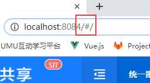

ipeople文档  
开发参考

http://10.18.50.163:10080/introduction/

设置淘宝镜像
npm install -g cnpm --registry=https://registry.npm.taobao.org

登录403 清空localstorge

永辉sit
http://mengine-ui.yh-fi-share.sit.yonghui.cn/mengine-ui/#/login

80457547/Azxs1234

**80457547**

1168812971531440128

1168812971531440128

1169052119506292736

永辉dev

http://fis-dev.mengine-ui.sitgw.yonghui.cn/mengine-ui/#/

80702179

永辉uat
http://mengine-ui-uat.yh-fi-share.sit.yonghui.cn/mengine-ui-uat/#/login

80457547/Azxs1234

移动管理平台
https://hr.yh-test.com/mam-console/admin/dashboard

test1/12345678

永辉itwork

http://itwork.yonghui.cn/#/agile/backlog?type=project&id=17&name=%E8%B4%A2%E5%8A%A1%E5%85%B1%E4%BA%AB&organizationId=1

永辉gitlab

http://gitlab.yonghui.cn/operation-yh-fi-share/fis-mengine-ui

svn地址

svn://svn.meicloud.com/JIEBAO_PROJECT/%E5%A4%96%E9%83%A8%E9%A1%B9%E7%9B%AE/%E6%B0%B8%E8%BE%89%E8%B4%A2%E5%8A%A1%E5%85%B1%E4%BA%AB%E4%B8%80%E6%9C%9F%E9%A1%B9%E7%9B%AE

1，完成迭代4的需求传递及生产bug的修复，以及上个迭代的代码评审结果修正。
2，完成冲销填单的变更需求，完成流水认领组件开发及选择流水弹窗组件，完成预付款弹窗变更需求，默认带出申请人公司等。

3，完成出差计划详情页跳转订机票的开发。

4，完成从execl文件批量中修改预算金额组件开发。

5，完成费用冲销模块的列表页，填单页，详情和审批页的开发。完成单据中的oa签呈单号选择组件，不同冲销类型选择对应类型的冲销明细并联动对应表格操作。完成冲销明细execl导入的开发。

6，完成出差明细中的使用记录的弹窗显示。

总结：本次迭代做了两个单据的填单，完成情况及时，有足够时间自测。这次迭代吸取了前面迭代高频bug产生原因，仔细对照原型和后端同事一起联调，bug率减少很多。

