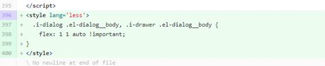

1、查询条件排列错乱的问题

​      问题预览：

  

已有bug号：4147,4149,4151,4152,4157,4158,4196,4193,4188

问题原因：flex布局问题

解决方案：在i-form-search绑定的表单对象添加以下属性，不要写在元素上

2、选择器显示异常

​       问题预览：

​       已有bug号：4196,4193,4190,4163,4146

​       问题原因：flex布局问题(flex:1)

解决方案：样式中重新定义flex:1(需注意样式覆盖问题)

