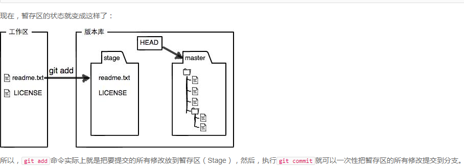
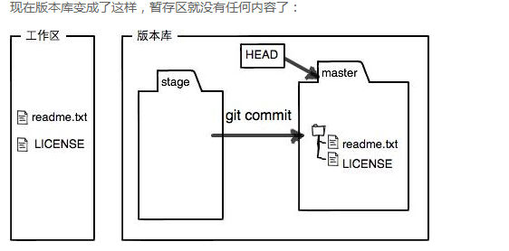
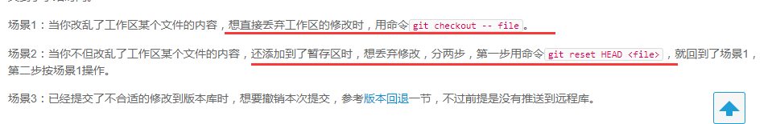
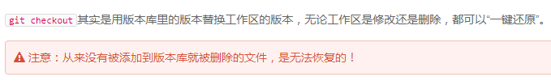
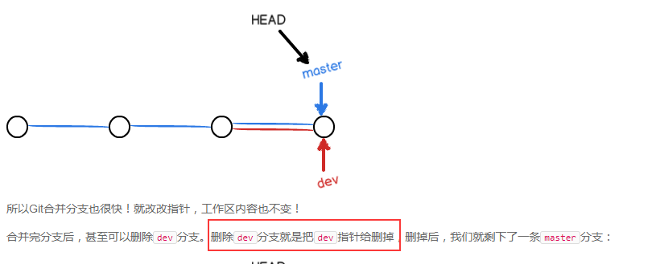
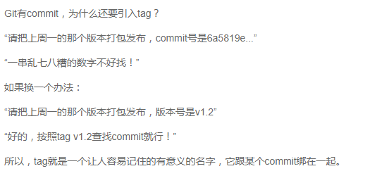

# git

2019-8-12 11:24 广东佛山美的广夏花园

---

### 基本

```
git status
git diff 文件名   #查看文件具体修改
```

每一个commit都相当于仓库的快照，如果发生意外就可以回退到之前一个commit中。


```
$ git reset --hard HEAD^
回退到上一个版本Git中，用HEAD表示当前版本，也就是最新的提交1094adb...（注意我的提交ID和你的肯定不一样），上一个版本就是HEAD^，上上一个版本就是HEAD^^，当然往上100个版本写100个^比较容易数不过来，所以写成HEAD~100
```

### 版本回退

`git reflog`用来记录你的每一次命令

- `HEAD`指向的版本就是当前版本，因此，Git允许我们在版本的历史之间穿梭，使用命令`git reset --hard commit_id`。
- 穿梭前，用`git log`可以查看提交历史，以便确定要回退到哪个版本。
- 要重返未来，用`git reflog`查看命令历史，以便确定要回到未来的哪个版本。





git上传的修改，而不是文件

-----



回退修改：修改的本地文件，修改的文件已将添加到暂存区



版本库就是上图最右边的地方

-----

#### 分支管理



查看分支：`git branch`

创建分支：`git branch <name>`

切换分支：`git checkout <name>`

创建+切换分支：`git checkout -b <name>`

合并某分支到当前分支：`git merge <name>`

删除分支：`git branch -d <name>`

###### 解决冲突

```
$ git add readme.txt 
$ git commit -m "conflict fixed"
```

当Git无法自动合并分支时，就必须首先解决冲突。解决冲突后，再提交，合并完成。

**解决冲突就是把Git合并失败的文件手动编辑为我们希望的内容**，再提交。

合并分支时，加上`--no-ff`参数就可以用普通模式合并，合并后的历史有分支，能看出来曾经做过合并，而`fast forward`合并就看不出来曾经做过合并

当手头工作没有完成时，先把工作现场`git stash`一下，然后去修复bug，修复后，再`git stash pop`（回复并删除stash），回到工作现场。

丢弃一个没有被合并过的分支，可以通过`git branch -D <name>`强行删除。

- 查看远程库信息，使用`git remote -v`；

- 本地新建的分支如果不推送到远程，对其他人就是不可见的；

- 从本地推送分支，使用`git push origin branch-name`，如果推送失败，先用`git pull`抓取远程的新提交；

- 在本地创建和远程分支对应的分支，使用`git checkout -b branch-name origin/branch-name`，本地和远程分支的名称最好一致；

- 建立本地分支和远程分支的关联，使用`git branch --set-upstream branch-name origin/branch-name`；

- 从远程抓取分支，使用`git pull`，如果有冲突，要先处理冲突。

- rebase操作可以把本地未push的分叉提交历史整理成直线；
- rebase的目的是使得我们在查看历史提交的变化时更容易，因为分叉的提交需要三方对比。（不懂）


#### 标签



标签可以代替commit那些不好记的字符串

- 命令`git tag <tagname>`用于新建一个标签，默认为`HEAD`，也可以指定一个commit id；
- 命令`git tag -a <tagname> -m "blablabla..."`可以指定标签信息；
- 命令`git tag`可以查看所有标签。
- 命令`git push origin <tagname>`可以推送一个本地标签；
- 命令`git push origin --tags`可以推送全部未推送过的本地标签；
- 命令`git tag -d <tagname>`可以删除一个本地标签；
- 命令`git push origin :refs/tags/<tagname>`可以删除一个远程标签。