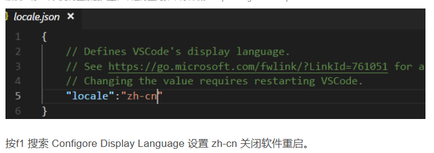
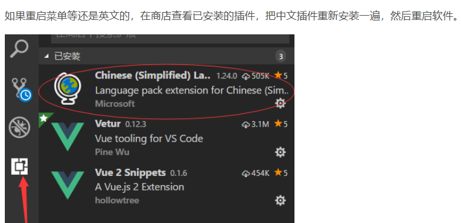

# 编辑器使用技巧

写在前面：以后因为生活工作变化，一定还会遇到同样的配置问题，记录好，节约时间

## vscode

### 1,配置中文

1）ctrl+shif+p 输入Configore Display Language（模糊查询display）改成zh-CN

2 ） 在插件中安装 Chinese插件

### 3，vue高亮

安装vetur

ctrl+shift+x打开插件搜索框

### 4，快捷键

ctrl+enter光标移动下一行（开一个空白行）并有缩进

ctrl+shift+enter光标移动到上一行，开新行，并有缩进

alt+up/down将光标所在行上下移动一行

Ctrl+shift+L 批量替换

shift+alt+a  多行注释

shift+alte+下箭头，复制当前行到下一行

shift+alte+f  格式化代码

ctrl+alt+t 函数注释

**crtl+alt+i**文件头注释

自定义快捷键方式： ctrl +alt+u 大写 ctrl+alt+s 小写  首选项中-编辑快捷键

----

## 在谷歌浏览器中安装vue-devtools

## git下载地址

https://git-scm.com/download/win

