#　webpack4.0 慕课

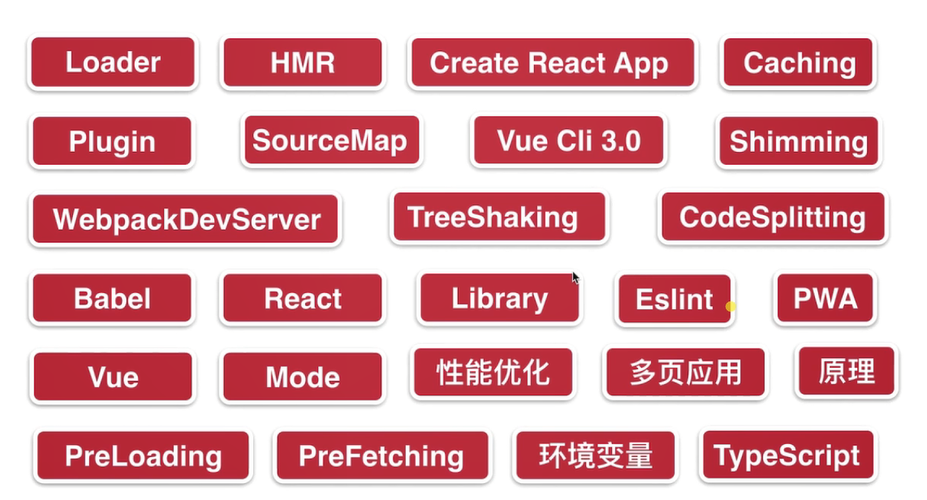

1，webpack是什么

由于面向过程编程会导致代码越来越长，采用面向对象（在js中，什么是面向对象）

通过script标签来引入不同模块会产生一些问题： 引入顺序，增加多个http请求

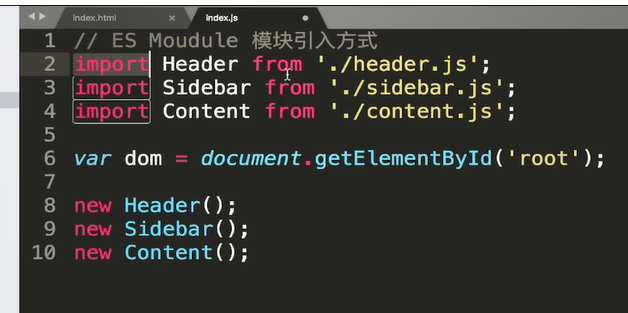

我们使用es moudule模块引入方式更好，但是浏览器不认识，所以使用webpack来翻译文件。

（里面用到了npm   还有es moudule  es5中语法，但是浏览器不认识，所以这是js熟悉度问题）

es moudule规定了导入的文件必须要有export

创建一个项目: npm init

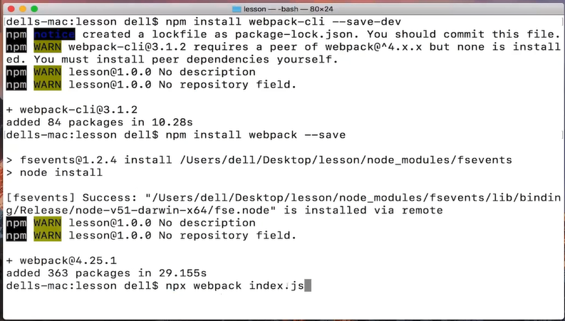

##### 2.2 webpack是个模块打包工具

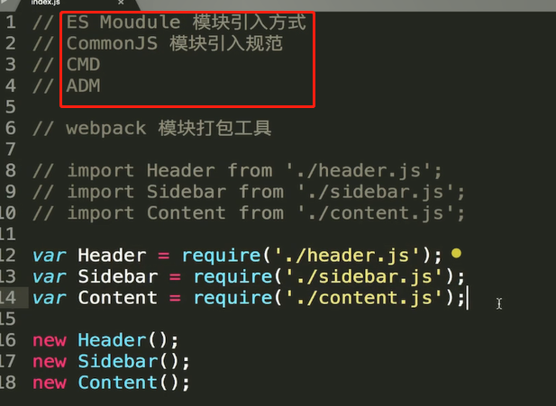

webpack能识别任何一种模块引入方式

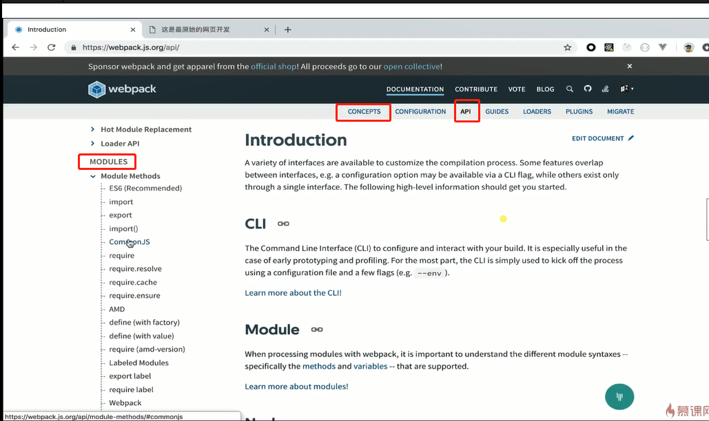

阅读英文文档：因为是最新的 阅读这方面关于模块化的概念

课后作业： https://webpack.js.org/api/module-methods/#es6-recommended module模块下的api

#### 2.3搭建webpack环境

npm init：创建一个node规范的包文件

> 如果npm包安装不了，可以试着使用手机热点安装
>
> 全局安装webpack存在的问题：要跑两个webpack版本不同的项目，一个是3，一个是4，但是全局安装4，3的就跑步起来，所以**webpack应该局部安装**，
>
> 全局卸载webpack: npm uninstall webpack -g
>
> 局部安装npm install webpack webpack-cli -D
>
> 局部安装后在项目中运行webpack ： npx webpack -v
>
> **npx会在当前项目中的node_module中找到该命令，直接webpack -v会在 全局的nodejs中寻找**
>
> 查看一个包的信息是否存在 npm info webpack

#### 2.4 webpack配置文件

webpack有默认的配置文件，如果想自己来写就在根目录中添加一个webpack.config.json

默认配置文件为webpack.config.js文件，用其他文件的话

npx webpack --config filename

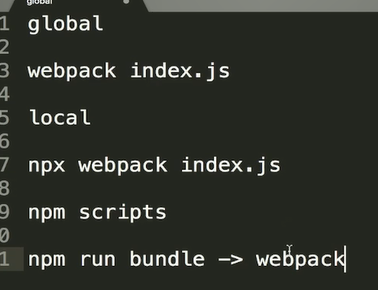

讲了三种运行webpack的方法

webpack-cli就是帮助我们在命令行中运行webpack命令

```
  "scripts": {
    "bundle": "webpack" //虽然运行npm run bundle 但是写在scripts里面的语句会默认去当前依赖中找webpack去执行
  },
```

```
const path = require('path'); // 引入node path核心模块

module.exports = {
  entry: './index.js', 
  output: {
    path: path.resolve(__dirname, 'dist'), // __dirname为当前webpack.config.js文件所在的目录下，
    filename: 'bundle.js'
  }
};
```

webpack配置文件

作业：开始的所有的知识点

#### 2-5 浅谈webpack打包知识点

mode: '' 有两种模式，一种是生产代码会压缩，一种是开发代码不会压缩

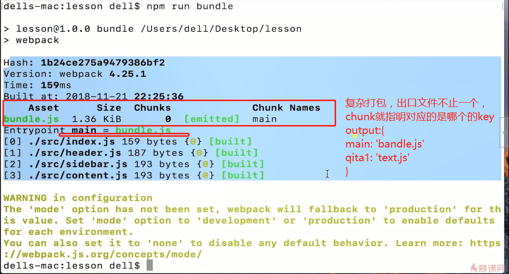

图片写错了是entry，后面接触复杂打包去理解

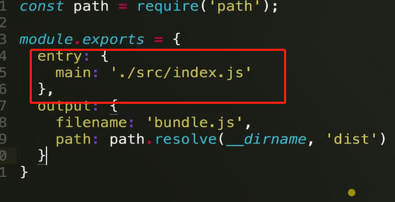

#### 3-1 loader是什么

webpack有很多loader和插件，学不完，但是如果开发中遇到很复杂很难的业务场景，应该在群里直接问，会有同事对这个领域的配置很熟悉

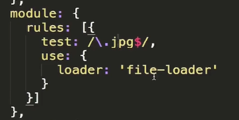

file-loader虽然知道可以打包图片

其实他是将图片搬到dist文件下，并返回文件地址。所以不只是图片，如果你想搬运文件并获得文件地址就可以用这个loader完成

loader是什么：打包方案

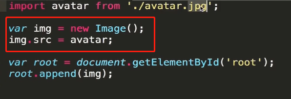

有些代码还是比较陌生的

webpack只能识别js

loader就是打包不同的文件，重点关注，import出来的东西是什么，可以怎么用

#### 3-2 使用loader打包静态资源

##### 图片

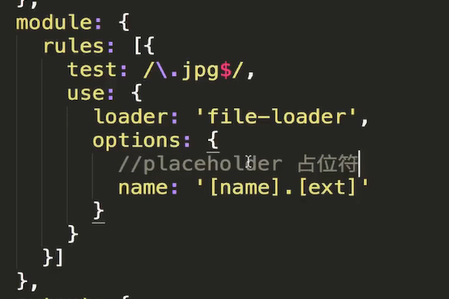

让打包成的文件的名字，和原始的一直

[ext]为file-loader的占位符

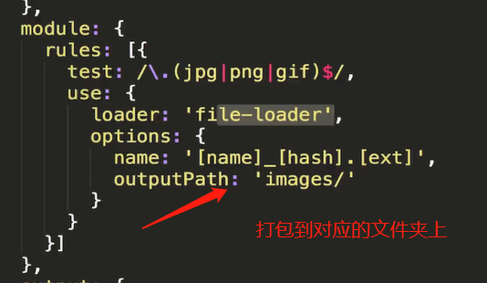


url-loader：也能打包图片文件，但是打包方式，是把图片变成base64形式，对于大文件不友好，小文件能减少http请求

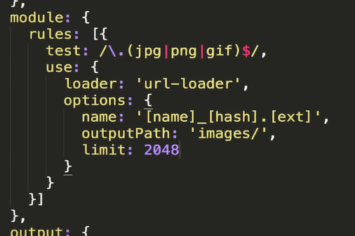

添加了limit，超过会使用file-loader的方式打包，其他是base64

##### 样式

 编程就是一堆规则，难度在于规则的理解和量

css-loader：分析几个css文件的关系，打包成一个css文件

style-loader： 将css文件挂在到html中的head里面

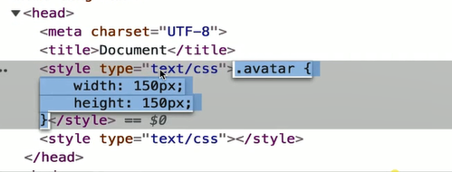

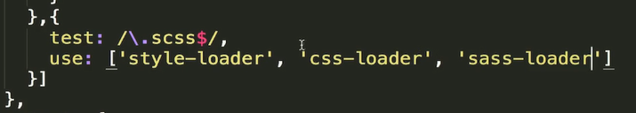

重要规则： webpack中loader是有先后顺序，从下到上一依次

css需要默认加一些前缀，有loader会自动帮忙做这个：postcss-loader有个配置文件如下

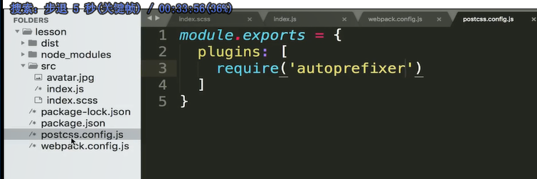

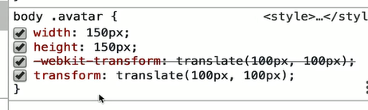

为css-loader添加配置项

 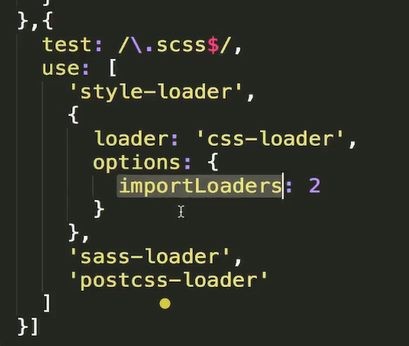

> 这个配置的意思，就是: 当你的sass文件又使用import来引入sass文件，理应当说，css文件里面的引入引出任务是css-loader来做，就不会回头在走sass-loader。这个配置就是告诉webpack，**当使用import引入是，也要使用前面两个loader来处理**

让当前 文件下的css文件样式只作用于当前文件，而不是全局，css模块化

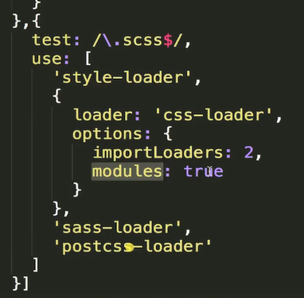

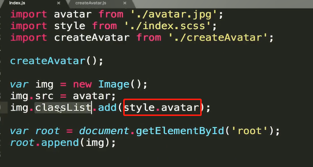

很麻烦，比理解的要复杂

##### 打包字体文件


不知道图表的实现原理，这四个文件的作用

asset manage 静态资源管理

以上的loader在文档上都有

#### 使用plugins让打包更便捷

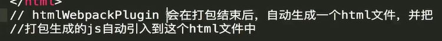

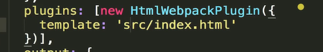

可以为这个html设定一个模板

plugins 是一个生命钩子函数，插件会在特定的打包时间为我们做一些工作

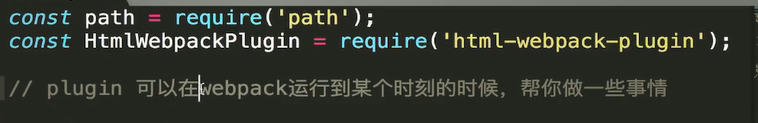

生命钩子

打包，将dist文件删除功能: clean-webpack-plugin(并非官方推荐，文档上没有，找其他文档别慌) 打包之前执行

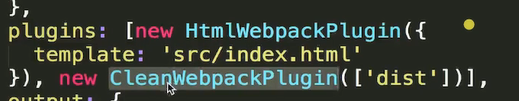

1：20：40 3-6节  

一个半小时（1：50）

剩（2个小时） 32*20 /6      11个小时   13个小时（周一到周六学完）

---

#### 3.6 Entry 与 Output 的基础配置

业务场景，想打包两次

output中的name对应着entry中的key


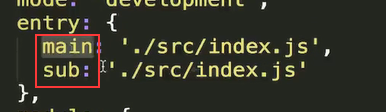

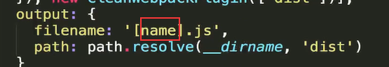

业务场景：留一个html给后端做入口文件， 引入打包的js文件（静态资源）想放到cdn上面，的时候，我们该如何配置webpack呢。

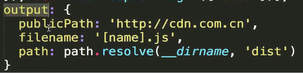


作业：output上面的配置参数

#### SourceMap 的配置

当我们代码出错了，页面报错了，只会告诉我们打包后的文件哪里出错了。并不会说那个代码里的哪行有错

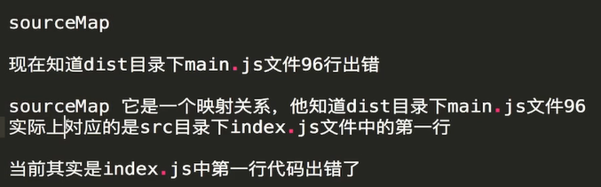

devtool就是sourcemap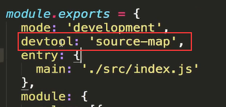

inline-source-map的作用，就是比source-map是把影射关系放在一个文件里，而inline是变成一个base64的url放在打包好的js文件里面

webpack是默认开启source-map  加了cheap只会精确到行不会列

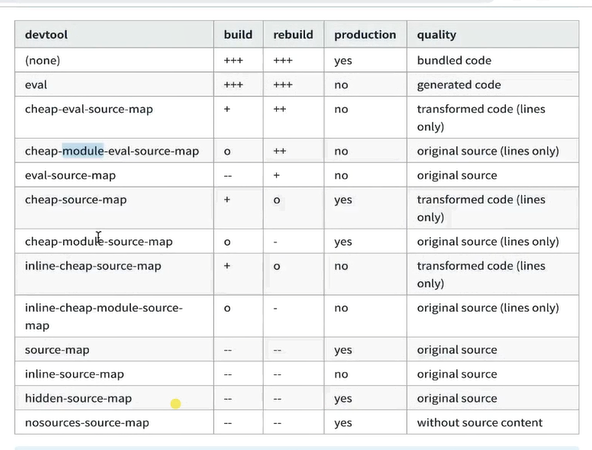

这些配置可以自由组合：cheap只管业务代码，加上module也会管模块代码

eval模式，就是将报错信息使用eval的形式添加到文件中，是最快的，但可能不全

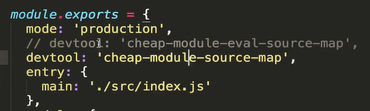

最佳实践开发为注释的一行，生产让信息更全面，使用不注释的那一行

#### 3-8 使用 WebpackDevServer 提升开发效率，并且开启一个本地服务器

当源代码发生变化，就会重新打包。webpackdevserver是现在业界用的最多的!!!

比watch，会帮忙重新刷新浏览器，open会自动帮忙打开，**并让开一个web服务器**，通过http协议打开而不是file协议

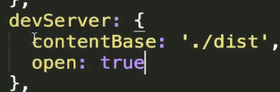

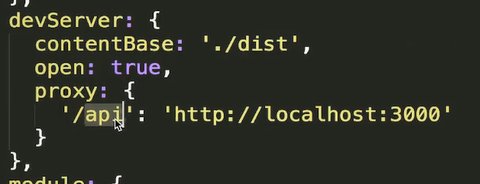

为什么现在脚手架都支持跨域，都是使用了这个代理。还有很多关于这个的配置项看文档

如何实现这个脚手架中的内容：核心就是用node来监听文件变化然后重启服务器。需要一个http服务器。可以借助express

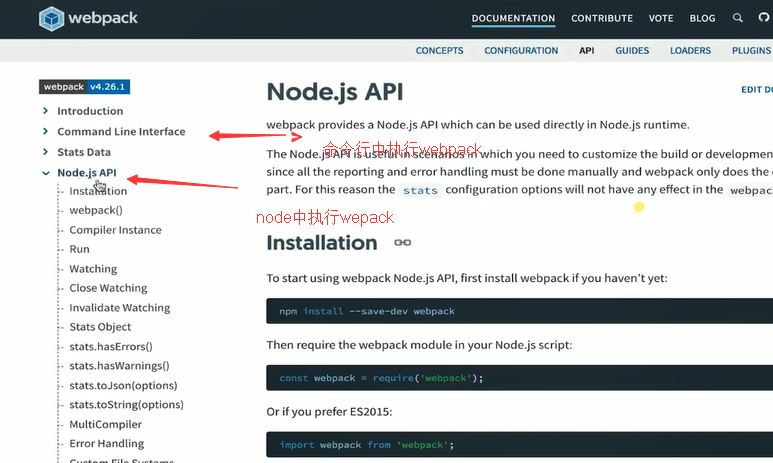

#### 3-9 hot moudle replacement

webpack-dev-serve 会把打包的dist文件放到电脑内存里面，这样提高我们的打包速度

> 修改了webpack配置文件，应该重启

修改了css文件，不重新刷新页面

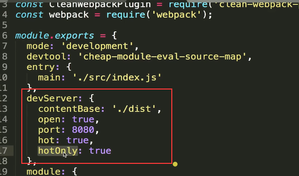

这边的hotOnly会让html失效的时候不重新刷新页面

这里面的hot没讲清楚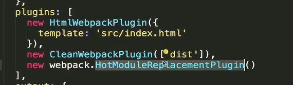

css不用写这段代码，原因就是css-loader帮忙写了这段代码

vue-loader也内置了这段代码，所以也不用自己添

hotonly 没配，如果html发生变化了会重新刷新页面

babel可以将es6代码抓换成es5。在babel官网中选择环境的教程安装

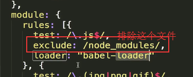

babel只是做语法的转换，还有一些全是的变量和函数是没有。这部分工作就是polyfill的工作。polyfill的使用也在babel官网中。

如何按需加载es6的语言？

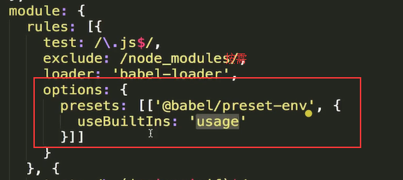

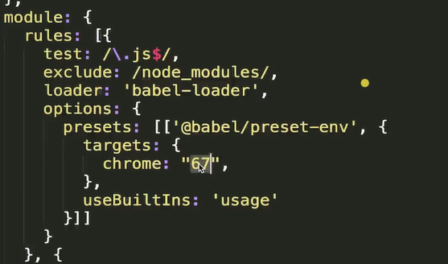

如果是需要打包支持浏览器67以上，看看怎么打包

**babel中的原理很庞大。如果很了解babel，就会知道框架语法是怎么转换成浏览器认识的语法。**

   polyfill会污染全局环境，而plugin-transform-runtime会使用闭包的方式？帮组组件引入polyfill

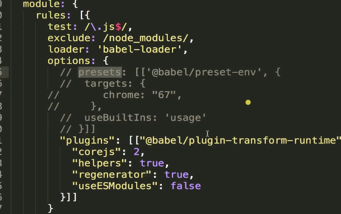

babel中的配置项太多可单独放在.babelrc中

#### 配置react代码的打包

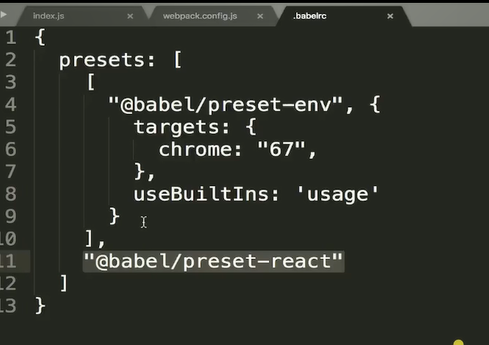


转换顺序也是从上到下，先转换react代码再转换es6代码

### 第4章 Webpack 的高级概念  

本章接第三章内容，继续讲解 Webpack 中难度更大的知识点，包含了 Tree Shaking，Code Spliting，打包环境区分，缓存，shimming 等内容，帮助你继续扩展 Webpack 的基础知识面

#### tree shaking

引入什么打包什么，把一棵树上的东西全部摇晃掉

tree shaking只支持esmodule方式引入（improt），因为es是静态引入，而commondjs是动态引入

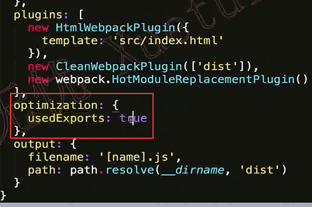

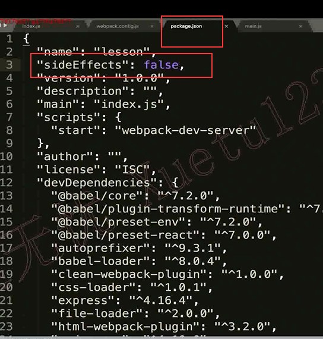

在package，json里面开启这个，就是说明，每次打包都是使用treeshaking打包

**如何在现有项目中使用**？

babel 中polly-fill里面就是给window绑定全局方法。**是不是导出任何内容**引入的时候。当要引入这个的时候在package.json中的sideEffects中添加这个文件，说明treeshaking的时候不要管这个文件。

正常情况下，可以添加这些比如所有的css文件，引入的时候不要用treeshaking

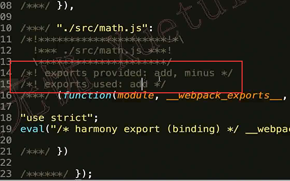

在开发环境，方便调试，都会打包出来，但是如果是生产环境，就不会打包出来

#### develiment和production模式的区分打包

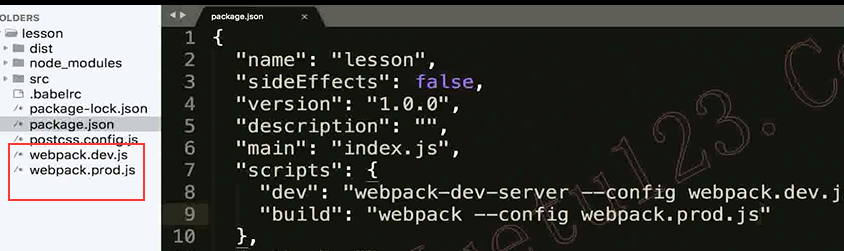

按环境分成两个配置文件

开发打包的文件都在内存里面不会生成dist文件

问题：两个环境中的配置文件有很多重复  

webpack-merge

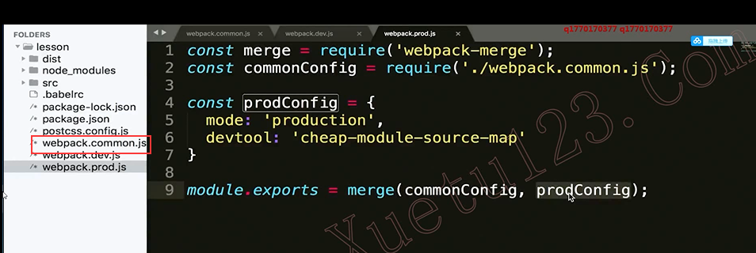

#### 4-3 code splitting

代码分割

30节(一天6节)，周六周日做面试题和笔试题

先保证我的视频能学完，再保证工作，why，先支付自己

晚上早点睡，早上早点起（11点睡，七点钟起床）睡饱了才能高效学习，高效工作，高效放松

3-8

webpack打包和代码分割的关系

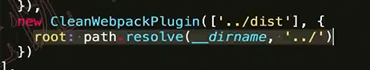

在使用cleanwebpack来清理文件夹的时候，设置这个插件的根目录是上一层。就实现**了webpack操作上一级目录的功能**  lodash

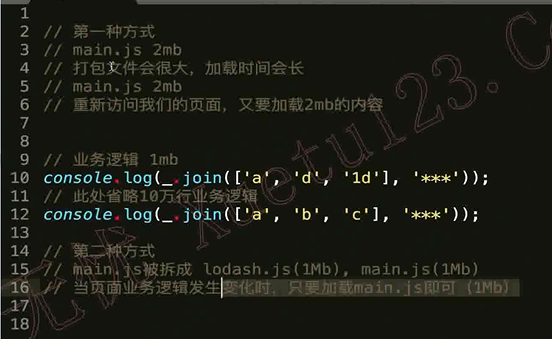

分开引入在html中，库文件不会发生变化，然后就会在客户浏览器中生产缓存，业务代码发生变化，就是发请求修改。

使用代码分割提高用户体验性

webpack自带的插件会帮我们智能的做代码分割

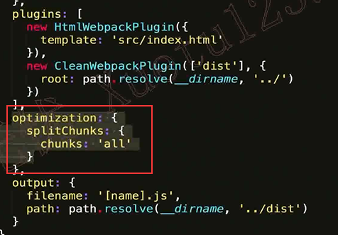

开启这个

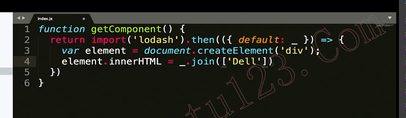

异步加载


转义异步代码

1，配置webpack，会帮忙分析同步代码中的代码分割

1，不配置，使用异步的方式加载，webpack也会做代码分割

代码分割是个概念，优化方式，


#### 4-5 treeshaking

和上面学的一模一样，

optimization配置，splitchucks插件


同步的代码走cacheGroups

cacheGroups叫做缓存组：符合上面的条件时，就会把他们打包到一起生成一个文件。

现在图片中有两个组：vendors和default

minChunks中用到多少次的时候使用代码分割

明天4-9 5-2 怕明天没时间，今天先提前学了，（一定要周五前学完，然后周六日，面试提和学习资料

priority字段的作用是：当一个库文件同事满足多个组的时候，那个优先级越高，就打包到那个组中

reuseExistingChunk：表示之前打包过，再次被引用不需要再次打包了

#### 4-7 lazy loading和chunk是什么

懒加载就是通过import异步加载模块

chunk：代码分割中，生成了多少个文件，我们都叫他chunk


 minchunk： 到底生成的chunk文件中最少多少个用到了这个库文件


### 第5章 Webpack 实战配置案例讲解

本章通过库文件打包，PWA项目打包，TypeScript打包支持等实战常见 Webpack 配置案例，带大家了解最新前端工程化常识，并在实例实现的过程中，巩固前三章节的基础知识点。同时章节末尾进行了 Webpack 打包性能优化的内容，帮助同学们了解如何在打包速度过慢时进行合理的打包过程优化

### 第6章 Webpack 底层原理及脚手架工具分析

本章首先讲解如何自己实现 Webpack 中的 Loader 和 Plugin 的扩展。在了解 Webpack 扩展机制后，近一步深入 Webpack 底层，通过编码，实现了类似 Webpack 的简单打包工具，在此过程中，让同学们能够真正理解打包过程中的各种复杂概念及底层原理

### 第7章 Create-React-App 和 Vue-Cli 3.0脚手架工具配置分析

最后一章增加了对 Create-React-App 和 Vue-Cli 3.0 两个前端脚手架工具中 Webpack 配置内容的分析，帮助同学了解不同脚手架工具设计的出发点，和配置的技巧。

 

 