# vue核心技术

## vue路由

实际上路由的实现时是通过栈的方法向栈中添加一个路由，导出一个路由

vue路由中有两个对象 this里面$route是路由信息   $router表示操作路由的一些方法

`<router-link></router-link>`

`<router-view></router-view>`

## vuex

vuex是vue的一个插件

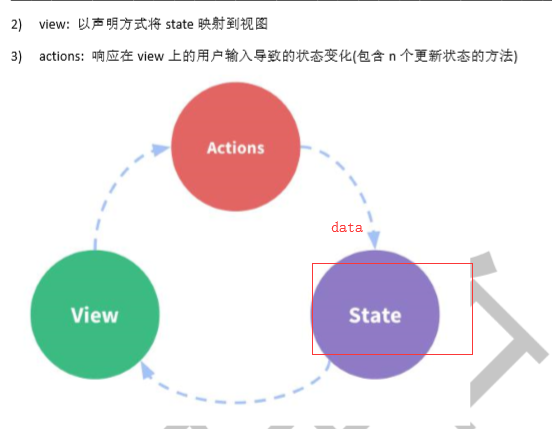

多组件共享状态（所谓状态就是变化的数据 ）

vuex就是用来对状态集中管理的工具

```vue
<template>
<div>
<p>{{$store.state.count}}</p>
<p>计算属性{{$store.getters.aaa}}</p>
<button @click="jiayi">点我加一</button>
</div>
</template>

<script>
export default {
  name: 'App',
//   computed:{
//       aaa(){
//           return this.$store.getters.aaa;
//       }
//   },也是可以的，计算属性不用在组件中定义了，可以直接调vuex中的getters中的属性
    methods:{
        jiayi(){
           this.$store.dispatch('jiayi')
        }
    }

}
</script>
<style>

</style>

```

```vue
//vuex核心管理对象模块：store
import Vue from 'vue'
import Vuex from 'vuex'
Vue.use(Vuex)
//默认向外暴露store
const state = {
  count: 0
}
const mutations = {
  IJAYIn(state){
      state.count++
  }
}
const actions = {
  jiayi({commit}){
      commit('IJAYIn')
  }
}
const getters = {
  aaa(state){
      console.log(state.count%2===0 ?'偶数':'奇数');
      return state.count%2===0 ?'偶数':'奇数';
  }
}
export default new Vuex.Store({
    state,//状态对象
    mutations,//包含多个更新state函数的对象
    actions,//包含多个对应事件回调函数的对象
    getters//包含多个getter计算属性函数的对象
})
```

```vue
// The Vue build version to load with the `import` command
// (runtime-only or standalone) has been set in webpack.base.conf with an alias.
import Vue from 'vue'
import App from './App'
import store from './store'


new Vue({
  el: '#app',
  components: { App },
  template: '<App/>',
  store//所有的组件对象都多了一个属性：$store
})

```

简写方式

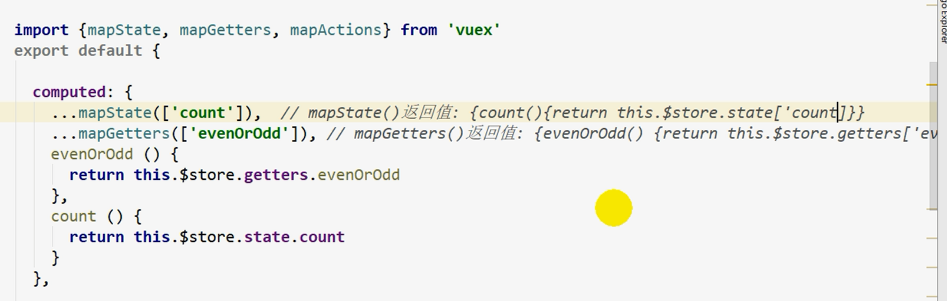

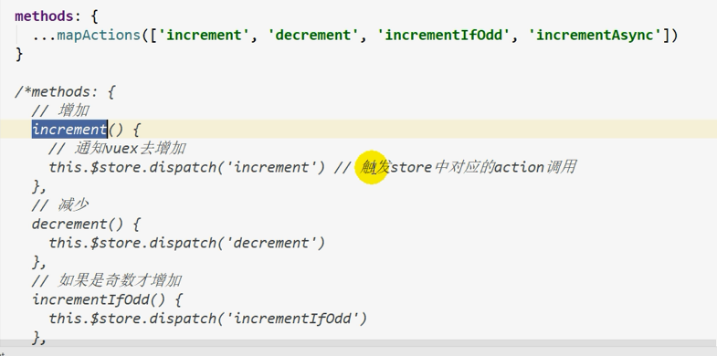

三点运算符的作用


vuex给的新的api中，mapAction返回的就是注释中注释掉的东西，也就是返回的是放着函数的数组，再用三点运算符使其变成逗号分隔开的参数序列

## vue源码

#### 准备

- 将伪数组转化为真数组

es6方法：Array.from(伪数组)

伪数组实际是一个对象

es5方法`[].slice.call(li);`

```js
const li = document.getElementsByTagName('li');
const ar2 = Array.prototype.slice.call(li);
//Array.prototype.slice是一个方法，调用它call方法。让对象li成为她的执行对象。并立即执行，最后返回一个新的数组。slice方法也是数组的浅拷贝方法
```

- 得到节点类型node.nodeType

  每个node的type是个数字，并且不同的不一样。知道是什么类型的节点

- 给对象添加属性（指定描述符）

  `Object.defineProperty(obj,pretyName,{})`

  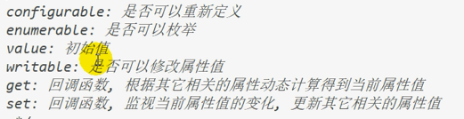

- 判断prop是否是obj自身的属性

  `obj.hasOwnProperty(prop)`

- 文档碎片（高效批量更新多个节点）

  解决频繁操作dom带来的问题

  `DocumentFragment`

  > dociment：对应显示的页面，包含n个elment  ui但更新document内部的某个元素界面也会更新
  >
  > documentFragment：内存中保留n个element的容器对象（不与界面关联），如果更新framgnet中的某个element，界面也会更新

  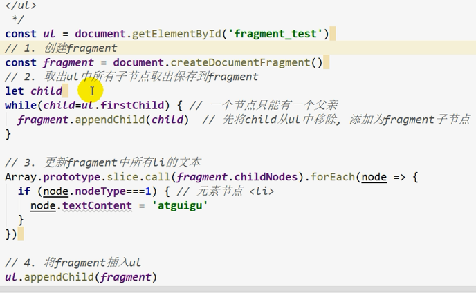


- 数据代理

  1) 数据代理: 通过一个对象代理对另一个对象(在前一个对象内部)中属性的操作(读/写) 

  2) vue 数据代理: 通过 **vm 对象来代理 data 对象**中所有属性的操作 

  3) 好处: 更方便的操作 data 中的数据

   4) 基本实现流程 

  ​	a. 通过 Object.defineProperty()给 vm 添加与 data 对象的属性对应的属性描述符

  ​	 b. 所有添加的属性都包含 getter/setter 

  ​	c. getter/setter 内部去操作 data 中对应的属性数据

  阅读源码技巧debug

  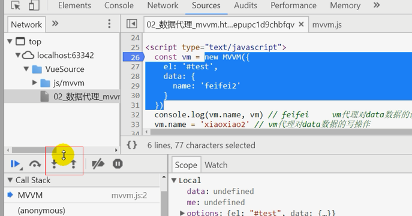

  红色框表示进入函数执行，旁边的是单步执行

  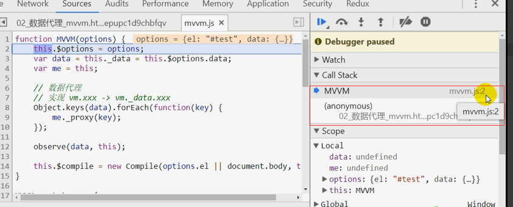

  红框表示当前运行的函数，并写明文件位置（call stack函数使用栈）

  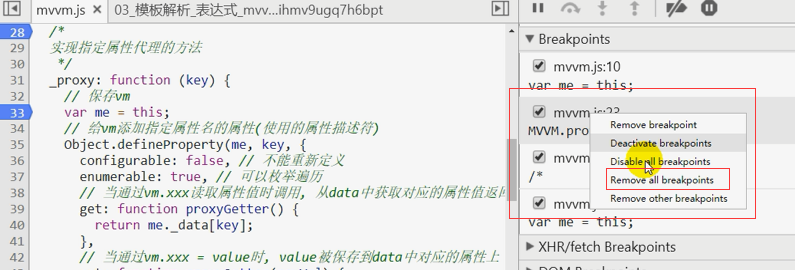

  点击断点，在右边点击选择消除所有断电

  数据代理实际代码：

  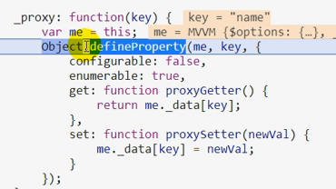

  用defineProperty方法对要代理的对象添加需要代理的data，并通过set和get来实现他们之间的连接。


- 模板解析

  vue如何解析template里面的js代码和内置vue语法

  1，大括号表达式

  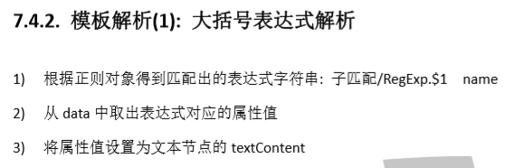

  对所有层次的节点编译（递归编译孩子节点）

  正则中`\{\{（.*）\}\}`的（）表示只匹配，也就是最终保留的东西就是（）括号匹配的内容

  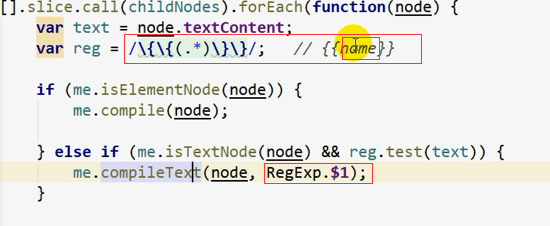

  2，事件指令解析

  3，一般事件解析

  上面的先不学，太复杂，留一个概念就行

- 数据绑定

这个很重要，学习，有助于理解vue框架

计算属性是如何实现的


