# vue基础知识

1，只记录重点的

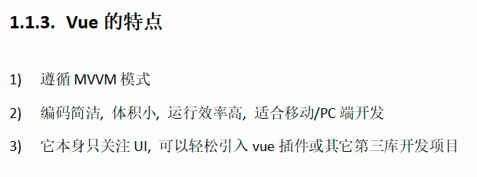

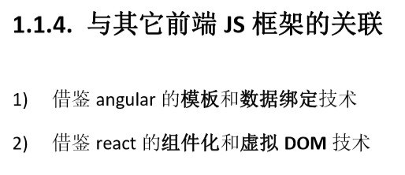

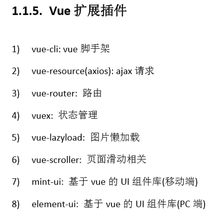

1，vue中实例

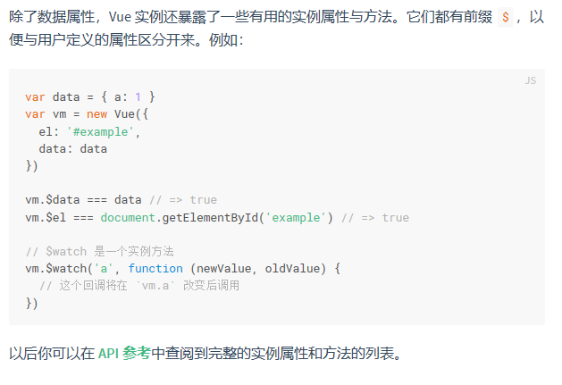

通过给new vue中传递一个对象参数，来创建一个vue实例，添加的属性也就添加到了vue实例中，并且具有双向数据绑定。其中vue实例也提供了一些有用的属性和方法，以$开头。

data属性对象中的属性才能用来v-module和{{}}


1，将data中的属性值加到html中的标签属性中（强制数据绑定）

表明字符串时data中的变量

2，绑定时间监听

并且方法中只写函数名就不传参数，如果要传加上即可

```vue
    <div id="app">
        <input type="text" v-model="message">
        <span>{{message.toLocaleLowerCase()}}</span>//大括号中写的js语法，可调变量属性
        
        
        <!-- 绑定了的当中不仅test是个函数而且参数也是data中的变量 -->
        <span v-on:click="test(url)">hello</span>
        <span @click="test(url)">hello</span>
    </div>

    <script src="vue.js"></script>
    <script>
        //创建一个vue实例（构造函数的形式），传递对应的数据初始化页面
        const vm = new Vue({
            el: '#app',
            data:{
                message:"zsy",
                url:"https://cn.vuejs.org/images/logo.png"
            },
            methods:{
                test(a){
                    console.log(a);
                }
            }
        });
    </script>
```

3,计算属性与监听

```vue
<script>
        //创建一个vue实例（构造函数的形式），传递对应的数据初始化页面
        const vm = new Vue({
            el: '#app',
            data:{
                fn:"zsy",
                ln:"cgy",
                n2:"q"
            },
            computed:{
                n1(){
                    //当涉及到n1中的变量改变的时候就会调用
                    return this.fn +"520"+this.ln;
                    // 这段代码是一个声明，是在初始化vue实例，this指向vue实例的属性
                },
                //直接是一个对象
                n3:{
                    get:function(){
                        return this.fn +" "+this.ln;
                    },
                    set:function(value){
                        this.fn = value.split(' ')[0];
                        this.ln = value.split(' ')[1];
                    }
                }
            },
            watch:{
                //监视某一个属性,监视属性并不会向vm中添加属性，所以n2需要在data中声明
                fn:function(value){
                    return this.n2=value+this.ln;
                }
            }          
        });

    </script>
```

4，class和style绑定

    <div id="app">
        <p :class="{aclass:isa,bclass:isb}"></p>
        <p :style="{color:activecolor,font-size:fn+'px'}"></p>
    </div>
```
    <div id="app">
        <p :class="{aclass:isa,bclass:isb}"></p>
        <p :style="{color:activecolor,font-size:fn+'px'}"></p>
    </div>

    <script src="vue.js"></script>
    <script>
        //创建一个vue实例（构造函数的形式），传递对应的数据初始化页面
        const vm = new Vue({
            el: '#app',
            data:{
                aclass:"aclass",
                bclass:"bclass",
                isa:true,
                isb:false,
                activecolor:'red',
                fontsize: 30
            },
```


class可以用对象的形式设置，如果是对象，一个属性代表一个类名，如果这个属性的值为true则存在，为false表示不存在。

5，列表遍历

```vue
    <div id="app">
        <ul>
            <li v-for="(value,index) in persons " :key="index">
                {{value.name}}---{{value.age}}--{{index}}
                --<button @click="update(index)">更新</button>
            </li>
        </ul>
    </div>

    <script src="vue.js"></script>
    <script>
        //创建一个vue实例（构造函数的形式），传递对应的数据初始化页面
        const vm = new Vue({
            el: '#app',
            data:{
                persons:[
                    {
                        name:"tom",age:"90"
                    },
                    {
                        name:"cat",age:"89"
                    }
                ]
            },
            methods:{
                update(index){
                    this.persons.splice(index,1,{name:"zsy",age:"78"});
                    //删除并替换成第三个参数
                }
            }
        });

    </script>
```

vue中只监听数据的本身的变化，但是数组本身是一个地址。所以vue还在原本数组操作方法上封装了一遍，使得支持数据绑定，所以要改变数组并让页面跟着改变时，需要使用vue中的数组变异方法

### 6.计算属性实现搜索和排序

```vue
    <div id="app">
        <input type="text" v-model="searchname">
        <ul>
            <li v-for="(value,index) in filterpersons " :key="index">
                {{value.name}}---{{value.age}}--{{index}}
            </li>
        </ul>
    </div>

    <script src="vue.js"></script>
    <script>
        //创建一个vue实例（构造函数的形式），传递对应的数据初始化页面
        const vm = new Vue({
            el: '#app',
            data:{
                searchname: "",
                persons:[
                    {
                        name:"tom",age:"90"
                    },
                    {
                        name:"cat",age:"89"
                    }
                ],
            },
            computed:{
                filterpersons(){
                    const {searchname,persons} = this;
                    //排序就是再在这对数组排一个顺序
                    //indexOf判断字串在p.name的位置
                    return persons.filter(p=>p.name.indexOf(searchname)!==-1)
                }
            },
            methods:{
                update(index){
                    this.persons.splice(index,1,{name:"zsy",age:"78"});
                }
            }
        });
    </script>
```

### 7 事件细节

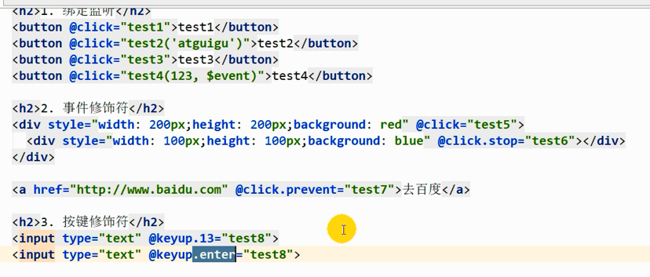

绑定监听：默认不传参数会穿一个$event参数，如果自己写明了参数则不传，如果写了参数，则在使用$event变量作为参数，则也能使用

事件修饰符：.stop阻止事件冒泡   .prevent阻止默认事件发生   .enter监听按下的键为enter键

### 8，自动收集表单数据

多选


下拉


select中的v-model是和option中的值保留在一起的

### 9，生命周期

用的最多的两个函数

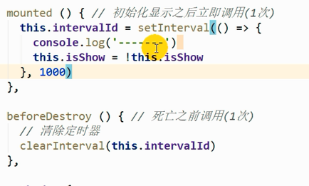

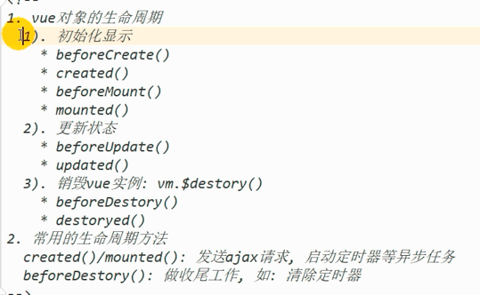

### 10.动画

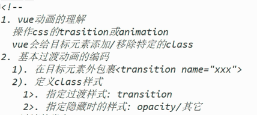


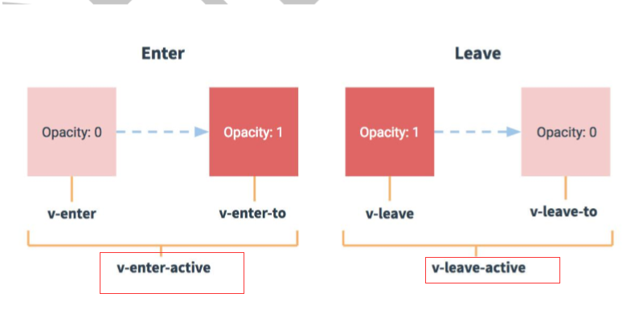

下面的这两个类是动画，决定动画中那些要改变

上面四个是四个状态，动画就是从一个状态变化到另一个状态怎么动

### 11，过滤器

定义过滤器来实现时间的格式化(moment时间格式化插件)

```vue
    <div id="app">
        <!-- filter前面是一个|竖线 -->
        <span>{{date | dateString('YYYY-MM-DD')}}</span>
    </div>

    <script src="vue.js"></script>
    <script src="https://cdnjs.cloudflare.com/ajax/libs/moment.js/2.22.2/moment.js"></script>
    <script>
        //es6形参默认值
        Vue.filter('dateString',function(value,format='YYYY'){
            console.log(format);
            return moment().format(format);
        });
        const vm = new Vue({
            el: '#app',
            data:{
                date: new Date()
            },
        });
    </script>
```

### 12，vue中指令和定义指令

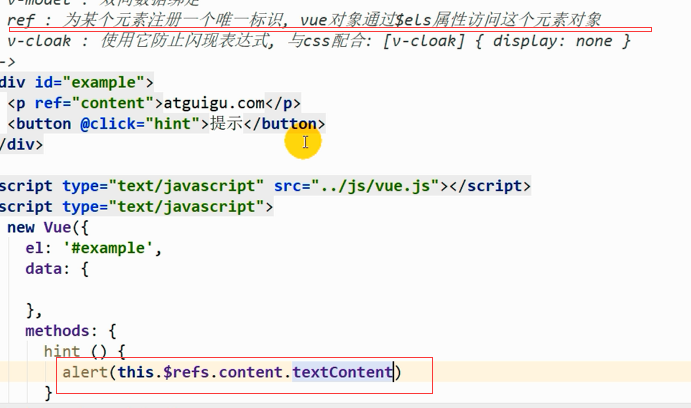

ref类似css中的id，这样可以来取得对应的元素对象

css属性选择器：[v-cloak]

v-cloak直接添加就行，就不会出现一开始是{{}}的情况`<span v-cloak></span>`

自定义指令：全局和局部

```vue
    <div id="app">
        <p v-upper-text="name"></p>
        <p v-lower-text="name"></p>
    </div>

    <script src="vue.js"></script>
    <script>
        //el：指令属性所在的标签对象
        //binding：包含指令相关信息数据的对象
        Vue.directive('upper-text',function(el,binding){
            el.textContent = binding.value.toUpperCase();
        })
        const vm = new Vue({
            el: '#app',
            data:{
                name:"hhhshfIjd"
            },
            directives:{
                'lower-text':function(el,binding){
                    el.textContent = binding.value.toLowerCase();
                }
            }
        });
    </script>
```

开发插件（见文档）

## 组件篇

所有的代码最后编译成app.js

在入口文件中将app.vue挂在到index.html中

而app.vue使用了各种组件

组件：局部功能模块

编写一个组件和使用一个子组件

```vue
子组件
<template>
  <div class="hello">
    <h1>{{ msg }}</h1>
  </div>
</template>

<script>
默认向外暴露,并且变量需要用函数来写 return 变量
export default {
  name: 'HelloWorld',
  data () {
    return {
      msg: '这里是helloworld.vue'
    }
  }
}
</script>
引用子组件的组件
<template>
  <div id="app">
    
    使用组件标签
    <HelloWorld/>
  </div>
</template>

<script>
引入组件
import HelloWorld from './components/HelloWorld'
export default {
  name: 'App',
  //映射组件
  components:{
    HelloWorld
  }
}
</script>
```

### 1，组件案例

编写组件的过程：1，拆分组件，2，编写静态组件（就是将一整个静态页面分别写到其他组件中，但还不实现里面的数据交互，只写静态的）3，在那个组件里面放数据（看这些数据是在一个组件里用到还是一些，如果是一些就放父组件里面）

注意：引入组件的三部：import  在组件中映射引用的组件  在template上使用组件标签

```vue
<template>
      <div class="col-md-8">
        <h3 class="reply">评论回复：</h3>
        <h2 style='display: none'>暂无评论，点击左侧添加评论！！！</h2>
        <ul class="list-group">
            <Item v-for="(value,index) in comment" :key="index" :value="value"/>
        </ul>
      </div>
</template>

<script>
import Item from './Item.vue'
export default {
  name: 'List',
  props:['comment'],
  data () {
    return {
    }
  },
  components:{
      Item
  }
}
</script>
```

> 注意：当发现一个值，其实本身没有意义，依赖其他值变化的，就用计算属性

数组方法，reduce，累加器

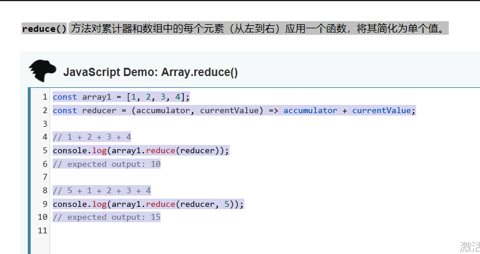

本地存储

#### 深度监视

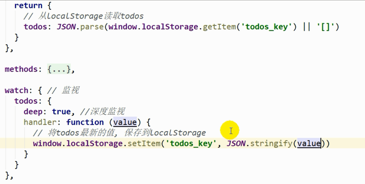

深度监视：这个值不止监视表面的值（地址值）而是监视内部任何的改变

存在localStorage，实际是用文件存

### 组件通信

1，props：之前案例有用

#### 2，自定义事件

$on $emit

适合父子组件

#### 3，publicjs

#### 4,solt

传递的是**标签**数据

当不一样的地方不仅仅是数据，而是一整个小组件的时候，需要传递标签。使用slot是最好的

### ajax请求


```vue
<template>
    <section class="jumbotron">
      <h3 class="jumbotron-heading">Search Github Users</h3>
      <div>
        <input type="text" placeholder="enter the name you search" v-model="searchName"/>
        <button @click="search">Search</button>
      </div>
    </section>
</template>

<script>
import PubSub from 'pubsub-js';
export default {
  name: 'search',
  data(){
      return {
          searchName:'',
      }
  },
  methods:{
      search:function(){
          const searchName = this.searchName.trim();
         
          if(searchName){
              PubSub.publish('search',searchName);
          }
      }
  },

}
</script>

<style>
.card {
  float: left;
  width: 33.333%;
  padding: .75rem;
  margin-bottom: 2rem;
  border: 1px solid #efefef;
  text-align: center;
}

.card > img {
  margin-bottom: .75rem;
  border-radius: 100px;
}

.card-text {
  font-size: 85%;
}

</style>

```

```vue
<template>
    <div class="row">
        <h2 v-if="firstView">请输入用户名</h2>
        <h2 v-if="loading">loading</h2>
        <h1 v-if="errorMsg">{{errorMsg}}</h1>
      <div class="card" v-for="(user,index) in users" :key="index">
        <a :href="user.url" target="_blank">
          
        </a>
        <p class="card-text">{{user.name}}</p>
      </div>
    </div>
</template>

<script>
import PubSub from 'pubsub-js';
import axios from 'axios'
export default {
  name: 'usermain',
  data(){
      return {
        firstView:true,
        loading : false,
        errorMsg:'',
        users:null
      }
  },
    mounted(){
        PubSub.subscribe('search',(msg,searchName)=>{
            console.log(this)
            const url = `https://api.github.com/search/repositories?q=${searchName}&sort=stars`;
            this.firstView= false;
            this.loading = true;
            this.users = null;
            this.errorMsg = '';
            axios.get(url).then(response=>{
                const users = response.data.items;
                this.loading = false;
                this.users = users.map(item=>({
                    url:item.owner.url,
                    avatarUrl:item.owner.avatar_url,
                    name:item.owner.login
                }));

            }).catch(error=>{
                this.loading = false;
                this.errorMsg = error
            })
        })
    }

}
</script>

```

> 注意：使用pubsub库时，PubSub.subscribe('search',(msg,searchName)
>
> 第一个参数时一个字符串，接受和发布的组件第一个参数需要相同，不是组件的名字
>
> 第二个参数需要时箭头函数，不然this指向为undefined

### ui组件库

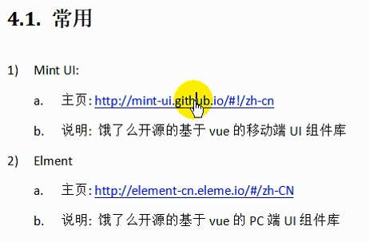

1，下载

2，注册成标签

3，在组件中直接使用

简化编码，已经写好了一些可以直接用的组件

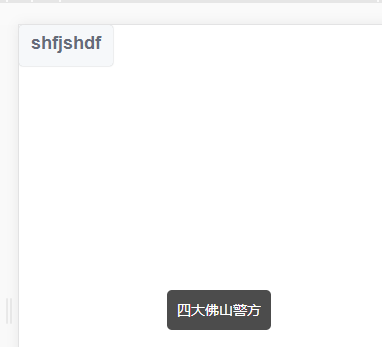

