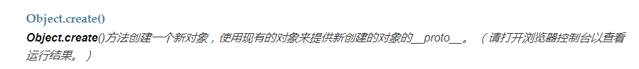

# 深入浅出vue.js

前言

什么是渐进式框架

vue的虚拟dom并不是让什么都变快了，是在80%场景下变快，20%下变慢了。

解决问题的一种方案背后是牺牲些什么

## 变化侦测

vue的响应式系统

什么是变化侦测

> 状态和dom之间存在一种映射关系，状态变化需要更新dom
>
> vue采用推的方式，状态变了，可以立马知道，并且知道状态对应的依赖dom。
>
> 如果依赖dom很精确，那么依赖追踪体系就会很耗内存
>
> vue将粒度做到组件层次，状态对应组件，在组件中对比虚拟dom来更新的对应的视图。

如何实现追踪变化

> Object.defineProperty 设定要监听的对象的set函数和get函数
>
> es6中的proxy也能实现
>
> es6是js语言的新标准，赋予了es6新特性

处理依赖

> get中收集依赖，set中触发依赖，就是组件中用到状态的地方全部更新
>
> 哪里用到了，get，哪里就收集依赖
>
> 通知对应的依赖，那么依赖是什么，由于要通知的地方有很多，并且类型都不一样，所以统一通知一个封装好的类的实例，叫做watcher。这个实例再去通知其他

const sub = [1,2,3];

console.log(sub.slice(),sub);

有啥用

因为vue中是使用循环为对象中的每个属性添加get和set方法。但是get和set方法只能跟踪变量是否被修改，删除和新增是检测不到，所以使用vm.$set,vm.$delete这两个api来实现

本章重点了解watcher的工作原理

---

## array的变化追踪

就是封装好数组的七个操作函数，使其可以通知更新

过程，就是使用Object.create来让一个对象继承array对象。之后再使用object.defineProperty为这个对象添加好要封装的函数设定vule为自定义的fucntion，然后在这个function中调用原型链上array对应的方法.

在observer中将需要双向数据绑定的数据,为其覆盖(做上面的操作)

#### watch的内部实现原理

为了可以实现取消监听功能,所以在watcher中存储了该变量依赖的列表

----

## 虚拟dom

vue2.0通过watcher将状态更新通知到组件，在组件中，通过虚拟dom来对比，更新需要改变的dom

> 提供与真实dom节点所对应的虚拟节点vnode
>
> 将虚拟节点vnode和旧虚拟节点oldvnode（将旧的缓存下来）进行对比，然后更新视图

----

## Vnode

vnode是一个js类，可以理解成节点描述对象，它描述了应该怎样去创建真实的dom节点

vnode有以下几种类型

注释节点，文本节点，元素节点，组件节点，函数式组件，克隆节点

克隆节点：当静态节点中状态发生改变时，很多时候他的节点属性什么不会发生改变，就直接用克隆节点

----

## patch

### 新增节点

1. 当oldvnode不存在的时候新增节点
2. 当oldvode和vnode是完全不同类型的节点的时候

### 删除节点

1. 只有oldvnode存在的时候，删除节点
2. 当新增节点时将旧的节点删除

### 更新节点

什么是静态节点：就是在运行时，无论状态是否发生变化，都不影响到这个节点。这个节点都不需要渲染

### 更新子节点（非常重要）

更新子节点可以分为4种操作：更新节点，新增节点，删除节点，移动节点位置

创建子节点

将创建的节点加入未处理（没有进行任何更新操作的节点）节点的前面

vue是个跨平台的框架，weex平台对节点的操作与web平台并不相同0

---

## 实例方法与全局api的实现原理

$watch $set $delete这三个方法是在stateMixin中挂载到vue原型中，与双向数据绑定有关

事件相关

$on $once $off $emit

  事件触发机制，和双向数据绑定相同都是采用，收集依赖，触发依赖 的方式来实现

生命周期相关的实力方法

$mount $forceUpdate $nextTick $destroy

#### $forceUpdate

使实例重新渲染，影响实例本身以及插入插槽内容的自组件，而不是所有的字组件

实现原理就是手动执行了watcher中的update方法，（因为当数据变化了，会调用update方法来重新渲染）

#### $destory

删除掉与其他组件的链接，将父组件的$children中删除自己，再将watcher所有的依赖追踪断掉teardown方法？？
再讲所有用户定义的$watcher去除，通过属性，watchers每次创建实例，都会讲watcher实例添加到这个属性中。

#### $nextTick

首先，watcher触发渲染是异步的，不是同步的，（js的异步事件队列），

所以执行宏任务，即使是写在数据更新之前，也是渲染dom之后，因为先执行微任务，再执行宏任务

nextTick则需要放在更新数据之后，因为更新数据，会产生更新dom的回调微任务，两者都是微任务，只有写在后面，才会拿到已经更新dom的钩子

vue内部，有防止同一个事件周期内，执行多个nextick函数

将用户注册的nexttick回调函数存储在一个数组里面，并且用一个变量来判断，是否想微任务中添加了任务，防止添加多个，当任务触发时，将数组中所有用户申明的函数执行。

由于微任务优先级太高，有些场景需要用到宏任务，

macrorimerFunc

vue优先使用serImmediate来实现，messageChannel为备选方案，最后会使用setTimeout

mount没看，看不懂

---

## 全局api的实现原理

Vue.extend

创建一个子类，这个子类继承vue

#### Vue.directive

注册或获取全局指令

指令，封装好，对普通dom元素进行底层操作，使用自定义指令

添加好自定义指令之后监听bind和update方法来触发

#### Vue.filter

注册或获取全局过滤器

可在双花括号表达式和bind指令中使用，放到`|`管道符后来使用

#### Vue.mixin

将传入的组件中的options和vue的合并在一起，所以会影响所有的注册之后创建的每一个vue实例

#### Vue.compile

变异模板字符串并返回包含渲染函数的对象

---

## 生命周期

好好看，很重要

#### 模板编译阶段

将模板编译为渲染函数

callhook函数为调用生命周期函数，生命周期钩子会放进列表里面，因为mixins可能会重写生命周期钩子函数，执行时，会依次执行列表里面的钩子函数。这是一种合并options的策略

errorcaptured钩子函数的作用是捕获来自子孙组件的错误，捕获钩子函数内发生的错误

#### 挂载阶段

将模板渲染到指定的dom元素中，在挂载的过程中，vue会开启watcher来持续追踪依赖的变化

#### 卸载阶段

#### 初始化实例属性

$开头的属性是提供给用户使用的外部属性，以_开头的属性是提供给内部使用的内部属性

$parent向上找到第一个不为抽象类父组件，$children则是子组件主动添加到父组件这个属性中的

$root，如果一个组件他没有父组件，那么他就是$root，如果有，直接拿他父组件的$root，依次传递下去

#### 初始化事件

将父组件中的v-on注册是事件添加到子组件的事件系统中

inject和provide

inject在初始化之前，目的是让用户可以再data中使用inject所注入的内容

inject的使用原理：依次向上寻找父组件中是否provide该内容

使用provide注入内容时，其实是将内容注入到当前组件实例的_provide中，inject可以从父组件这个属性中获取注入内容

#### 初始化状态

什么是props

为什么methods中的方法可以通过this访问，data在vue.js内部是什么样的，coumputed是如何工作，watch原理

先初始化props，再初始化data，再初始化watcher ，watcher既可以观察props也可以观察data

props初始化，就是将定义好的props规格化，通过规格化后的props从其父组件传入的props数据中筛选出需要的数据保存在vm._props中，然后在vm上设置一个代理，实现通过vm.x访问vm.__props.x

methods初始化，就是校验方法是否合法，并确定是否有重名并且props已经声明过了会发出警告，之后挂载到vm中

 computed初始化，computed是数据发生变化后，将计算属性的dirty属性设置为false，说明这次取值需要重新计算，如果为true，则不需要重新计算。这次计算的值变了才去执行渲染函数

自定义指令没看

#### 过滤器的奥秘

自定义过滤器来格式化文本

过滤器可以传参和串联

传参，{{a | mony('b','c')}}

这里面会把管道前面的变量作为mony的第一个参数，b，c为第二第三个参数

串联表示可以使用多个过滤器

---

## 最佳实践

在v-for中使用key会加快更新dom的速率

在v-if和v-else使用key 会避免vue重用dom带来意想不到的结果

利用虚拟dom渲染时通过key来对比两个节点是否相同

为所有路由添加一个query

   

props向下传递，事件向上传递 ，会让组件更容易理解

js中更多使用驼峰式命名，字html中用横线链接 