# vue

## vue大厂最佳实践

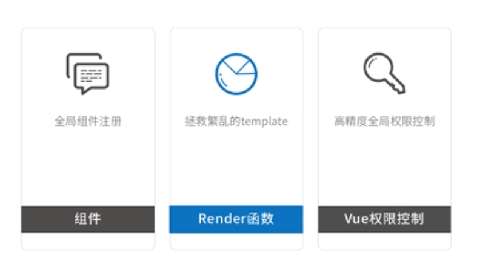

1，全局组件注册

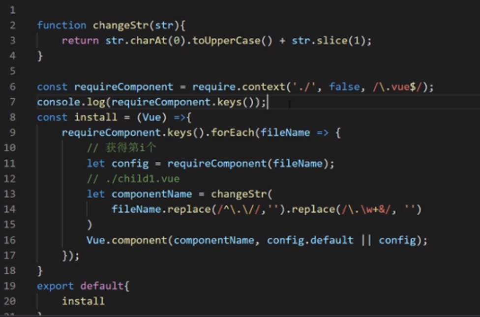

插件安装全局组件

require.context是webpack的方法

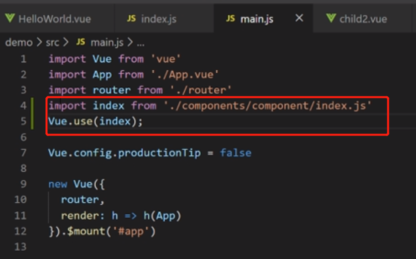

Vue.use()  require.context

---

业务分层

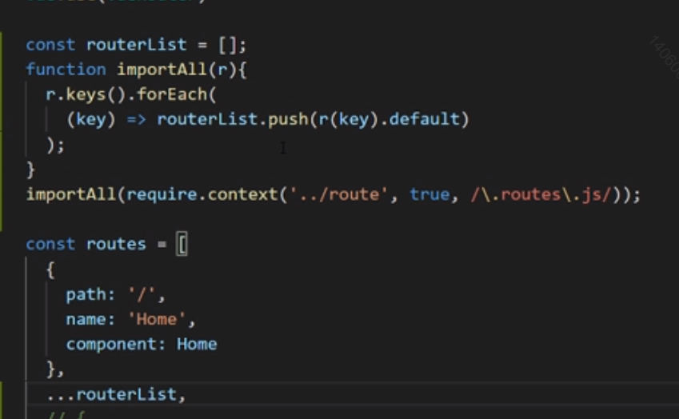

require.context用来拿多个文件，

**而不用新增一个文件，就import一个新的，然后在...引入**，不用维护，组件写好就行

default就是拿模块默认暴露出的东西

懒加载的原理：路由一点击的时候执行import

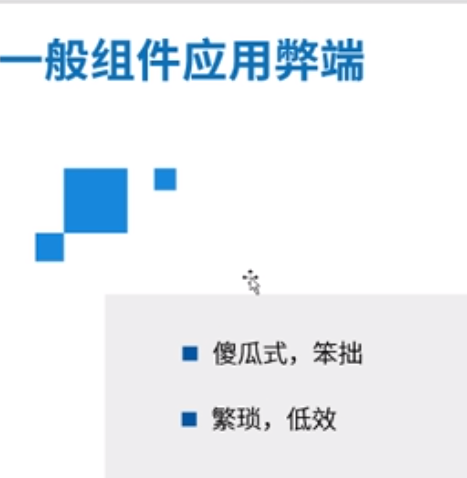

---

render函数

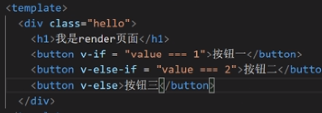

render中的h就是createElement

render中创建的dom和template中创建的dom有什么区别

vue模板做出的是虚拟dom

render函数生成的是真实dom。（render省去了转义成vnode的过程）

在js中写复杂逻辑

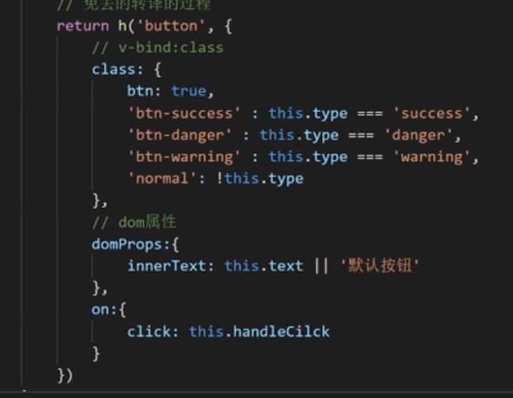

template值判断多，vnode

全局权限控制

全局自定义指令来做权限

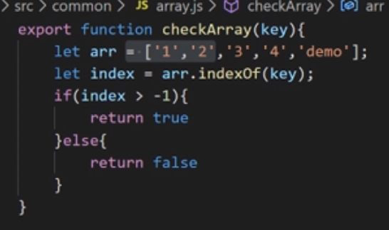

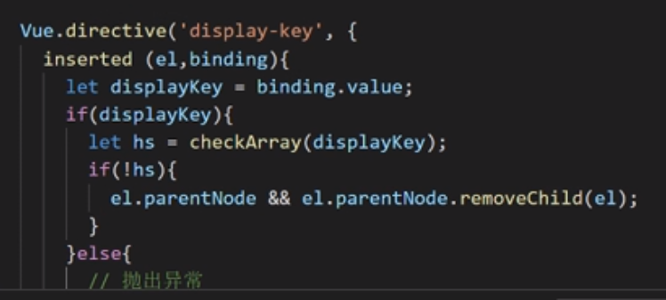

----

简易的存储一个变量

用一些替代的（其实不会去用）

----

#　ｖｕｅ技巧

- vuex的替代方案
- 打包优化
- 插件解决项目中问题

## vuex替代

1，bus

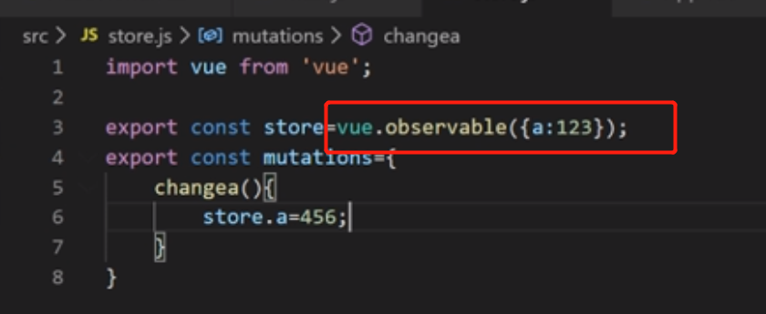

使用vue.observable来监听变量

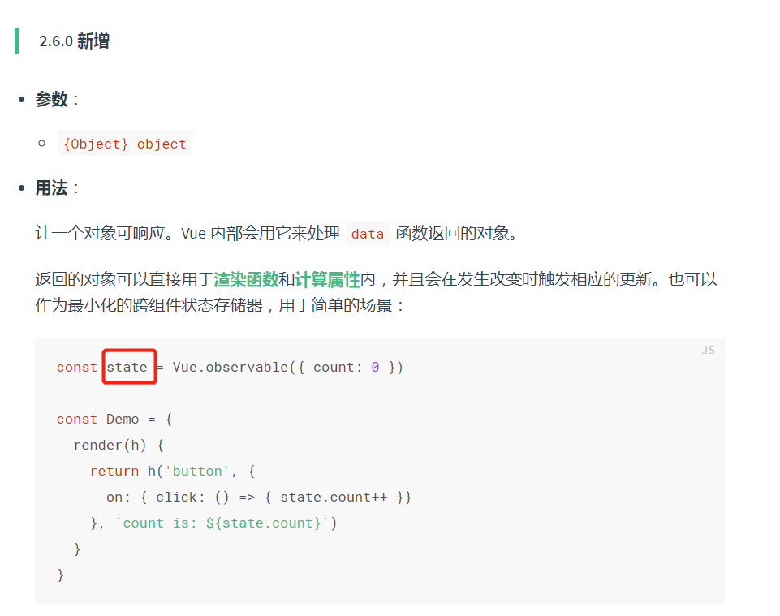

