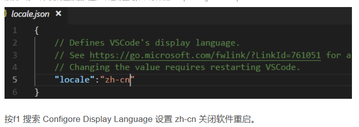
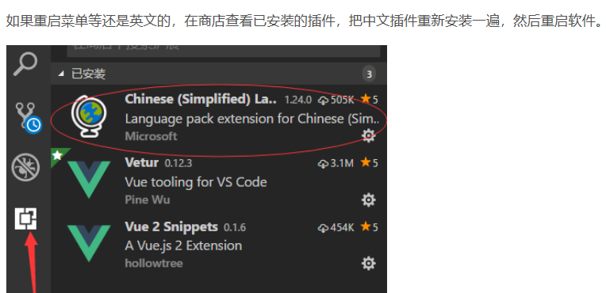

# 编辑器使用技巧

写在前面：以后因为生活工作变化，一定还会遇到同样的配置问题，记录好，节约时间

## vscode

### 1,配置中文

1）ctrl+shif+p 输入Configore Display Language改成zh-CN

2 ） 在插件中安装 Chinese插件

### 3，vue高亮

安装vetux

ctrl+shift+x打开插件搜索框

### 4，设定文件模板

