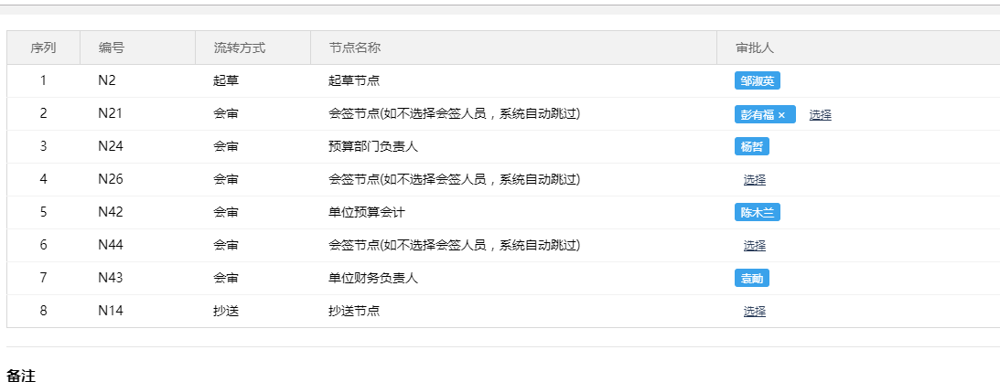
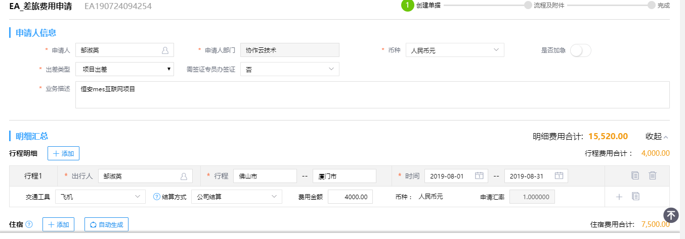
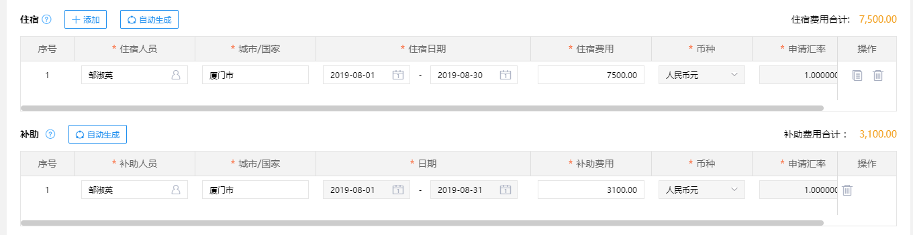
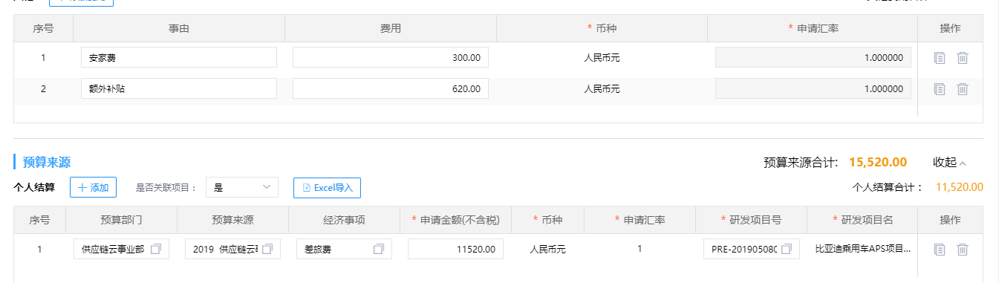
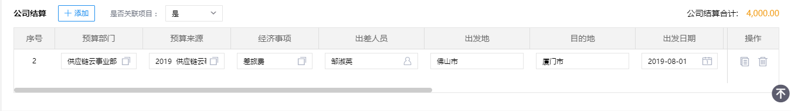

邹宁东
记住手上工作
能我工作做什么
提前一个月
最后五天发一个离职申请
加班一定要打卡:
没打好就要不签
9点 4点半
八个小时
异地补签
至少星期五
星期四 项目经理 直线经理
至少4小时才算加班
五一 10.1-3三倍工资
晚上加班，也要走加班流程（平日加班流程）算的是项目奖金
外部平时加班是义务加班（？）
平日加班不可补休
部门总监（四天及四天以上）
病假和孕假是基本工资
尽量用调休假
美福我的保险可以看
餐补16
项目奖金是做完了发
活动经常参加
年会发钱
买车一万五，发三年每年五千、
买房：一年一万，补10年
0，97 0,97 0.95
广州，深圳
西门美创和总部

公积金可以直接取出来佛山

美的借钱6%的利息（可以不还本金）按时还不会上真信

商务信用卡（招商银行，中信银行），一万五（出差ec单）

每个月十号之前就收集物资

### 公务财务报销规定

报销主体是广东美云

提前申请差旅EA申请 ，EC报销单 引用之前的EA，不能超过之前申报的预算（发票最重要，寄回来报销（邹宁东，走到小财那一步就可交单））

大于1000的金额必需要？？？抵扣联，支付记录，发票，坐车发票，火车票一定要留着（用信用卡留下票根）

住宿必须找酒店要就宿清单，专用发票，办公费也要专用发票（发票注意是广东美云）

我们是美亚的会员8折

以公司名义租房子，以广东美云签合同并专用发票

下个月2号之前，把自己所有的出勤异常处理掉

有打印的权限，点击打印就可打印（每层的文印室）

补签（请假中心中就可以 ）

我们有wiki吗？？ 

----

周四提申请，最迟周五。

临时加班：先打卡，在周一之前把流程走完

一定要写加班原因 加班时间和打卡时间取交集

项目经理+直线经理 考勤人邹宁东   内部项目加内部负责人   薪资专员： 王珊珊

到时间了就一定能够要（群里）催一下  

补签理由：打卡失败  在项目上（直接选领导）

-----

### 填写ea单

1390+1390+<2000   = 4000   

1500机票报4500

个人结算是自己出钱，

安家费就是第一次去这个项目才有

两个礼拜可以回一次base地，住宿如果安排了宿舍就不用申请

三个礼拜不回补贴500这个就有补贴，去其他地方就可以去比回base地便宜的地方。

预算不能估计低了，不能太高。

额外补贴是看补助是120还是100

项目出差，一定要

http://emsnew.midea.com/portal/#/

再加项目经理

-----

#### 填写ec单

任务什么时候交，做成什么样可以达成任务目的，谁能够提供帮助，是最高效的，

知识库

---

#### 写文档

功能设计，技术团队写详细设计

数字和字符前后加空格

每个功能但令出来

添加注释 对齐

代码不整洁

养成好的习惯

写的文档就是给别人看，一直坚持这个原则。

对做的最好的同事学习，对自己能有多高要求就有多高

详细设计，描述清楚开发人员该怎么做

有的时候就是要借助别人的力量来解决

当事人沟通解决不了，就找他的上级，如果也解决不到，就找自己的上级找他的上级。

该找上级就找商机，该麻烦就应该麻烦

带着问题去参加培训

第一个工作很重要就是决定了领导的印象

7点到公司

看书到8：30

晚上一定会看书

工作学习

如果没有上升空间，我一定会走掉

对事情的总结（成长），努力成为大家都喜欢的人，做任何事超出别人的预期，帮别人想到别人先鼓捣的东西

每天有什么意义的事情，学会了什么记下来

1，优秀的人学习（习惯）

2，学不到就自己去看书

看书之后拿去用才能变成自己的

改变自己的思想的书

改变思维，习惯做法的书