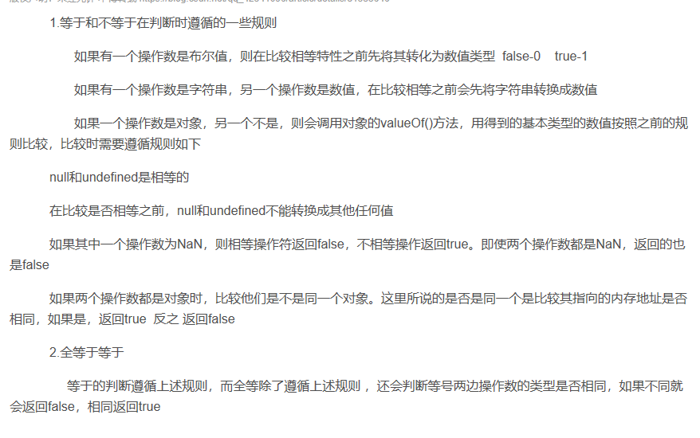

# JavaScript语言精粹

---

1，js的精粹：1）对象字面量表示法--通过列出对象的组成就可以简单创建对象

​		2）弱类型

​		3）原型继承--无类型的对象系统，对象直接从其他对象继承属性

​	js糟粕：全局变量体系

---

js中全等与等于的区别

等于：

如果一个操作数是布尔值，就将布尔值转化为数字

如果一个操作数是字符串，就把字符串转化为数字

如果一个操作数是对象，另一个不是，调用对象的valueof得到数值进行之后比较。两个都是对象，比较地址

另外

null和undefined是相等，参与比较，二者都不能转化为其他值

NaN不等于任何包括他NaN

全等在等于之上在比较类型是否相同

---

3，js中以下都被当做false，其余都是true，包括“false”以及所有的对象

false，null，NaN，undefined，空字符串，数字0

---

