。TCP/IP 协议族按层次分别分
为以下 4 层：应用层、传输层、网络层和数据链路层TCP（Transmission Control
Protocol，传输控制协议）和 UDP（User Data Protocol，用户数据报
协议）。

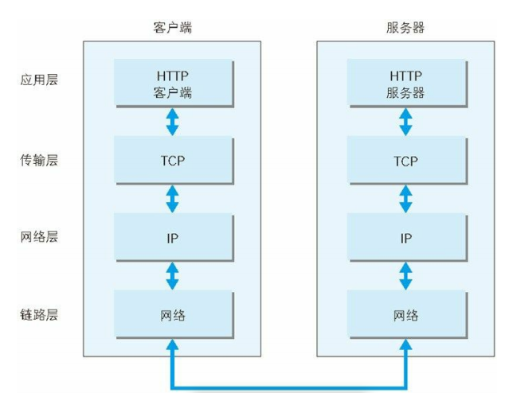

DNS（Domain Name System）服务是和 HTTP 协议一样位于应用层的
协议。它提供域名到 IP 地址之间的解析服务。

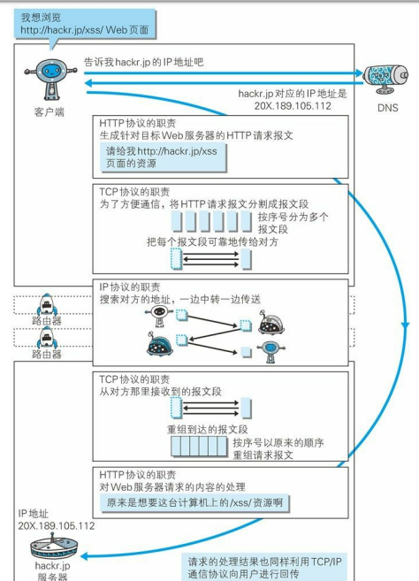

与 URI（统一资源标识符）相比，我们更熟悉 URL（Uniform
Resource Locator，统一资源定位符）。  URI 用字符串标识某一互联网资源，而 URL表示资源的地点（互联
网上所处的位置）。可见 URL是 URI 的子集。

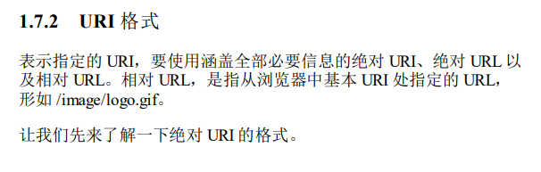

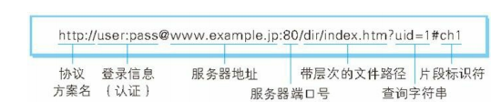

----

## 第二章 简单的http协议

HTTP 是不保存状态的协议

PUT：传输文件
PUT 方法用来传输文件。就像 FTP 协议的文件上传一样，要求在请
求报文的主体中包含文件内容，然后保存到请求 URI 指定的位置。

HEAD：获得报文首部
HEAD 方法和 GET 方法一样，只是不返回报文主体部分。用于确认
URI 的有效性及资源更新的日期时间等。

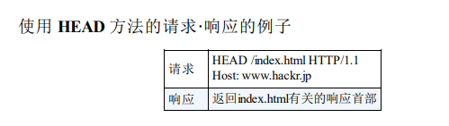

DELETE：删除文件
DELETE 方法用来删除文件，是与 PUT 相反的方法。DELETE 方法按
请求 URI 删除指定的资源。

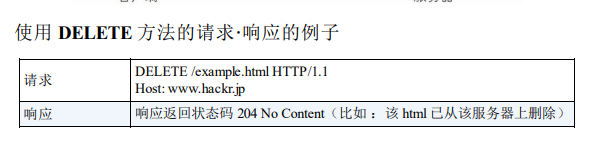

OPTIONS：询问支持的方法
OPTIONS 方法用来查询针对请求 URI 指定的资源支持的方法。

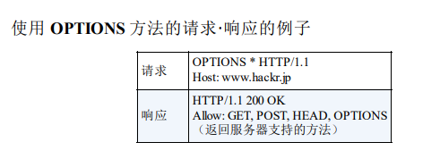

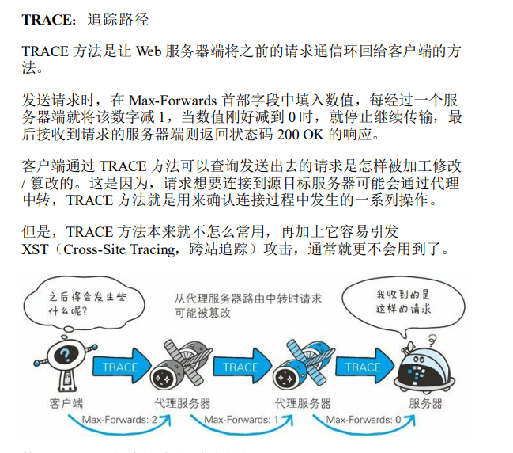

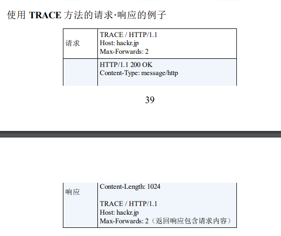

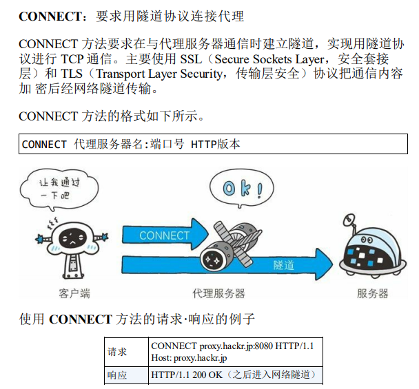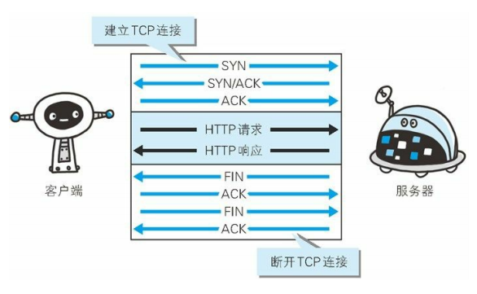

持久连接
为解决上述 TCP 连接的问题，HTTP/1.1 和一部分的 HTTP/1.0 想出了
持久连接（HTTP Persistent Connections，也称为 HTTP keep-alive 或
HTTP connection reuse）的方法。持久连接的特点是，只要任意一端
没有明确提出断开连接，则保持 TCP 连接状态。

持久连接旨在建立 1 次 TCP 连接后进行多次请求和响应的交
互

管线化

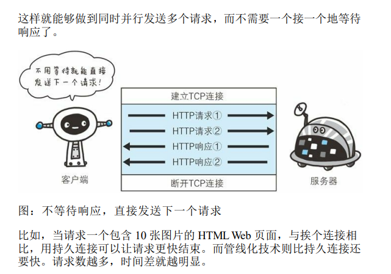

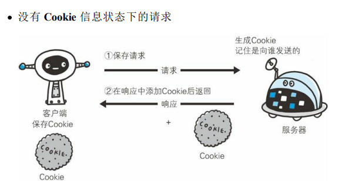

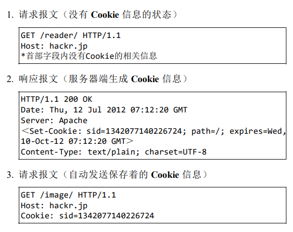

--------

## 第 3 章 HTTP 报文内的 HTTP信息

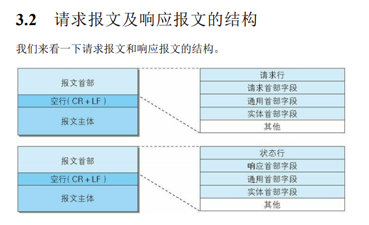

请求报文和响应报文的首部内容由以下数据组成。现在出现的各种首
部字段及状态码稍后会进行阐述。
请求行
包含用于请求的方法，请求 URI 和 HTTP 版本。
状态行
包含表明响应结果的状态码，原因短语和 HTTP 版本。
首部字段
包含表示请求和响应的各种条件和属性的各类首部。
50
一般有 4 种首部，分别是：通用首部、请求首部、响应首部和实体首
部。其他
可能包含 HTTP 的 RFC 里未定义的首部（Cookie 等）

压缩传输的内容编码
并保持实体信息原样压
缩。内容编码后的实体由客户端接收并负责解码。

常用的内容编码有以下几种。
gzip（GNU zip）
compress（UNIX 系统的标准压缩）
deflate（zlib）
identity（不进行编码）

分割发送的分块传输编码

分块传输编码会将实体主体分成多个部分（块）。每一块都会用十六
进制来标记块的大小，而实体主体的最后一块会使用“0(CR+LF)”来标
记。

多部分对象集合的每个部分类型中，都可以含有首部字段。另外，可
以在某个部分中嵌套使用多部分对象集合。有关多部分对象集合更详
细的解释，请参考 RFC2046。

多种对象数据

要实现该功能需要指定下载的实体范围。像这样，指定范围发送的请
求叫做范围请求（Range Request）。
对一份 10 000 字节大小的资源，如果使用范围请求，可以只请求
5001~10 000 字节内的资源。

针对范围请求，响应会返回状态码为 206 Partial Content 的响应报
文。另外，对于多重范围的范围请求，响应会在首部字段 Content-
Type 标明 multipart/byteranges 后返回响应报文如果服务器端无法响应范围请求，则会返回状态码 200 OK 和完整的
实体内容

----

内容协商：按请求头字段，来协商返回的内容

Accept
Accept-Charset
Accept-Encoding
Accept-Language
Content-Language

----

第 4 章　返回结果的 HTTP 状态码

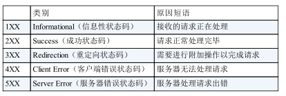

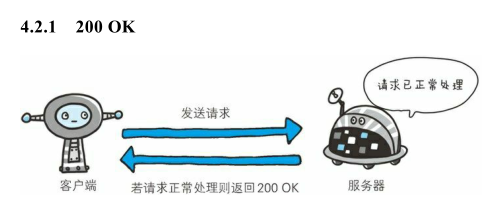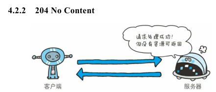

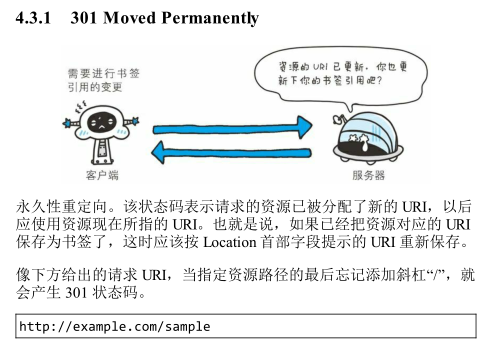

是怎么识别的呢，怎么做到重定向呢

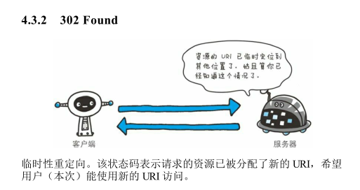

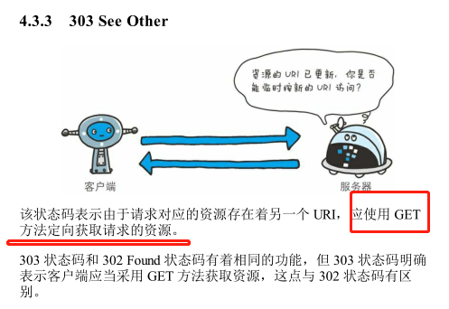

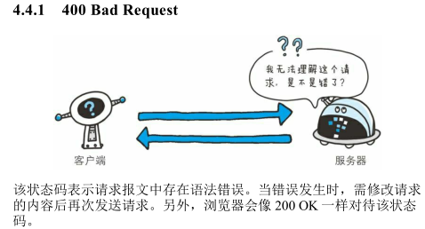

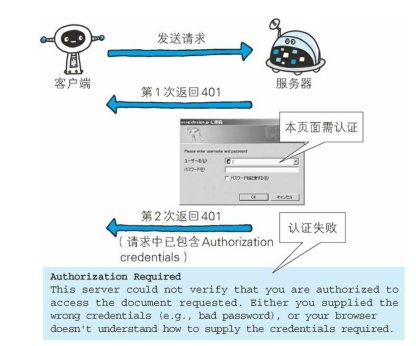

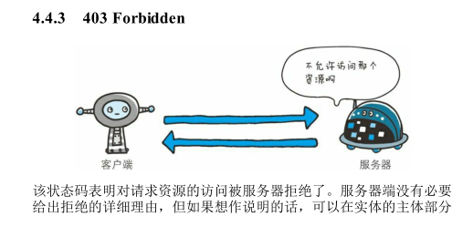

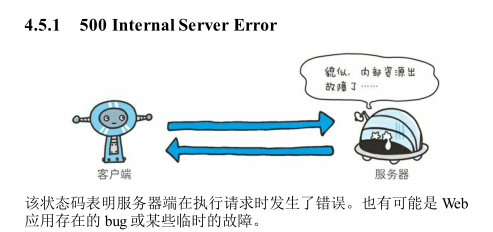

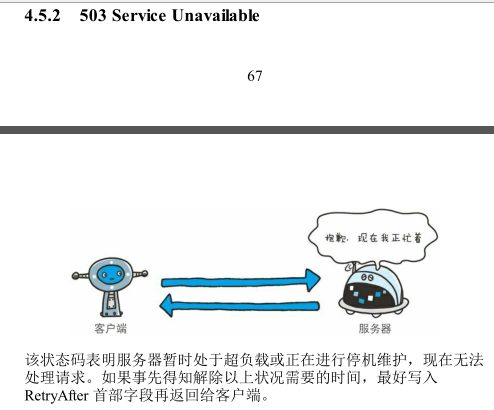

