# 穷爸爸富爸爸

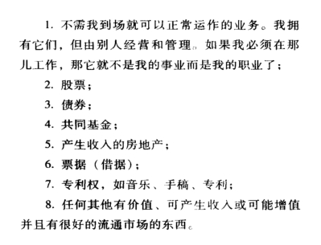

经营自己的事业，关注自己的工作的同事，经营自己的事业

每一块钱都是我的雇员，让他们去带来更多的雇员

（经营自己的事业）找到投资机会

养成财商，财商由这四部分组成

会计：财务知识，钱越多就需要越精确。读懂财务报表  细节

投资：策略和方案

市场：

法律

----

积极发现机会

开发自己的财商

关注变化来快速赚钱

买入卖出赚差价是作者最推崇

破产财产

花时间提高自己的财商，增强自己的动脑能力

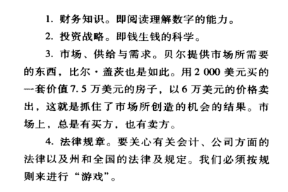

小额播种，精通游戏规则的那群人获益，这就需要不停的锻炼自己的财商

失败是成功之母。在投资的道路上可定会有很多挫折和失败，从中学习

寻找别的忽视的机会

学会融通资金的技巧

如何把聪明的人集合起来，因为这样你有值得信赖的顾问

先付出钱，之后获得更多的钱

----

第八课，克服困难

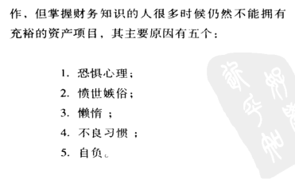

不要害怕失败

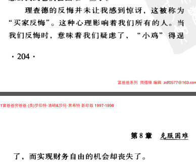

不要听着小鸡叫，天要塌下来了，买贵了。正确识别哪些小鸡。不要把别人说的话，不经过思考就听进去.

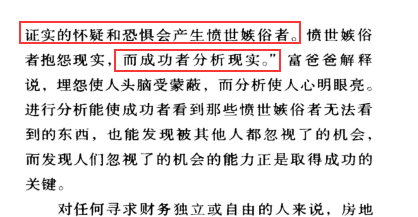

冷静分析现实

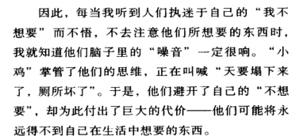

不想要的噪音会影响你获得你想要的东西，会蒙蔽你的脑子，不去思考你想要的，当看到你不想到的情况时

勤于思考

思考如何去做到这个

而不是觉得自己做不到

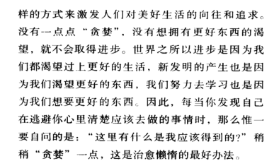

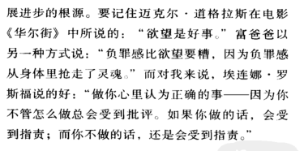

为了盈利而理财

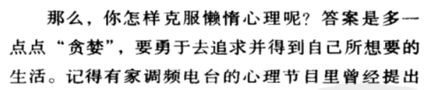

时刻想着我要怎么做到这个

贪婪的想着，积极

要成好的理财习惯，其他习惯也很好，慢慢养成

开始激发理财的是个步骤

1，需要超现实的理由----精神力量来支持我面对未来的种种

2，每天作出自己的选择

我们的用钱习惯表明了我们是个什么样的人

我们每天都在选择，选择如何支配自己的时间，选择如何支配自己的钱

投资教育

做一个冲浪者，思考如何在下一个浪中高高托起

3，看交朋友，财商，内幕消息

4，掌握一种模式，然后在学习一种新的模式

5，首先支付自己----如果不能控制自己，那么就别想着致富，是否缺乏自律是区分富人穷人中产的首要因素

关注自己的产品，服务，专业技能

现金流管理

人事管理

个人时间管理

首先支付自己

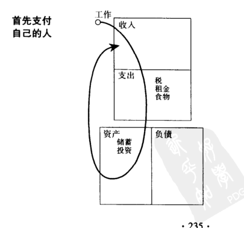

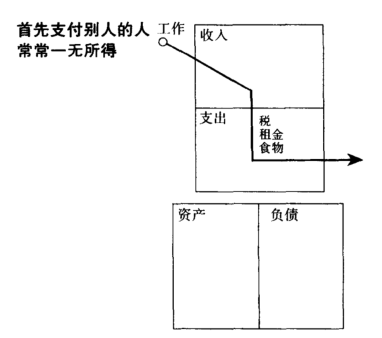

首先支付自己，先满足自己的资产下的需求，问：什么是自己资产下的需求，问问问，支付给自己，给自己赚钱的，而不是消费支付给别人，给别人赚钱

---

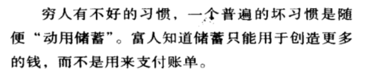 

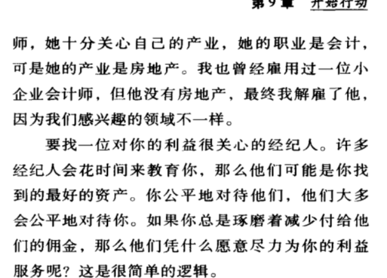

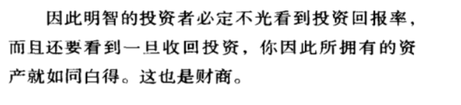

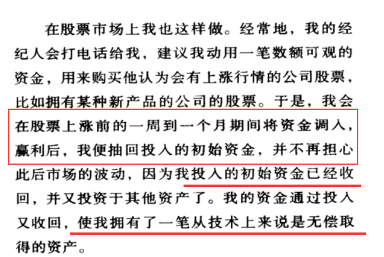

8、资产用来购买奢侈品

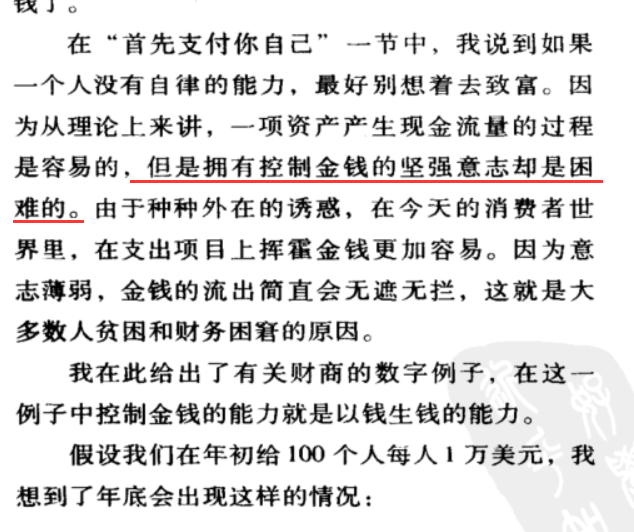

9、对英雄的崇拜

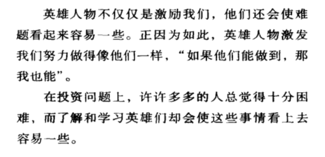

10，先予后取

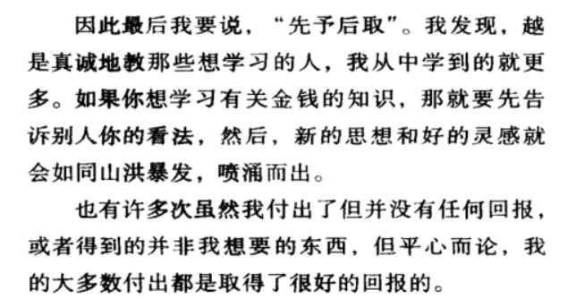

这个真的比较试用人际关系，对于其他地方，就是想着自己要得到什么就先付出什么

传授知识

第10章

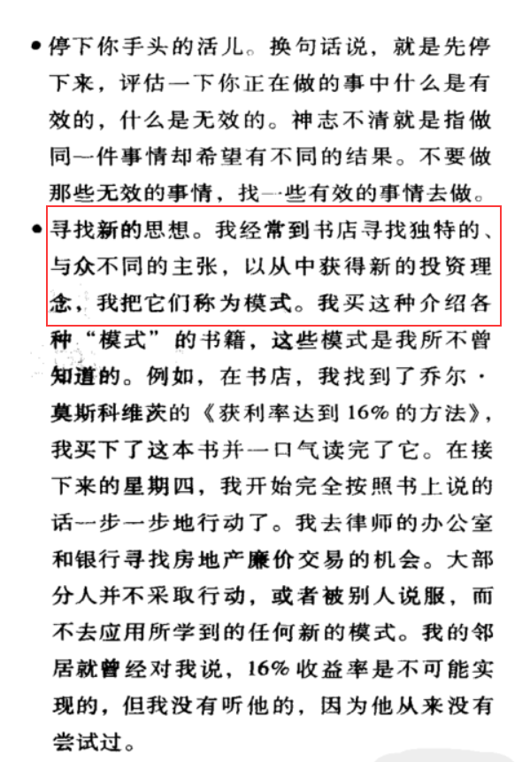

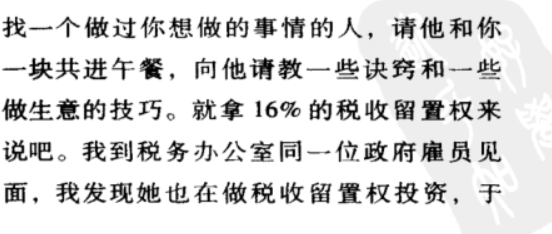

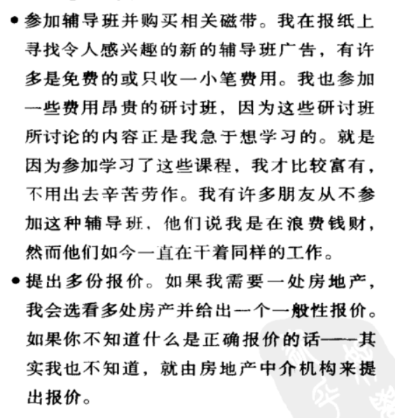

能盈利的东西都有两个特点1)廉价 2）就是有变化，有增值的可能

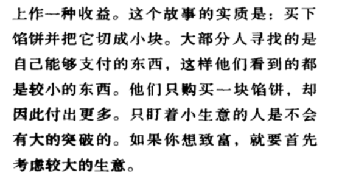

孩子受到良好的教育的同时，自己退休后舒适的生活的费用

