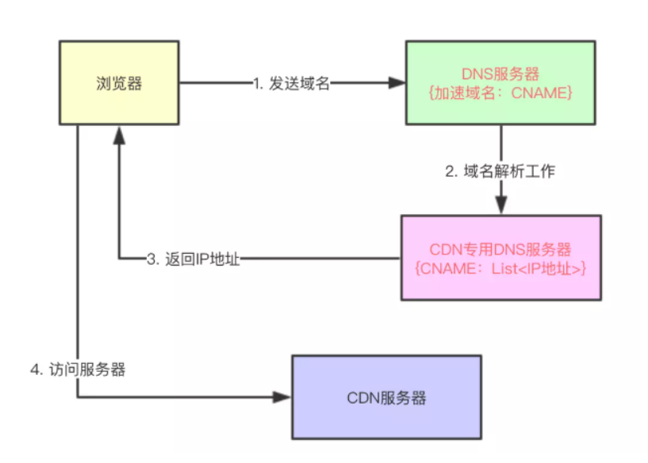

cdn怎么找到最近的站点

你的猜测是对的，就是基于你的IP,DNS返回一个最近的服务器。所以对cdn来说，维护一个准确及时的ip数据库非常重要。

# cdn的原理

休息一下，等下看这个，cdn的原理

如图所示是通过CDN进行请求响应的过程图。通过图中可以看出，在DNS解析域名时新增了一个`全局负载均衡系统（GSLB）`，GSLB的主要功能是根据用户的本地DNS的IP地址判断用户的位置，筛选出距离用户较近的`本地负载均衡系统（SLB）`，并将该SLB的IP地址作为结果返回给本地DNS。SLB主要负责判断`缓存服务器集群`中是否包含用户请求的资源数据，如果缓存服务器中存在请求的资源，则根据缓存服务器集群中节点的健康程度、负载量、连接数等因素筛选出最优的缓存节点，并将HTTP请求重定向到最优的缓存节点上

为了更清晰地说明CDN的工作原理，下面以客户端发起对"join.qq.com/video.php"的HTTP请求为例进行说明：

1. 用户发起对"join.qq.com/video.php"的HTTP请求，首先需要通过本地DNS通过"迭代解析"的方式获取域名"join.qq.com"的IP地址；
2. 如果本地DNS的缓存中没有该域名的记录，则向`根DNS`发送DNS查询报文；
3. `根DNS`发现域名的前缀为"com"，则给出负责解析`com`的`顶级DNS`的IP地址；
4. 本地DNS向`顶级DNS`发送DNS查询报文；
5. `顶级DNS`发现域名的前缀为"qq.com"，在本地记录中查找负责该前缀的`权威DNS`的IP地址并进行回复；
6. 本地DNS向`权威DNS`发送DNS查询报文；
7. 权威DNS查找到一条NAME字段为"join.qq.com"的`CNAME记录`（由服务提供者配置），该记录的Value字段为"join.qq.cdn.com"；并且还找到另一条NAME字段为"join.qq.cdn.com"的A记录，该记录的Value字段为GSLB的IP地址；
8. 本地DNS向GSLB发送DNS查询报文；
9. GSLB根据`本地DNS`的IP地址判断用户的大致位置为深圳，筛选出位于华南地区且综合考量最优的SLB的IP地址填入DNS回应报文，作为DNS查询的最终结果；
10. 本地DNS回复客户端的DNS请求，将上一步的IP地址作为最终结果回复给客户端；
11. 客户端根据IP地址向SLB发送HTTP请求："[join.qq.com/video.php](https://join.qq.com/video.php)"；
12. SLB综合考虑缓存服务器集群中各个节点的资源限制条件、健康度、负载情况等因素，筛选出最优的缓存节点后回应客户端的HTTP请求（状态码为302，重定向地址为最优缓存节点的IP地址）；
13. 客户端接收到SLB的HTTP回复后，重定向到该缓存节点上；
14. 缓存节点判断请求的资源是否存在、过期，将缓存的资源直接回复给客户端，否则到源站进行数据更新再回复。

其中较为关键的步骤为6~9，与普通的DNS过程不同的是，这里需要服务提供者（源站）配置它在其权威DNS中的记录，将直接指向源站的A记录修改为一条CNAME记录及其对应的A记录，CNAME记录将目标域名转换为GSLB的别名，A记录又将该别名转换为GSLB的IP地址。通过这一系列的操作，将解析源站的目标域名的权力交给了GSLB，以致于GSLB可以根据地理位置等信息将用户的请求引导至距离其最近的"缓存节点"，减缓了源站的负载压力和网络拥塞。

以上主要介绍了目前CDN中最为常见的工作方式，这种工作方式利用CNAME将域名和目标IP之间进行解耦，将目标IP的解析权下放到GSLB中，方便实现更多自定义的功能，是一种更加灵活的方式。

作者：kk_miles
链接：https://juejin.im/post/6844903873518239752
来源：掘金
著作权归作者所有。商业转载请联系作者获得授权，非商业转载请注明出处。

---

gslb在dns的时候分析出最近的缓存节点

https://www.jianshu.com/p/1dae6e1680ff

cdn加速原理

---

在请求某个域名时，LDNS 一般有两个情况：一种是域名在 LDNS 上有记录，另一种情况是没有记录，两种情况的处理流程不一样。

- 假设当访问 163 这个域名时，如果 LDNS 上有缓存记录，那它会直接将 IP 地址吐出来。
- 如果没有缓存记录，它将会一步步向后面的服务器做请求，然后将所有数据进行汇总后交给最终的客户，这个环节术语叫”递归“。

在完全不命中情况，LDNS 首先会向全球13个根域服务器发起请求，询问 .com 域名在哪里，然后根域服务器作出回答，然后去向 .com 的服务器询问 .163.com 在哪里，一步步往下，最后拿到 www.163.com 这个域名所对应的 IP 地址。这个过程较复杂，如果大家感兴趣可去查相关资料，在这就不一一赘述。

当业务需要接入到 CDN 时，用户只需调整自己的 DNS 配置信息，将 A 记录改为 CNAME 记录，将内容改为 CDN 厂商所提供的接入域名即可。

302大盘cname上的cdn加速服务上

----

## Cdn有哪些优化静态资源加载速度的方法？

可以参考阿里云团队的[《CDN之我见》](https://yq.aliyun.com/articles/577708?spm=a2c41.11181499.0.0)。总结如下：

资源调度：CDN会根据用户接入网络的ip寻找距离用户最优路径的服务器。调度的方式主要有DNS调度、http 302调度、使用 HTTP 进行的 DNS 调度（多用于移动端）； 缓存策略和数据检索：CDN服务器使用高效的算法和数据结构，快速的检索资源和更新读取缓存； 网络优化：从OSI七层模型进行优化，达到网络优化的目的。 L1物理层：硬件设备升级提高速度 L2数据链路层：寻找更快的网络节点、确保 Lastmile 尽量短 L3路由层：路径优化，寻找两点间最优路径 L4传输层：协议TCP优化，保持长连接、TCP快速打开 L7应用层：静态资源压缩、请求合并

