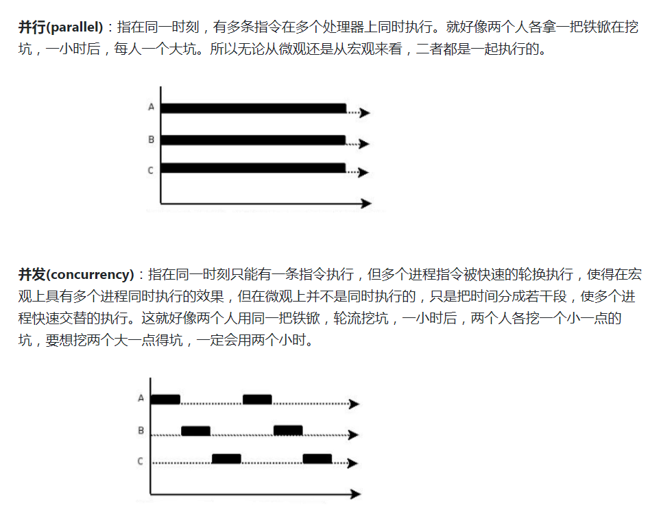
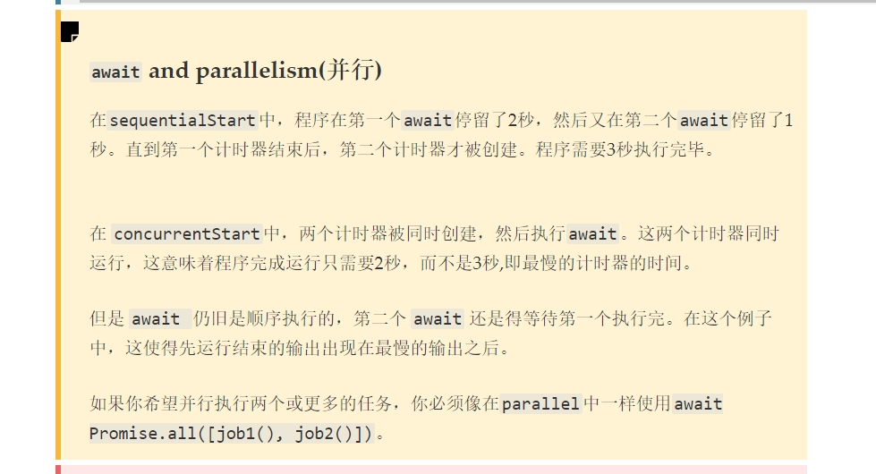

**使用for await of遍历时，会等待前一个Promise对象的状态改变后，再遍历到下一个成员。**

```js
var sleep = function (time, i) {
      return new Promise(function (resolve, reject) {
        setTimeout(function () {
          console.log(i)
          resolve(i);
        }, time);
      })
    };
let tasks = [];
for (let i = 0; i < 5; i++) {
    tasks.push(sleep(1000,i));
}
async function a(tasks){
  await Promise.all(tasks);
}
a(tasks)
MyPromise.all = function (promises) {
      return new Promise((resolve, reject) => {
        if (promises.length === 0) {
          resolve([]);
        } else {
          let result = [];
          let index = 0;
          for (let i = 0; i < promises.length; i++) {
            promises[i].then(data => {
              result[i] = data;
              if (++index === promises.length) {
                resolve(result);
              }
            }, err => {
              reject(err);
              return;
            });
          }
        }
      });
    }

promise.all并发（一起执行，然后）
```

```js
var sleep = function (time, i) {
      return new Promise(function (resolve, reject) {
        setTimeout(function () {
          console.log(i)
          resolve(i);
        }, time);
      })
    };
let tasks = [];
for (let i = 0; i < 5; i++) {
    tasks.push(sleep(1000,i));
}
async function a(tasks){
  await Promise.all(tasks);
}
a(tasks)
MyPromise.all = function (promises) {
      return new Promise((resolve, reject) => {
        if (promises.length === 0) {
          resolve([]);
        } else {
          let result = [];
          let index = 0;
          for (let i = 0; i < promises.length; i++) {
            promises[i].then(data => {
              result[i] = data;
              if (++index === promises.length) {
                resolve(result);
              }
            }, err => {
              reject(err);
              return;
            });
          }
        }
      });
    }
// sleep函数，和promise没两样，await就是promise的语法糖
const sleep = (time) => {
  return new Promise(resolve => setTimeout(resolve, time))
}
async function sleepAsync() {
  console.log('fuck the code')
  await sleep(1000)
  console.log('fuck the code again')
}
sleepAsync()
```



并行要用promise.all

sleep要用await，也可以用promise。。await底层也是promise

---

## await 原理

**await会等待后面的promise完成，如果await后面不是promise,它会把它转换成立即resolve的promise，就是 Promise.resolve(val)**

#### 基本原理

async / await 本质上是 generator 的语法糖，与 generator 相比，多了以下几个特性：

- 内置执行器，无需手动执行 `next()` 方法
- **await 后面的函数可以是 promise 对象也可以是普通 function，而 yield 关键字后面必须得是 thunk 函数或 promise 对象**

**第二点就说明为啥如果不是promise，会没啥效果**

```js
async function fn(args) {
  // ...
}
```

等同于：

```js
function fn(args) {
  return spawn(function* () {
    // ...
  });
}
```

而 spawn 函数就是所谓的自动执行器了

```js
function spawn(genF) {
  return new Promise(function(resolve, reject) {
    const gen = genF();
    function step(nextF) {
      let next;
      try {
        next = nextF();
      } catch(e) {
        return reject(e);
      }
      if(next.done) {
        return resolve(next.value);
      }
      Promise.resolve(next.value).then(function(v) {
        step(function() { return gen.next(v); });
      }, function(e) {
        step(function() { return gen.throw(e); });
      });
    }
    step(function() { return gen.next(undefined); });
  });
}
```