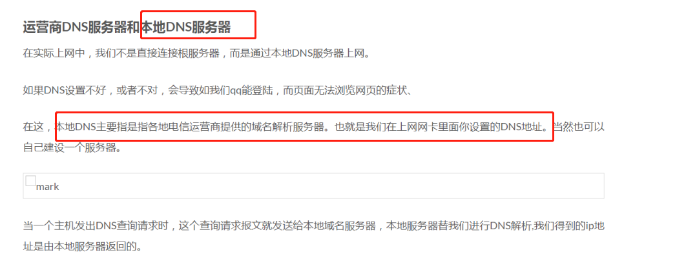
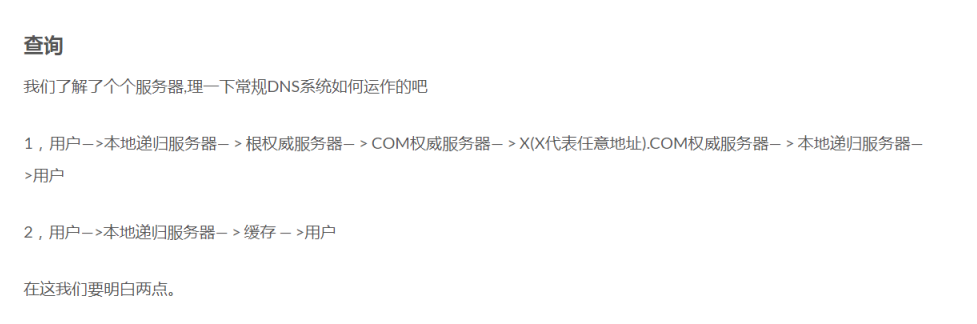
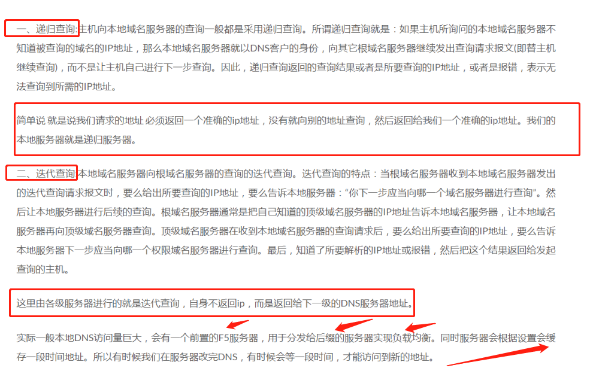
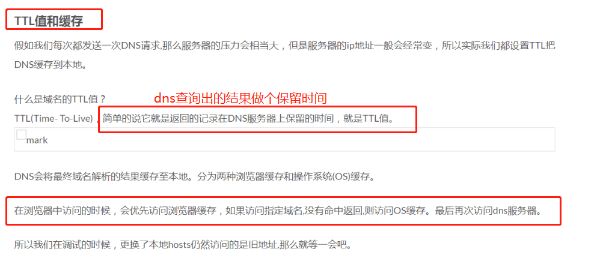
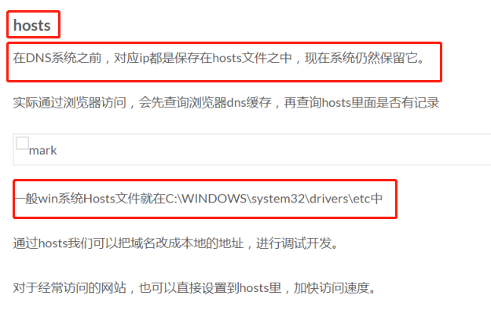

# dns

## [写给前端工程师的DNS基础知识](http://www.sunhao.win/articles/netwrok-dns.html)

抽象点DNS就是 一个记录ip地址的超级分布式数据库。

因此我们DNS主要通过UDP。

当我们访问www.sunhao.win的时候,如果本地dns服务器没有记录，那么它就会向根服务器去请求地址。

也就是它会向根服务器请求win域的地址。然后通过win域继续向下请求。根域名服务器并不直接把待查询的域名直接解析出IP地址，而是告诉本地域名服务器下一步应当找哪一个顶级域名服务器进行查询。

所以根域名服务器很重要。假定所有的根域名服务器都瘫痪了，那么整个DNS系统就无法工作。











----

## [前端优化: DNS预解析提升页面速度](https://www.jianshu.com/p/95a0c0636d28)

`meta` 元素定义的元数据的类型包括以下几种：

- 如果设置了 `name` 属性，`meta` 元素提供的是文档级别（*document-level*）的元数据，应用于整个页面。
- 如果设置了 `http-equiv` 属性，`meta` 元素则是编译指令，提供的信息与类似命名的HTTP头部相同。
- 如果设置了 `charset` 属性，`meta` 元素是一个字符集声明，告诉文档使用哪种字符编码。
- 如果设置了 `itemprop` 属性，`meta` 元素提供用户定义的元数据。

```xml
<meta http-equiv="x-dns-prefetch-control" content="on" />
```

其中x-dns-prefetch-control ，字段是表明岂不启动dns预处理，on为启动

> 1. 在页面header中使用link标签来强制对DNS预解析:

```xml
<link rel="dns-prefetch" href="http://bdimg.share.baidu.com" />
```

---

## [DNS解析](https://imweb.io/topic/55e3ba46771670e207a16bc8)

### DNS域名解析过程

　　当用户在浏览器中输入ke.qq.com并按下回车键后：

- 第1步，查找**浏览器缓存**。

  > 浏览器会检查缓存中有没有这个域名对应的解析过的IP地址，如果缓存中有，这个解析过程就将结束。浏览器缓存域名也是有限制的，不仅浏览器缓存大小有限制，而且缓存的时间也有限制，通常情况下为几分钟到几小时不等。这个缓存时间太长和太短都不好，如果缓存时间太长，一旦域名被解析到的IP有变化，会导致被客户端缓存的域名无法解析到变化后的IP地址，以致该域名不能正常解析，这段时间内有可能会有一部分用户无法访问网站。如果时间设置太短，会导致用户每次访问网站都要重新解析一次域名。

- 第2步，查找**系统缓存**。

  > 如果用户的浏览器缓存中没有，浏览器会查找操作系统缓存中是否有这个域名对应的DNS解析结果。其实操作系统也会有一个域名解析的过程，在Windows中可以通过C:\Windows\System32\drivers\etc\hosts文件来设置，你可以将任何域名解析到任何能够访问的IP地址。如果你在这里指定了一个域名对应的IP地址，那么浏览器会首先使用这个IP地址。例如，我们在测试时可以将一个域名解析到一台测试服务器上，这样不用修改任何代码就能测试到单独服务器上的代码的业务逻辑是否正确。正是因为有这种本地DNS解析的规程，所以黑客就有可能通过修改你的域名解析来把特定的域名解析到它指定的IP地址上，导致这些域名被劫持。

  - 第3步，查找**路由器缓存**。

    > 如果系统缓存中也找不到，那么查询请求就会发向路由器，它一般会有自己的DNS缓存。

  - 第4步，查找**ISP DNS 缓存**。

    > 运气实在不好，就只能查询ISP DNS 缓存服务器了。在我们的网络配置中都会有"DNS服务器地址"这一项，操作系统会把这个域名发送给这里设置的DNS，也就是本地区的域名服务器，通常是提供给你接入互联网的应用提供商。这个专门的域名解析服务器性能都会很好，它们一般都会缓存域名解析结果，当然缓存时间是受域名的失效时间控制的，一般缓存空间不是影响域名失效的主要因素。大约80%的域名解析都到这里就已经完成了，所以ISP DNS主要承担了域名的解析工作。

- 第5步，**递归搜索**。

  > 　最无奈的情况发生了, 在前面都没有办法命中的DNS缓存的情况下,(1)本地 DNS服务器即将该请求转发到互联网上的根域（即一个完整域名最后面的那个点，通常省略不写）。(2)根域将所要查询域名中的顶级域（假设要查询ke.qq.com，该域名的顶级域就是com）的服务器IP地址返回到本地DNS。(3) 本地DNS根据返回的IP地址，再向顶级域（就是com域）发送请求。(4) com域服务器再将域名中的二级域（即ke.qq.com中的qq）的IP地址返回给本地DNS。(5) 本地DNS再向二级域发送请求进行查询。(6) 之后不断重复这样的过程，直到本地DNS服务器得到最终的查询结果，并返回到主机。这时候主机才能通过域名访问该网站。

### DNS有关的网络性能优化

1、减少DNS查找，避免重定向 　　浏览器DNS缓存 、计算机DNS缓存、 服务器DNS缓存、使用Keep-Alive特性 来减少DNS查找。考虑影响DNS缓存的因素：

- 服务器可以设置TTL值表示DNS记录的存活时间。本机DNS缓存将根据这个TTL值判断DNS记录什么时候被抛弃，这个TTL值一般都不会设置很大，主要是考虑到快速故障转移的问题。
- 浏览器DNS缓存也有自己的过期时间，这个时间是独立于本机DNS缓存的，相对也比较短，例如chrome只有1分钟左右。
- 浏览器DNS记录的数量也有限制，如果短时间内访问了大量不同域名的网站，则较早的DNS记录将被抛弃，必须重新查找。不过即使浏览器丢弃了DNS记录，操作系统的DNS缓存也有很大机率保留着该记录，这样可以避免通过网络查询而带来的延迟。

### DNS有关的安全问题

1、DNS欺骗：DNS欺骗即域名信息欺骗是最常见的DNS安全问题。当一个DNS服务器掉入陷阱，使用了来自一个恶意DNS服务器的错误信息，那么该DNS服务器就被欺骗了。DNS欺骗会使那些易受攻击的DNS服务器产生许多安全问题，例如：将用户引导到错误的互联网站点，或者发送一个电子邮件到一个未经授权的邮件服务器。网络攻击者通常通过两种方法进行DNS欺骗。

- 缓存感染：黑客会熟练的使用DNS请求，将数据放入一个没有设防的DNS服务器的缓存当中。这些缓存信息会在客户进行DNS访问时返回给客户，从而将客户引导到入侵者所设置的运行木马的Web服务器或邮件服务器上，然后黑客从这些服务器上获取用户信息。
  - DNS信息劫持：入侵者通过监听客户端和DNS服务器的对话，通过猜测服务器响应给客户端的DNS查询ID。每个DNS报文包括一个相关联的16位ID号，DNS服务器根据这个ID号获取请求源位置。黑客在DNS服务器之前将虚假的响应交给用户，从而欺骗客户端去访问恶意的网站。
  - DNS重定向：攻击者能够将DNS名称查询重定向到恶意DNS服务器。这样攻击者可以获得DNS服务器的写权限

2、拒绝服务攻击 　　黑客主要利用一些DNS软件的漏洞，如在BIND 9版本（版本9.2.0以前的 9系列）如果有人向运行BIND的设备发送特定的DNS数据包请求，BIND就会自动关闭。攻击者只能使BIND关闭，而无法在服务器上执行任意命令。如果得不到DNS服务，那么就会产生一场灾难：由于网址不能解析为IP地址，用户将无方访问互联网。这样，DNS产生的问题就好像是互联网本身所产生的问题，这将导致大量的混乱。

3、分布式拒绝服务攻击 　　DDOS 攻击通过使用攻击者控制的几十台或几百台计算机攻击一台主机，使得服务拒绝攻击更难以防范，更难以通过阻塞单一攻击源主机的数据流，来防范服务拒绝攻击。

4、缓冲区漏洞溢出攻击 　　黑客利用DNS服务器软件存在漏洞，比如对特定的输入没有进行严格检查，那幺有可能被攻击者利用，攻击者构造特殊的畸形数据包来对DNS服务器进行缓冲区溢出攻击。如果这一攻击成功，就会造成DNS服务停止，或者攻击者能够在DNS服务器上执行其设定的任意代码。

如何防范？？