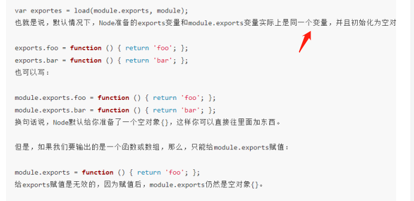

https://github.com/jimuyouyou/node-interview-questions（完成）

https://juejin.im/post/6844903870066327566（进程问题）

https://juejin.im/post/6844903951742025736（有难度的面试题，可以了，就是这个了）

https://www.jianshu.com/p/2e0284db8e1d

https://www.zhihu.com/question/24648388

https://zhuanlan.zhihu.com/p/34748838

看这个效率很低

module.exports等于exports

只能给对象属性赋值，不能直接覆盖，node提供的是module和exports这两个变量

---

https://juejin.im/post/6844903951742025736

看到这里

