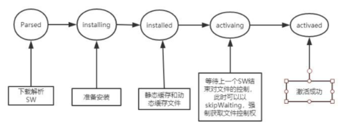
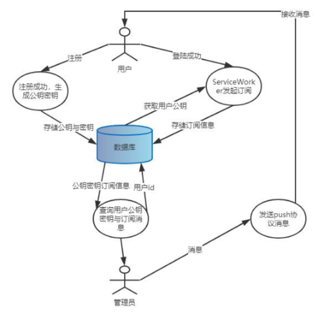

> 1、静态资源，比如css，js，图片，音频，图标等上线之后几乎不发生
> 改变，尤其是在一个ServiceWorker周期里面，极少发生改变的文件。采用
> cache-first策略。
> 2、展示类接口请求，对于前端界面，需要一些不怎么频繁改变的接口数
> 据，采用network-first策略。
> 3、请求修改类接口请求，对于一些用户动态操作，需要将操作结果存储
> 到数据库中的接口，采用network-only策略

静态资源

Cache-First策略会在有缓存的时候返回缓存，没有缓存才会去请求
并且把请求结果缓存（静态资源）

入口html是不会的

network-first资源优先走网络，成功以后会把资源添加到缓存里面，当发
现网失败就会回退读取缓存（展示接口）

network-only只请求线上资源，不使用缓存。（增删改）

**AppShell为页面中固定的一些部分，如footer和header等。在本项目中**
**主要是将footer组件加入缓存列表，在页面被请求时提前展示出来，减少用**
**户的白屏时间**

Skeleton为项目中的骨架屏，目的是减少用户的白屏时间

在本项目中采用轻量级的Express框架来实现服务器端任务。分为数据层
（data层）、路由层（router层）、工具层（util层）和视图层（view层）

### web-push的过程

在用户注册时，使用web-pushAPI生成生成一对公钥密钥，并存储到数
据库中的用户表中的对应字段

> 1.constwebpush=require('web-push');
> 2.constvapidKeys=webpush.generateVAPIDKeys();
> 3.letpublicKey=vapidKeys.publicKey
> 4.letprivateKey=vapidKeys.privateKey

用户登陆成功后，将公钥通过主线程通信机制postMessage传递给
ServiceWoker，通知ServiceWorer请求用户订阅

ServiceWoker请求获得订阅权限，用户同意之后，**利用主线程发送过来**
**的公钥生成订阅消息**，并发送请求将生成的订阅信息保存到数据库中的用户表中
当前登陆用户的sub字段中。用户拒绝之后标记好，在下一次ServiceWorker生
命周期中再次请求订阅。                  

管理员打开推送页面，填写好了要发送的用户id及要发送的消息，服务
通过路由接受到管理员传的用户id和要发送的消息，通过用户id找出这个用户
的公钥和密钥以及订阅信息。使用push协议向浏览器发送推送消息给这个用户。

ServiceWoker监听push事件，收到之后，提取发送的消息，检验公钥密
钥，并将发送的信息格式化提取出来，然后使用NotificationAPI并通知在线的
用户。

