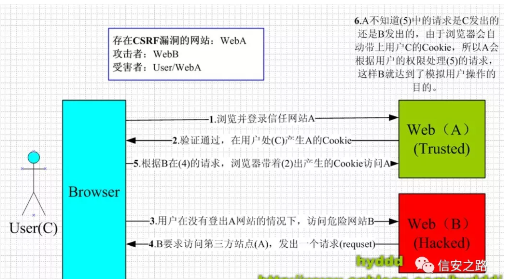

## xss

彻底弄懂xss攻击原理和实例，解决所有的相关问题

-----

- 网页挂马;
- 盗取 Cookie;
- DoS 攻击;
- 钓鱼攻击;
- 蠕虫攻击;
- 劫持用户 web 行为;
- 结合 CSRF 进行针对性攻击;

所以xss攻击也是可以拿到cookie，并且可以结合csrf做攻击

### 3) XSS 类型

目前的 XSS 总共可以分为三种类型：

- **反射型(也叫非持久型)**
- **存储型(也叫持久型)**
- **DOM 型**

PS：前两种 XSS 都会与服务器产生交互，后一种不会产生交互。(某安全大佬面试)

如果我们访问`http://127.0.0.1/.html#a=<script>alert(/xss/)</script>`   当我们访问上述 url 时，服务器会返回源代码，我们可以用抓包工具截取，发现与正常访问的页面无差别，可是当浏览器收到源代码时便把 HTML 文本解析成 DOM 对象并执行，结果弹出 /xss/ 消息框，感兴趣的朋友可以试试。  具体执行过程如图：

> 这里写的是，当用户请求黑客给的url，服务器返回黑客准备的html，然后将将html解析成dom对象执行，然后弹出黑客窗口

我们知道 Cookie 有如下常见的属性：

- Domain————设置关联 Cookie 的域名;
- Expires————通过给定一个过期时间来创建一个持久化 Cookie;
- Httponly————用于避免 Cookie 被 Javascript 访问;
- Name————Cookie 的名称;
- Path————关联到 Cookie 的路径，默认为 /;
- Value————读写 Cookie 的值;
- Secure————用于指定 Cookie 需要通过安全 Socket 层传递连接;  

并且 Cookie 也可以安装类型分为：

- 本地 Cookie————即储存在计算机硬盘中，关闭浏览器后依旧存在;
- 内存 Cookie————即储存在内存中，随浏览器的关闭而消失;  

如何区分两者很简单，只要判断 cookie 中的 expires 即过期时间属性有没有设置，如果设置了即为本地 cookie，反之为内存 cookie。  

**xss只要是让客户点击伪造链接，点击伪造链接，这个链接里面有黑客写的代码，，代码可以是反射型，存储型，dom型。然后反射型，就是点一次就直接攻击到了这个客户端**

**存储型，就是通过请求，把黑客写的攻击代码存储到服务器上，这样持久化，其他用户请求服务器也会被攻击**

**dom型，就是用户点击黑客链接，**

简单来说，通过修改页面 DOM 节点形成的 XSS，称之为 DOM Based XSS。

```
<!DOCTYPE html>
<html lang="en">

<head>
  <meta charset="UTF-8">
  <meta name="viewport" content="width=device-width, initial-scale=1.0">
  <meta http-equiv="X-UA-Compatible" content="ie=edge">
  <title>XSS</title>
</head>

<body>
  <div id="t"></div>
  <input type="text" id="text" value="">
  <input type="button" id="s" value="search" onclick="test()">
</body>
<script>
function test() {
  const str = document.querySelector('#text').value
  document.querySelector('#t').innerHTML = '<a href="' + str + '" >查找结果</a>'
}
</script>

</html>
复制代码
```

该页面的作用是，在输入框内输入一个内容，跳出查找结果能直接跳转，效果如下：


点击查找结果后，页面会自动跳到百度（毒）页面，但是细心的我们会发现，这字符串拼接有可乘之机啊，输入`" onclick=alert(/XSS/) //`：


**这个例子很好，就是用户进去黑客写的网站，然后，输出了搜索条件，出来了结果，然后这个结果，其实是一些攻击链接伪造成a标签，然后这个a标签写着搜索出来的结果文字。修改了本该出现的dom节点。**


---

反射型

```
<!DOCTYPE html>
<html lang="en">

<head>
  <meta charset="UTF-8">
  <meta name="viewport" content="width=device-width, initial-scale=1.0">
  <meta http-equiv="X-UA-Compatible" content="ie=edge">
  <title>Document</title>
</head>

<body>
  <div id="t"></div>
  <input id="s" type="button" value="获取数据" onclick="test()">
</body>
<script>
  function test() {
    const arr = ['1', '2', '3', '']
    const t = document.querySelector('#t')
    arr.forEach(item => {
      const p = document.createElement('p')
      p.innerHTML = item
      t.append(p)
    })
  }
</script>

</html>
复制代码
```

假设这是一个留言板块，加载到这一页时，页面会输出：


黑客可以轻易盗取存储在你本地浏览器的各种信息，进而模拟登陆信息，黑入账户，进行各种操作。

**问题是拿到的localstorge是同源的**

暂时理解到这里，通过面试题来深入理解

xss

就是让客户端执行攻击的脚本

反射，dom，都是让用户点击链接执行脚本（伪造成正常网站），反射型，是用户点了之后执行脚本，，dom型，是通过对dom的操作进行攻击，添加一个img标签``

---

## csrf

在b页面中，要求访问a页面，然后浏览器自动带着a页面的cookie




我们知道，**当我们使用 img 等标签时，通过设置标签的 src 等属性引入外部资源，是可以被浏览器认为是合法的跨域请求，也就是说是可以带上 Cookie 访问的。** 

#### 2) 结合 XSS 利用

CSRF+XSS 结合，产生的危害已几何倍数剧增。如果 CSRF 和 XSS 两个漏洞是在同一个域下的话，那么此时的 CSRF 已经变成了 OSRF 了，即本站点请求伪造(出自《黑客攻防技术宝典 Web 实战篇第二版》p366)，此时已经变成XSS的请求伪造攻击，本文不在赘述。  

具体如何结合：这个问题要好好看看

osrf终极问题

---

等下好好理解下下面的csrf

[Referer ](https://www.sojson.com/tag_referer.html)是 [ HTTP ](https://www.sojson.com/tag_http.html)请求`header` 的一部分，当浏览器（或者模拟浏览器行为）向`web` 服务器发送请求的时候，头信息里有包含 [ Referer ](https://www.sojson.com/tag_referer.html)。比如我在`www.sojson.com` 里有一个`www.baidu.com` 链接，那么点击这个`www.baidu.com` ，它的`header` 信息里就有：

  Referer=https://www.sojson.com

目前为止看到的csrf就是上面那个图

那么可以利用这个来防止盗链了，比如我只允许我自己的网站访问我自己的图片服务器，那我的域名是`www.sojson.com`，那么图片服务器每次取到Referer来判断一下是不是我自己的域名`www.sojson.com`，如果是就继续访问，不是就拦截。

2.防止恶意请求。

比如我的SOJSON网站上，静态请求是`*.html`结尾的，动态请求是`*.shtml`，那么由此可以这么用，所有的`*.shtml`请求，必须[ Referer ](https://www.sojson.com/tag_referer.html)为我自己的网站。

> Referer=https://www.sojson.com

## 二、Referer的伪造

#### 1.伪造为ip地址

1. 使用Firefox的X-Forwarded-For Header 插件更改ip地址
2. 使用brup拦截请求包，在Proxy里面发送到Repeater，将Http头中的`X-Forwarded-For`改为想改的ip

#### 2.伪造为URL

  通过brup拦截，再使用Reapter修改`Referer`为想指定的URL

----

现在看看osrf，然后再看看面试题，就Ok了

Feiji 在自己的用户资料中插入了一段存储型Xss的Payload脚本，**其中就可以构造我们的OSRF的语句，致使任何查看它的用户在不知情的情况下执行各种操作**。从中可以看出，OSRF的苛刻条件有：一是要有存储型Xss、二是要有完成一次CSRF的条件。所以OSRF很少为人所知。

不看了不考

----

xss面试题

如何防止xss攻击和csrf攻击

xss攻击： httpOnly 输入检查

csrf攻击： 

复习下笔记再补充下，现在不想复习，留到之后

----

