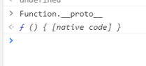

> 
>
> ```
> function Foo() 
> 
> Foo.__proto__ == Function.prototype
> 
> Foo.prototype.__proto__ == Object.prototype
> Object.__proto__==Function.prototype
> 
> Object.prototype.__proto__ ==null （对象的原型是谁创建的，是null）
> 
> Function.prototype.__proto ==Object.prototype
> Function.__proto__ = Function.prototype(函数是函数创建的)
> 
> ```
>
> 


好，我们先来谈谈原型这个概念。JS中一切皆对象，而每个对象都有一个原型（Object除外），这个原型，大概就像Java中的父类，所以，基本上你可以认为原型就是这个对象的父对象，即每一个对象（Object除外）内部都保存了它自己的父对象，这个父对象就是原型。一般创建的对象如果没有特别指定原型，那么它的原型就是Object(这就很类似Java中所有的类默认继承自Object类)。


function a{} 

a是继承子function的，所以`a.__proto__`指向`Funtion.prototype`

a的原型对象，`a.prototype`本身也是一个对象（和函数没有关系，他就是一个对象），所以`a.prototype.__proto__`指向`Object.prototype`


**Object由来（一个东西是对象，`那么他的___proto__就指向Object.prototype`，如果一个东西是另一个东西创建的，那么`Object.__proto__ == Function.prototype`这个东西的隐式原型指向另一个东西的原型）（这就是公式）**

function Object(){}

**因为Object也是由函数创建的,所以`Object.__proto__ == Function.prototype`**

**秘诀就是，对象是函数创造的，所以`__proto__`指向`Function.prototype`**

**函数的原型也是个对象，所以原型隐式原型是对象**

**`Function.prototype.__proto__ == Object.prototype`**

`Object.prototype.__proto__ == null`

原型是个对象，prototype是个对象

Object也是Function创造的对象，所以`Object.__proto__ == Function.prototype`。有构造方法的对象，都有prototype，方便继承。所有对象都有一个`__proto__`



**`Function.__proto__` = `Function.prototype`**

继承谁也就是通过谁创建的，所有对象又基本是函数创造的，

**”函数是由函数创造的“**

---

## prototype
prototype是一个拥有 [[Construct]] 内部方法的对象才有的属性。

例如函数，对象的方法，ES6 中的类。注意 ES6 中的箭头函数没有 [[Construct]] 方法，因此没有prototype这个属性，除非你为它添加一个。

当创建函数时，JavaScript 会为这个函数自动添加prototype属性，这个属性指向的是一个原型对象Functionname.prototype。我们可以向这个原型对象添加属性或对象，甚至可以指向一个现有的对象。

## `__proto__`
接下来我们说说继承，每个对象都有一个__proto__属性，这个属性是用来标识自己所继承的原型。

注意： JavaScript 中任意对象都有一个内置属性 [[Prototype]] ，在ES5之前没有标准的方法访问这个内置属性，但是大多数浏览器都支持通过__proto__来访问。以下统一使用__proto__来访问 [[Prototype]]，在实际开发中是不能这样访问的。

原型链
JavaScript 可以通过prototype和__proto__在两个对象之间创建一个关联，使得一个对象就可以通过委托访问另一个对象的属性和函数。

这样的一个关联就是原型链，一个由对象组成的有限对象链，用于实现继承和共享属性。

构造函数创建对象实例
JavaScript 函数有两个不同的内部方法：[[Call]] 和 [[Construct]] 。

如果不通过new关键字调用函数，则执行 [[Call]] 函数，从而直接执行代码中的函数体。

当通过new关键字调用函数时，执行的是 [[Construct]] 函数，它负责创建一个实例对象，把实例对象的__proto__属性指向构造函数的prototype来实现继承构造函数prototype的所有属性和方法，将this绑定到实例上，然后再执行函数体。

模拟一个构造函数：

function createObject(proto) {
    if (!(proto === null || typeof proto === "object" || typeof proto === "function"){
        throw TypeError('Argument must be an object, or null');
    }
    var obj = new Object();
    obj.__proto__ = proto;
    return obj;
}

var foo = createObject(Foo.prototype);
至此我们了解了prototype和__proto__的作用，也了解使用构造函数创建对象实例时这两个属性的指向，以下使用一张图来总结一下如何通过prototype和__proto__实现原型链。


prototype是一个拥有 [[Construct]] 内部方法的对象才有的属性。

每个对象都有一个`__proto__`属性，这个属性是用来标识自己所继承的原型。

Function.prototype也是一个对象，他继承于Object.prototype

`Functon.prototype.__proto__`==Object.prototyoe

同理

foo = new Foo()

function Foo()

Foo.prototype也是一个对象，他继承来自Object.prototype

----

## `Function.__proto__` = `Function.prototype`

Object.prototype 就是原型链的顶端（不考虑 null 的情况下），所有对象继承了它的 toString 等方法和属性。

`Function.prototype` 是引擎创建出来的函数

Object 作为构造函数时，其 `[[Prototype]]` 内部属性值指向 Function.prototype，即

```
Object.__proto__ === Function.prototype
```

Function 构造函数是一个函数对象，其 `[[Class]]` 属性是 `Function`。Function 的 `[[Prototype]]` 属性指向了 `Function.prototype`，即

```
Function.__proto__ === Function.prototype
```

## Function & Object 鸡蛋问题

我们看下面这段代码

`Function构造函数继承子Function Object构造函数也继承子Function`

`Function.__proto__ === Function.prototype`

`Object.__proto__ === Function.prototype`

`Function.prototype也是一个对象，他继承与Object.prototype`

`Function.prototype.__proto__ == Object.protptype`

`谁继承谁，就是谁的__proto__==谁的prototype`

```js
Object instanceof Function 		// true
Function instanceof Object 		// true

Object instanceof Object 			// true
Function instanceof Function 	// true
复制代码
```

`Object` 构造函数继承了 `Function.prototype`，同时 `Function` 构造函数继承了`Object.prototype`。这里就产生了 **鸡和蛋** 的问题。为什么会出现这种问题，因为 `Function.prototype` 和 `Function.__proto__` 都指向 `Function.prototype`。

```js
// Object instanceof Function 	即
Object.__proto__ === Function.prototype 					// true

// Function instanceof Object 	即
Function.__proto__.__proto__ === Object.prototype	// true

// Object instanceof Object 		即 			
Object.__proto__.__proto__ === Object.prototype 	// true

// Function instanceof Function 即	
Function.__proto__ === Function.prototype					// true
复制代码
```

对于 `Function.__proto__ === Function.prototype` 这一现象有 2 种解释，争论点在于 Function 对象是不是由 Function 构造函数创建的一个实例？

**解释 1、YES**：按照 JavaScript 中“实例”的定义，a 是 b 的实例即 `a instanceof b` 为 true，默认判断条件就是 `b.prototype` 在 a 的原型链上。而 `Function instanceof Function` 为 true，本质上即 `Object.getPrototypeOf(Function) === Function.prototype`，正符合此定义。

**解释 2、NO**：Function 是 `built-in` 的对象，也就是并不存在“Function对象由Function构造函数创建”这样显然会造成鸡生蛋蛋生鸡的问题。实际上，当你直接写一个函数时（如 `function f() {}` 或 `x => x`），也不存在调用 Function 构造器，只有在显式调用 Function 构造器时（如 `new Function('x', 'return x')` ）才有。

我个人偏向于第二种解释，即先有 `Function.prototype` 然后有的 `function Function()` ，所以就不存在鸡生蛋蛋生鸡问题了，把  `Function.__proto__` 指向 `Function.prototype` 是为了保证原型链的完整，让 `Function` 可以获取定义在 `Object.prototype` 上的方法。


作者：木易杨说
链接：https://juejin.im/post/5cb4861ff265da036504efbc
来源：掘金
著作权归作者所有。商业转载请联系作者获得授权，非商业转载请注明出处。