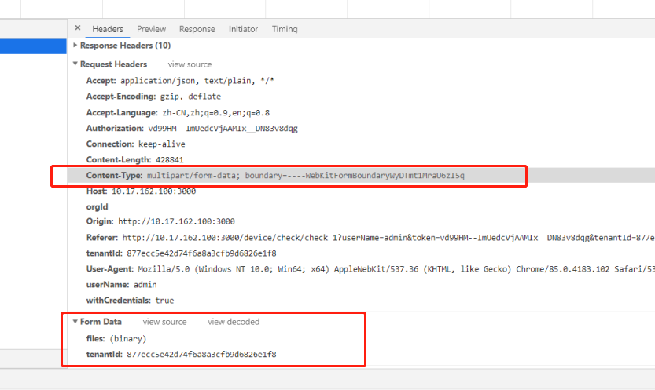

很接近了，但是XHR对象的直属progress事件并不是用来监听上传资源的进度的。XHR对象还有一个属性upload, 它返回一个XMLHttpRequestUpload 对象，

**文件上传的二进制具体是怎么处理的**

```js
submitUpload() {
    let formData = new FormData();
    let fileList = this.$refs.upload.uploadFiles;
    if (fileList.length > 0) {
        fileList.forEach(file => {
            formData.append("files", file.raw);
        });
        formData.append('tenantId', this.$store.state.auth.tenantId);
        this.$http.post('attachment', formData, "/upload").then(res => {
            if (res.code === 200 && res.data.attachmentList.length > 0) {
                this.$refs.upload.clearFiles();
                this.tableArr.push(...res.data.attachmentList);
                this.tableArr.forEach(item => {
                    this.formInfo.attachmentIds.push(item.id);
                });
                this.formInfo.attachmentIds = Array.from(new Set(this.formInfo.attachmentIds));
            } else {
                this.fileList = [];
            }
        })
    }
    // this.$refs.upload.submit();
},
```



大文件上传呢？？

在JavaScript中，文件FIle对象是Blob对象的子类，Blob对象包含一个重要的方法`slice`，通过这个方法，我们就可以对二进制文件进行拆分

也是用这个context-type

### HTTP状态码206是干什么的（断点续传）

> 小提示：工作中没有遇到过需要上传下载大型文件，所以这个问题当时老老实实回答不知道。具体应该和断点续传相关，可能也需要回答一些`range`的头部信息等

headers: { +          "content-type": "application/json" +        },

**序列化了的json**

### multipart/form-data（大文件上传）

表单

### application/x-www-form-urlencoded（appliction是二进制

url式编码，对表单数据

### Multipart 类型

```
multipart/form-data
multipart/byteranges
```

***Multipart* 类型表示细分领域的文件类型的种类**，经常对应不同的 MIME 类型。这是*复合*文件的一种表现方式。`multipart/form-data` 可用于联系 [HTML Forms](https://developer.mozilla.org/en-US/docs/Web/Guide/HTML/Forms) 和 [`POST`](https://developer.mozilla.org/zh-CN/docs/Web/HTTP/Methods/POST) 方法，此外 `multipart/byteranges`使用状态码[`206`](https://developer.mozilla.org/zh-CN/docs/Web/HTTP/Status/206) `Partial Content`来发送整个文件的子集，而HTTP对不能处理的复合文件使用特殊的方式：将信息直接传送给浏览器（这时可能会建立一个“另存为”窗口，但是却不知道如何去显示内联文件。）