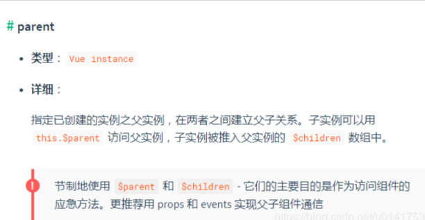

##  框架

### mvvm

### 生命周期

###  数据绑定

`Object.defineProperty` 在数组中的表现和在对象中的表现是一致的，数组的索引就可以看做是对象中的 `key`。

1. 通过索引访问或设置对应元素的值时，可以触发 `getter` 和 `setter` 方法。
2. 通过 `push` 或 `unshift` 会增加索引，对于新增加的属性，需要再手动初始化才能被 observe。
3. 通过 pop 或 shift 删除元素，会删除并更新索引，也会触发 `setter` 和 `getter` 方法。

所以，`Object.defineProperty`是有监控数组下标变化的能力的，只是 Vue2.x 放弃了这个特性。

上面已经知道 `Object.defineProperty` 对数组和对象的表现是一致的，那么它和 Proxy 对比存在哪些优缺点呢？

**1. `Object.defineProperty `只能劫持对象的属性，而 Proxy 是直接代理对象。**

由于 `Object.defineProperty` 只能对属性进行劫持，需要遍历对象的每个属性，如果属性值也是对象，则需要深度遍历。而 Proxy 直接代理对象，不需要遍历操作。

**2. `Object.defineProperty `对新增属性需要手动进行 Observe。**

由于 `Object.defineProperty `劫持的是对象的属性，所以新增属性时，需要重新遍历对象，对其新增属性再使用 `Object.defineProperty` 进行劫持。

也正是因为这个原因，使用 Vue 给 data 中的数组或对象新增属性时，需要使用 vm.$set 才能保证新增的属性也是响应式的。

下面看一下 Vue 的 set 方法是如何实现的，set 方法定义在 core/observer/index.js ，下面是核心代码。

```javascript
/**
 * Set a property on an object. Adds the new property and
 * triggers change notification if the property doesn't
 * already exist.
 */
export function set (target: Array<any> | Object, key: any, val: any): any {
  // 如果 target 是数组，且 key 是有效的数组索引，会调用数组的 splice 方法，
  // 我们上面说过，数组的 splice 方法会被重写，重写的方法中会手动 Observe
  // 所以 vue 的 set 方法，对于数组，就是直接调用重写 splice 方法
  if (Array.isArray(target) && isValidArrayIndex(key)) {
    target.length = Math.max(target.length, key)
    target.splice(key, 1, val)
    return val
  }
  // 对于对象，如果 key 本来就是对象中的属性，直接修改值就可以触发更新
  if (key in target && !(key in Object.prototype)) {
    target[key] = val
    return val
  }
  // vue 的响应式对象中都会添加了 __ob__ 属性，所以可以根据是否有 __ob__ 属性判断是否为响应式对象
  const ob = (target: any).__ob__
  // 如果不是响应式对象，直接赋值
  if (!ob) {
    target[key] = val
    return val
  }
  // 调用 defineReactive 给数据添加了 getter 和 setter，
  // 所以 vue 的 set 方法，对于响应式的对象，就会调用 defineReactive 重新定义响应式对象，defineReactive 函数
  defineReactive(ob.value, key, val)
  ob.dep.notify()
  return val
}
```

在 set 方法中，对 target 是数组和对象分别做了处理。target 是数组时，会调用重写过的 splice 方法进行手动 Observe 。

对于对象，如果 `key` 本来就是对象的属性，则直接修改值触发更新，否则调用 defineReactive 方法重新定义响应式对象。

如果采用 `proxy` 实现，`Proxy` 通过 `set(target, propKey, value, receiver)` 拦截对象属性的设置，是可以拦截到对象的新增属性的。


不止如此，Proxy 对数组的方法也可以监测到，不需要像上面 vue2.x 源码中那样进行 hack。


完美！！！

**3. `Proxy`支持 13 种拦截操作，这是 `defineProperty `所不具有的。**

- **`get(target, propKey, receiver)`**：拦截对象属性的读取，比如 `proxy.foo` 和`proxy['foo']`。
- **`set(target, propKey, value, receiver)`**：拦截对象属性的设置，比如`proxy.foo = v` 或 `proxy['foo'] = v`，返回一个布尔值。
- **`has(target, propKey)`**：拦截 `propKey in proxy` 的操作，返回一个布尔值。
- **`deleteProperty(target, propKey)`**：拦截 `delete proxy[propKey]` 的操作，返回一个布尔值。
- **`ownKeys(target)`**：拦截`Object.getOwnPropertyNames(proxy)、Object.getOwnPropertySymbols(proxy)、Object.keys(proxy)、for...in`循环，返回一个数组。该方法返回目标对象所有自身的属性的属性名，而 `Object.keys()` 的返回结果仅包括目标对象自身的可遍历属性。
- **`getOwnPropertyDescriptor(target, propKey)`**：拦截`Object.getOwnPropertyDescriptor(proxy, propKey)`，返回属性的描述对象。
- **`defineProperty(target, propKey, propDesc)`**：拦截`Object.defineProperty(proxy, propKey, propDesc）`、`Object.defineProperties(proxy, propDescs)`，返回一个布尔值。
- **`preventExtensions(target)`**：拦截 `Object.preventExtensions(proxy)`，返回一个布尔值。
- **`getPrototypeOf(target)`**：拦截 `Object.getPrototypeOf(proxy)`，返回一个对象。
- **`isExtensible(target)`**：拦截 `Object.isExtensible(proxy)`，返回一个布尔值。
- **`setPrototypeOf(target, proto)`**：拦截 `Object.setPrototypeOf(proxy, proto)`，返回一个布尔值。如果目标对象是函数，那么还有两种额外操作可以拦截。
- **`apply(target, object, args)`**：拦截 `Proxy` 实例作为函数调用的操作，比如`proxy(...args)、proxy.call(object, ...args)、proxy.apply(...)`。
- **`construct(target, args)`**：拦截 `Proxy` 实例作为构造函数调用的操作，比如`new proxy(...args)`。

### 状态绑定

不知道考点

目前只知道action和commit和mutation和store

先过

### 组件通信

- `props` / `$emit`

- `$children` / `$parent`

  

  `provide`/ `inject` 是`vue2.2.0`新增的api, 简单来说就是父组件中通过`provide`来提供变量, 然后再子组件中通过`inject`来注入变量。

  > 注意: 这里不论子组件嵌套有多深, 只要调用了`inject` 那么就可以注入`provide`中的数据，而不局限于只能从当前父组件的props属性中回去数据

  ### `ref` / `refs`

  `ref`：如果在普通的 DOM 元素上使用，引用指向的就是 DOM 元素；如果用在子组件上，引用就指向组件实例，可以通过实例直接调用组件的方法或访问数据， 我们看一个`ref` 来访问组件的例子:

  ```
  // 子组件 A.vue
  
  export default {
    data () {
      return {
        name: 'Vue.js'
      }
    },
    methods: {
      sayHello () {
        console.log('hello')
      }
    }
  }
  复制代码
  // 父组件 app.vue
  
  <template>
    <component-a ref="comA"></component-a>
  </template>
  <script>
    export default {
      mounted () {
        const comA = this.$refs.comA;
        console.log(comA.name);  // Vue.js
        comA.sayHello();  // hello
      }
    }
  </script>
  ```

  ### `localStorage` / `sessionStorage`

  这种通信比较简单,缺点是数据和状态比较混乱,不太容易维护。 通过`window.localStorage.getItem(key)`获取数据 通过`window.localStorage.setItem(key,value)`存储数据

  > 注意用`JSON.parse()` / `JSON.stringify()` 做数据格式转换 `localStorage` / `sessionStorage`可以结合`vuex`, 实现数据的持久保存,同时使用vuex解决数据和状态混乱问题.

  ### `$attrs`与 `$listeners`

  现在我们来讨论一种情况， 我们一开始给出的组件关系图中A组件与D组件是隔代关系， 那它们之前进行通信有哪些方式呢？

  1. 使用`props`绑定来进行一级一级的信息传递, 如果D组件中状态改变需要传递数据给A, 使用事件系统一级级往上传递
  2. 使用`eventBus`,这种情况下还是比较适合使用, 但是碰到多人合作开发时, 代码维护性较低, 可读性也低
  3. 使用Vuex来进行数据管理, 但是如果仅仅是传递数据, 而不做中间处理,使用Vuex处理感觉有点大材小用了.

  在`vue2.4`中，为了解决该需求，引入了`$attrs` 和`$listeners` ， 新增了`inheritAttrs` 选项。 在版本2.4以前，默认情况下,父作用域中不作为 prop 被识别 (且获取) 的特性绑定 (class 和 style 除外)，将会“回退”且作为普通的HTML特性应用在子组件的根元素上。接下来看一个跨级通信的例子:

  ```
  // app.vue
  // index.vue
  
  <template>
    <div>
      <child-com1
        :name="name"
        :age="age"
        :gender="gender"
        :height="height"
        title="程序员成长指北"
      ></child-com1>
    </div>
  </template>
  <script>
  const childCom1 = () => import("./childCom1.vue");
  export default {
    components: { childCom1 },
    data() {
      return {
        name: "zhang",
        age: "18",
        gender: "女",
        height: "158"
      };
    }
  };
  </script>
  复制代码
  // childCom1.vue
  
  <template class="border">
    <div>
      <p>name: {{ name}}</p>
      <p>childCom1的$attrs: {{ $attrs }}</p>
      <child-com2 v-bind="$attrs"></child-com2>
    </div>
  </template>
  <script>
  const childCom2 = () => import("./childCom2.vue");
  export default {
    components: {
      childCom2
    },
    inheritAttrs: false, // 可以关闭自动挂载到组件根元素上的没有在props声明的属性
    props: {
      name: String // name作为props属性绑定
    },
    created() {
      console.log(this.$attrs);
       // { "age": "18", "gender": "女", "height": "158", "title": "程序员成长指北" }
    }
  };
  </script>
  复制代码
  // childCom2.vue
  
  <template>
    <div class="border">
      <p>age: {{ age}}</p>
      <p>childCom2: {{ $attrs }}</p>
    </div>
  </template>
  <script>
  
  export default {
    inheritAttrs: false,
    props: {
      age: String
    },
    created() {
      console.log(this.$attrs); 
      // { "gender": "女", "height": "158", "title": "程序员成长指北" }
    }
  };
  </script>
  ```


  把$attrs来收集父组件props属性，这个$attrs可以直接传递个下个子组件

   <C v-bind="$attrs" v-on="$listeners"></C>

$listeners是$attrs一个是属性，另一个则对应监听的事件


## webpack

## 3. Loader 工作流程简述

我们来回顾一下 `Loader` 的一些特点：

- `Loader` 是一个 `node` 模块；
- `Loader` 可以处理任意类型的文件，转换成 `webpack` 可以处理的模块；
- `Loader` 可以在 `webpack.config.js` 里配置，也可以在 `require` 语句里内联；
- `Loader` 可以根据配置从右向左链式执行；
- `Loader` 接受源文件内容字符串或者 `Buffer`；
- `Loader` 分为多种类型：同步、异步和 `pitching`，他们的执行流程不一样；
- `webpack` 为 `Loader` 提供了一个上下文，有一些 `api` 可以使用；
- ...

我们根据以上暂时知道的特点，可以对 `Loader` 的工作流程有个猜测，假设有一个 `js-loader`，它的工作流程简单来说是这样的：

1. `webpack.config.js` 里配置了一个 `js` 的 `Loader`；
2. 遇到 `js` 文件时，触发了 `js-loader`;
3. `js-loader` 接受了一个表示该 `js` 文件内容的 `source`;
4. `js-loader` 使用 `webapck` 提供的一系列 `api` 对 `source` 进行转换，得到一个 `result`;
5. 将 `result` 返回或者传递给下一个 `Loader`，直到处理完毕。

`webpack` 的编译流程非常复杂，暂时还不能看明白并且梳理清楚，在这里就不误导大家了。

关于 `Loader` 的工作流程以及源码分析可以看 [【webpack进阶】你真的掌握了loader么？- loader十](https://juejin.im/post/5bc1a73df265da0a8d36b74f#heading-1)


webpack相关的看不懂，因为没有深入学习，怎么办

## babel

https://mp.weixin.qq.com/s/C-WmM5tjfc3r4sB52C4R0Q

## 前端部署

所以，大公司的静态资源优化方案，基本上要实现这么几个东西：

1. 配置超长时间的本地缓存                 —— 节省带宽，提高性能
2. 采用内容摘要作为缓存更新依据      —— 精确的缓存控制
3. 静态资源CDN部署                           —— 优化网络请求
4. 更资源发布路径实现非覆盖式发布  —— 平滑升级


## 前端监控

https://mp.weixin.qq.com/s/W0i-Iu6nqkWttsGZ-RmOqw

是个工程问题


## 前端优化

## 设计模式

https://www.cnblogs.com/tugenhua0707/p/5198407.html