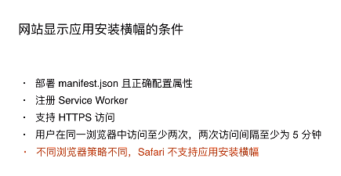

# PWA

https://juejin.im/e/pwa-lavas  视频学习

## manifest.json中各个字段的作用

manifest.json文件的作用是用来实现添加到桌面。**这个json文件就是一些配置，**里面的各个字段决定作用。



- 我们需要手动编写service-worker.js文件。
- 我们需要在网页中下载并注册service-worker.js文件。
- Service Worker具有超能力，可以拦截并处理HTTP请求

```js
// 不起眼的一行if，除了防止报错之外，也无意间解释了PWA的P：
// 如果浏览器不支持Service Worker，那就当什么都没有发生过
if ('serviceWorker' in navigator) {
    window.addEventListener('load', function () {
        // 所以Service Worker只是一个挂在navigator对象上的HTML5 API而已
        navigator.serviceWorker.register('/service-worker.js').then(function (registration) {
            console.log('我注册成功了666');
        }, function (err) {
            console.log('我注册失败了');
        });
    });
}
```

## Service Worker的主要事件

- install：顾名思义，Service Worker安装时触发，通常在这个时机缓存文件。
- activate：顾名思义，Service Worker激活时触发，通常在这个时机做一些重置的操作，例如处理旧版本Service Worker的缓存。
- fetch：顾名思义，浏览器发起HTTP请求时触发，通常在这个事件的回调函数中匹配缓存，是最常用的事件。
- push：顾名思义，和推送通知功能相关，没有相关需求的话可以不去了解。
- sync：顾名思义，和后台同步功能相关，没有相关需求的话可以不去了解。

### 1.缓存静态资源

Service Worker的一大应用是可以利用CacheStorage API来缓存js、css、字体、图片等静态文件。我们可以在Service Worker的install阶段，指定需要缓存的具体文件，在fetch事件的回调函数中，检查请求的url，如果匹配了已缓存的资源，则不再从服务端获取，以此达到提升网页性能的目的。常用的构建PWA的`App Shell`架构，就是利用这种方式实现的。
 需要注意的是，性能的提升是相对于完全没有缓存的情况来讲的，而浏览器本身有着相对完善的HTTP缓存机制。所以使用Service Worker缓存，并不能使我们已经相对完善的架构有立竿见影的性能提升，Service Worker缓存真正有意义的地方在于，利用它可以更精准地、以编码方式控制缓存，如何缓存、缓存什么、如何更新缓存，完全取决于代码如何写，所以这提供了很大的自由度，但同时也带来维护成本。它只是换了一种缓存方式，而不是从无到有的突破。

### 最佳缓存策略

Cache-First 策略会在有缓存的时候返回缓存，没有缓存才会去请求 并且把请求结果缓存。也就是说，第一次页面加载跟普通页面加载没有 任何区别的，第二次访问的资源是直接走了本地缓存数据的。此种策略 非常适合不经常发生变化的静态资源。

network-first 资源优先走网络，成功以后会把资源添加到缓存里面，当发 现网失败就会回退读取缓存。此种策略非常适合展示类接口缓存

network-only 只请求线上资源，不使用缓存。使用这种策略来缓存用户请 求数据库增删改的操作。防止之后因为缓存这些需要修改数据库请求，但是实际 上没有修改数据库，之后出现展示出错，误导用户