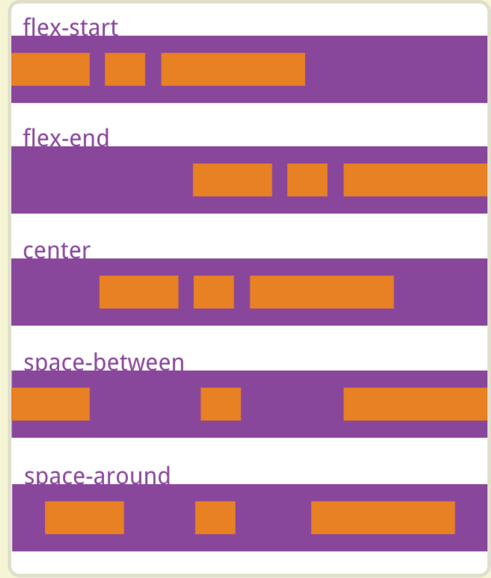
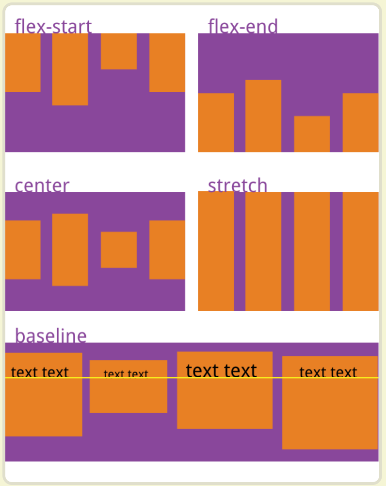
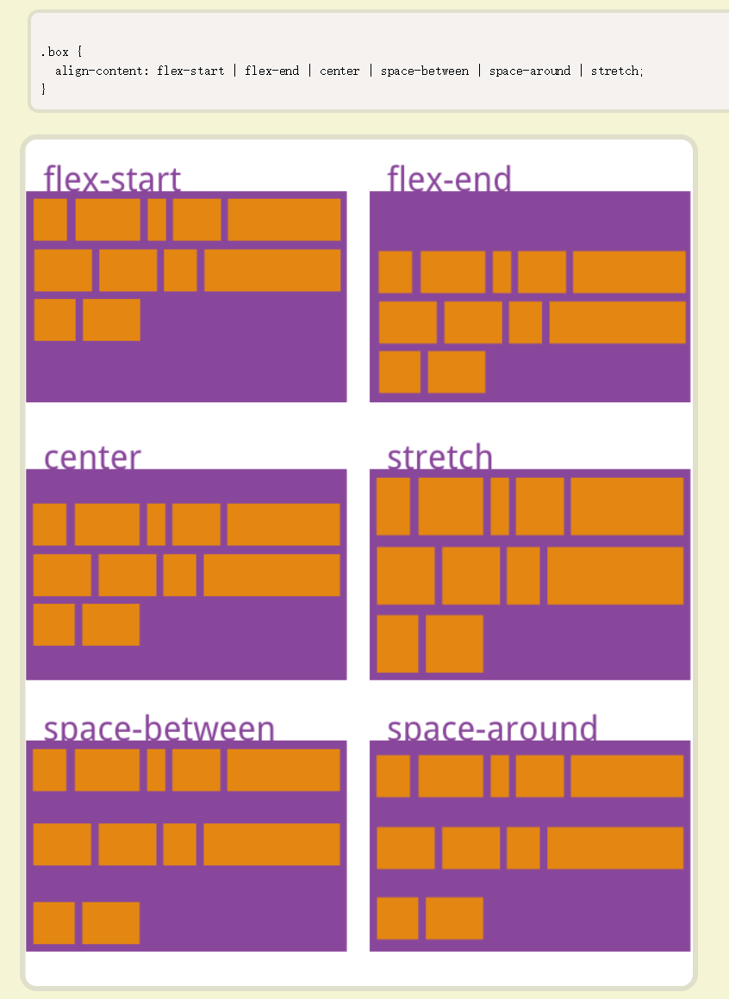

# flex

1，flex-grow:1

这个div会自动填充剩余空间。这就是三栏布局中间那栏能自适应的原因

- flex-direction
- flex-wrap
- flex-flow
- justify-content
- align-items
- align-content

flex-direction： row  column

flex-wrap：wrap 排不下换不换行

flex-flow：row nowrap  是上面两个属性的简写

justify-content： 在主轴对齐方式

flex-start  flex-end  center space-between space-around



align-items:交叉轴对齐

flex-start flex-end center baseline stretch



align-content :多轴对齐方式



order 定义项目的排列顺序，数字越小月前，默认0

flex-grow 项目的放大比例

flex-shrink`flex-shrink`属性定义了项目的缩小比例，默认为1，即如果空间不足，该项目将缩小。

`flex-basis`属性定义了在分配多余空间之前，项目占据的主轴空间（main size）。浏览器根据这个属性，计算主轴是否有多余空间。它的默认值为`auto`，即项目的本来大小。

> ```css
> .item {
>   flex-basis: <length> | auto; /* default auto */
> }
> ```

它可以设为跟`width`或`height`属性一样的值（比如350px），则项目将占据固定空间。

```
flex`属性是`flex-grow`, `flex-shrink` 和 `flex-basis`的简写，默认值为`0 1 auto
```

不放大也不缩小，大小是本身项目的大小

`align-self`属性允许单个项目有与其他项目不一样的对齐方式，可覆盖`align-items`属性。默认值为`auto`，表示继承父元素的`align-items`属性，如果没有父元素，则等同于`stretch`。

```css
auto | flex-start | flex-end | center | baseline | stretch;
```

