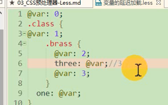

# 一小时学会less

less学习（学习笔记，取所需即可）

写在前面：Less 是一门 CSS 预处理语言，它扩展了 CSS 语言，增加了变量、Mixin、函数等特性，使 CSS 更易维护和扩展。Less 可以运行在 Node 或浏览器端。

## 1，注释

//编译后不保留

/**/编译后保留

## 2，变量

```less
        @color:red;
        .wrapper{
            width:200px;
            height: 200px;
            border: 1px solid @color;
```

如果需要定义属性名和选择器的变量，用的时候加{}花括号

变量的延迟加载



第六行中的变量@var，需要等到.brass这个块里面所有的css加载完再在加载

并且当前块的变量只能找本块及向上。不能调用子块变量

记住就是简单的字符替换，变量，就是替换字符。结构也是用空格表示子父之间dom

## 3，嵌套规则

**除了子父级中的嵌套，当想表示和本身是同一级的时候使用&**

```less
            .inner{
                @var: green;
                width:100px;
                height: 100px;
                border: 1px solid @color;
                &:hover{
                    background-color: black;
                }
            }
加了&等同于----（.inner:hover{样式}），不加则为（.inner :hover）
```

## 4，混合

混合就是将一系列属性从一个规则集引入到另一个规则集的方式。（反过来就是将一些共同的代码提取出来放入一个规则中，然后再其他规则中套用这个规则使得代码简化，灵活化）

1，普通混合

2，不带输出的混合(就是将不需要输出的规则后面加（）如：.inner(){ width：200px；}

3，带参数的混合（实参和形参不吻合会报错）

4，带参数并且有默认值的混合

5，带多个参数的混合

6，命名参数（当形参和实参个数不匹配，可以指定为具体的实参）

居中样式规则集

```css
        .juzhong(@w:100px,@h:100px,@c:red){
            width:@w;
            height: @h;
            border: 1px solid @c;
            position: absolute;
            left:50%;
            top:50%;
            margin-top:-250px;
            margin-left:-250px;
        }
        .wrapper{
            .juzhong(500px,500px);
            .inner{
                .juzhong(200px,200px,@c:pink);
            }
        }
```

7，**匹配模式**

引入外部less文件  `@import './css/01.css'`

匹配模式：当简单的混合不能满足定制一些东西的时候。比如说需要一个可以设置方向和颜色的三角形。这个是不能简单替换变量可以实现的。less中也没有条件语句来判断需要的是向上的边框还是向下的。就有了模式。将那些不参与定制的语句放到一个集合中，其他的写成不同的模式。在调用 .trangle(L, 30px, red)时同时会调用.trangle(@_)。

```html
    <style type="text/less">
            .trangle(@_){
                width:0px;
                height:0px;
            }
            .trangle(L,@c,@w){
                border-width: @w;
                border-style: dashed solid dashed dashed;
                border-color: transparent @c transparent transparent;
            }
            .trangle(R,@c,@w){
                border-width: @w;
                border-style: dashed  dashed solid dashed;
                border-color: transparent transparent @c  transparent;
            }
            .wrapper{
                .trangle(L, 30px, red)
            }
        </style>
            <script src="less.js"></script>
    </head>
    <body>
        <div class="wrapper">
        </div>
    </body>
```

8，arguments变量(鸡肋)

```css
.border(@w,@s,@c){
    border: @arguments;
}
.wrapper{
    .border(1px,solid,red)
}
最后编译：
.wrapper{
    border: 1px solid red;
}
```

## less运算

在less中可以进行加减乘除的运算

less中计算的双方只需要一方带有单位

`width:(100+200px)`

css原生计算：cacl（100px+100）实际是交给浏览编译

## less继承

`.wrapper .inner:nth-child(1){}`

nth-child表示找到.inner的父元素（.wrapper）的子元素中第一个，并且class为.inner的

```html
/* 在每组兄弟元素中选择第四个 <p> 元素 */
p:nth-of-type(4n) {
  color: lime;
}
```

所以总结来说：nth-child和nth-of-type都是找和前面的元素同级的元素。在less中，选中.wrapper下的第一个.inner应该用&来写表示同级

```less
.wrapper{
    .inner{
        &:nth-child(1){
            
        }
    }
}
```


编译后的css，会创建一个组合的选择器，加了all就会把这个类所有的状态都加进去


继承和混合的区别

1，继承的性能比混合高

2，继承的灵活度比混合低（不能传递参数）

## less避免编译

`padding:~"cacl(100+10px)"`

使用~“”包裹的语句less不会处理直接字符串输出