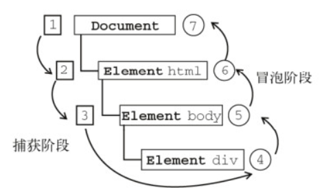

# dom

## DOM的事件模型是什么？(了解基本

DOM之事件模型分脚本模型、内联模型(同类一个，后者覆盖)、动态绑定(同类多个)

```js
<body>
<!--行内绑定：脚本模型-->
<button onclick="javascrpt:alert('Hello')">Hello1</button>
<!--内联模型-->
<button onclick="showHello()">Hello2</button>
<!--动态绑定-->
<button id="btn3">Hello3</button>
</body>
<script>
/*DOM0：同一个元素，同类事件只能添加一个，如果添加多个，
* 后面添加的会覆盖之前添加的*/
function shoeHello() {
alert("Hello");
}
var btn3 = document.getElementById("btn3");
btn3.onclick = function () {
alert("Hello");
}
/*DOM2:可以给同一个元素添加多个同类事件*/
btn3.addEventListener("click",function () {
alert("hello1");
});
btn3.addEventListener("click",function () {
alert("hello2");
})
if (btn3.attachEvent){
/*IE*/
btn3.attachEvent("onclick",function () {
alert("IE Hello1");
})
}else {
/*W3C*/
btn3.addEventListener("click",function () {
alert("W3C Hello");
})
}
</script>
```

---

事件冒泡 事件委托



事件委托及相关面试题待补充


