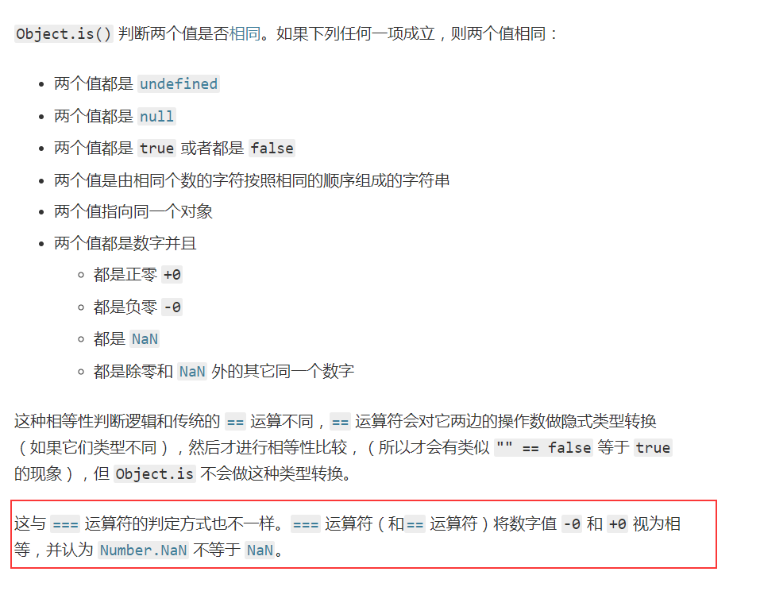

# es6

## let const

1，块级作用域

2，不会变量提升，任何在声明前调用都会报错，暂时死去

3，不能重复申明，就是用var都不行，只要用了这两个

## 结构赋值

1，赋值的是给后面，模式不会被赋值

2，函数的参数也可以结构赋值

3，结构赋值如果左边不是对象或数组，都会先转为对象，undefined和null转化不了会报错

4，undefined才会使用默认值，赋值不成功也会使用undefined

5，遍历器中可以for（let [key,value] of map)

## 正则看不懂

## 数值的扩展

## math

对math方法的扩充和数学相关

## 函数的拓展

尾递归调用优化

很有意思

但是有段代码看不懂

