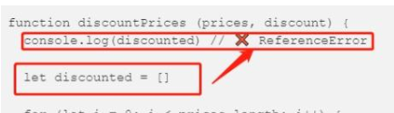
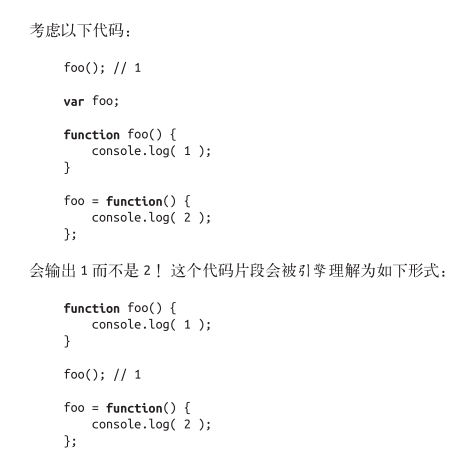

# 第一部分  作用域和闭包

## 第一章  作用域是什么

### 1.2  理解作用域

`var a=2` 编译器首先会分成  `var a`如果作用域里面已经存在同名的a，它会忽略。如果不存在会添加。载执行`a=2`先在作用域中寻找变量a再赋值

> LHS 和 RHS 的含义是“赋值操作的左侧或右侧”并不一定意味着就是“= 赋值操作符的左侧或右侧”。赋值操作还有其他几种形式，因此在概念上最 好将其理解为“赋值操作的目标是谁（LHS）”以及“谁是赋值操作的源头 （RHS）”  RHS找到变量的值   LHS找到要赋值的变量的本体  

在寻找变量时是从内及外从局部到全局变量。

### 1.4 异常

1、在作用域里面找不到变量引擎就会抛出 ReferenceError 异常。    

2、TypeError ：对变量进行赋值不合理发生报错。类型不符合等等等原因，在这个阶段发生的问题就会报错。

js可以在函数里面嵌套函数，妈呀。脑壳疼


## 第二章  词法作用域

**词法作用域的期欺骗**（这两个都不能用，无语）

eval(..) 函数可以接受一个字符串为参数，并将其中的内容视为好像在书 写时就存在于程序中这个位置的代码    

```js
function foo(str, a) {
eval( str ); // 欺骗！
console.log( a, b );
}
var b = 2;
foo( "var b = 3;", 1 ); // 1, 3
```

**eval(..) 通常被用来执行动态创建的代码**

**with**

```js
var obj = {
a: 1,
b: 2,
c: 3
};
// 单调乏味的重复 "obj"
obj.a = 2;
obj.b = 3;
obj.c = 4;
// 简单的快捷方式
with (obj) {
a = 3;
b = 4;
c = 5;
}
但实际上这不仅仅是为了方便地访问对象属性。考虑如下代码：
function foo(obj) {
with (obj) {
a = 2;
}
}
var o1 = {
a: 3
};
var o2 = {
b: 3
};
foo( o1 );
console.log( o1.a ); // 2
foo( o2 );
console.log( o2.a ); // undefined
console.log( a ); // 2——不好， a 被泄漏到全局作用域上了！
```


with方法可以用来调用一个对象的多个属性

1、当这个对象没有这个属性，并不会为其创建

2、当进入with函数时，里面的属性变为with作用域也就是全局变量。

eval(..) 函数如果接受了含有一个或多个声明的代码，就会修改其所处的词法作用域，而 with 声明实际上是根据你传递给它的对象凭空创建了一个全新的词法作用域。    

## 第三章  函数作用域和块作用域

### 函数作用域

函数作用域的含义是指，属于这个函数的全部变量都可以在整个函数的范围内使用及复 用（事实上在嵌套的作用域中也可以使用）。    

**意思就是定义好了一个函数，这个函数里面所有的变量和函数可以在这个函数中调用。并且这个函数如果里面嵌套了一个函数的话。这个里面的函数也可以访问外部函数的变量。**

```js
function doSomething(a) {
b = a + doSomethingElse( a * 2 );
console.log( b * 3 );
}
function doSomethingElse(a) {
return a - 1;
}
var b;
doSomething( 2 ); // 15
```

注意：因为函数doSomething是在全局定义的作用域，那么在这个作用域中可以使用全局域中所有的变量和函数。也就是可以使用变量b和函数doSomethingElse。

上面说的作用域是说。如果一个变量是在函数doSomething中定义的话，那么就只有在函数doSomething中的作用域才能使用这个定义的变量。在其他外部变量就不能使用。

```js
        a=10;
        console.log(a);
```

宽松模式下可以通过，并且可以

### 块作用域

首先：js没有块作用域。在for循环中使用var定义的变量相当于全局变量

拓展：let和const和var的区别

1，**var 和 let 对比**

1）let有块作用域，不会成为全局变量

2）let不会声明提升

在变量声明之前就访问变量，会直接提示 ReferenceError，而不像 var 那样使用默认值 undefined:



2，**let 和 const 对比**

const 和 let 的作用域都是块作用域，不同的是 const 变量一旦被赋值，就**不能再改变**了

## 第四章  提升

js中，存在声明提升

需要注意：1，函数也会声明提升，就是函数内部定义的变量慧提升

2，只有声明会提升，实际的赋值不会提升

3，声明中，是函数优先（同名的函数和变量）。不管函数是不是在变量声明的前面，只要是重复声明就是函数优先



## 第五章  作用域闭包

