# 现代js教程

## promise

函数是**异步**调用的，因为动作不是此刻（加载脚本）完成的，而是之后。

> 我认为函数是同步的，但是当遇到脚本加载和ajax请求的时候会是异步的
>
> 问题：js那些是异步的，那些异步的核心机制是什么

### promise是什么

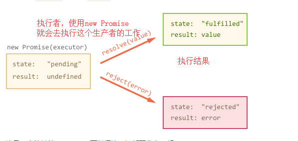

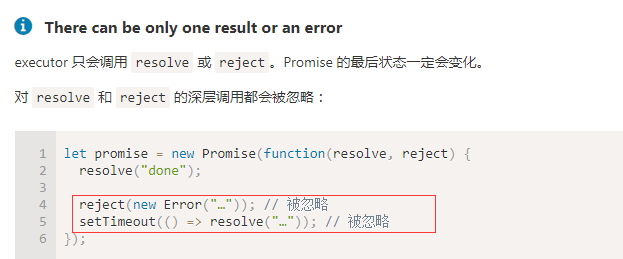

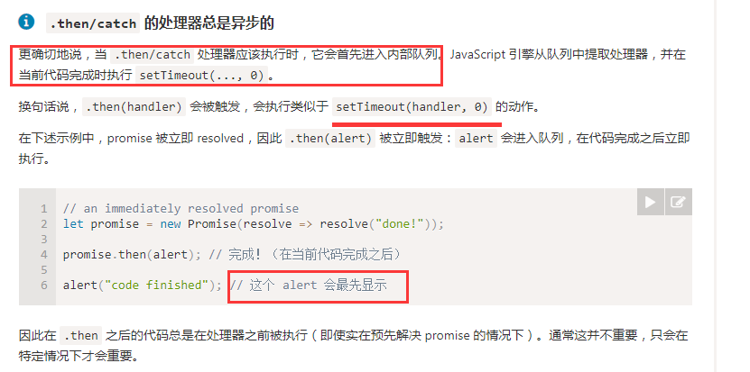

promise有了状态改变之后，是立即执行.then函数的，但是 **立刻执行**  是说执**行类似settimeout中的时间为0**，也就是会加入处理队列中，并不是真正的立即执行。**所以.then的处理器总是异步的**

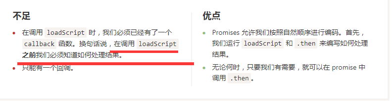

使用promise的时候，我们必须要知道什么时候结束修改状态，任何地方都可以使用.then方法，只要有promise对象

对 `resolve` 的第二次调用会被忽略，因为只有对 `reject/resolve` 的第一次调用会被处理。更深层的调用都会被忽略。

---

promise链

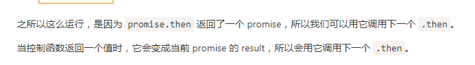

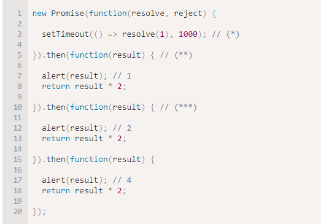

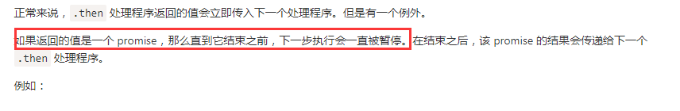

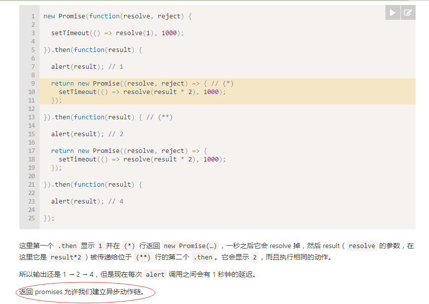

promise的每个.then都会返回一个promise，所以可以链式调用promise

在链式.then中，又可以使用promsie作为return。

为什么要用promise链，因为使用.then之后代码逻辑就是一个向下，而不是向下再向右的死亡金字塔，所以通常，链是优先考虑的

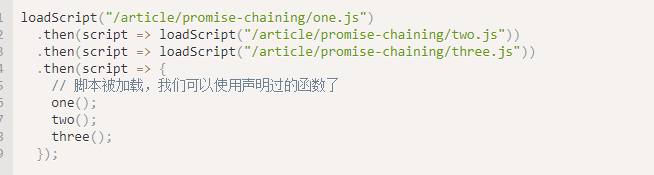

.then**再理解**

> 首先学习js中类的概念
>
> es6中的类其实就是语法糖，让之前使用函数的构造方法，为原型添加公用方法形成一个更易了解的语法格式。类就是函数，一个可以new的函数

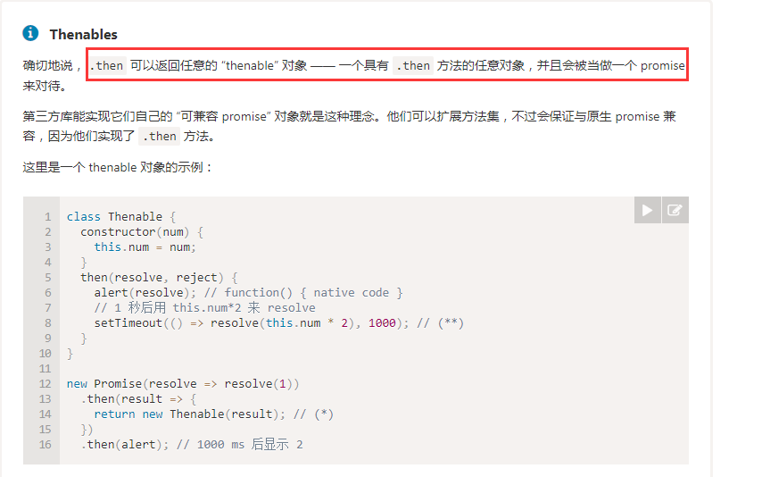

对上面不是很理解，暂时不看了，知道就行，可以自己写一个“thenable”类，修改pomise的then方法。

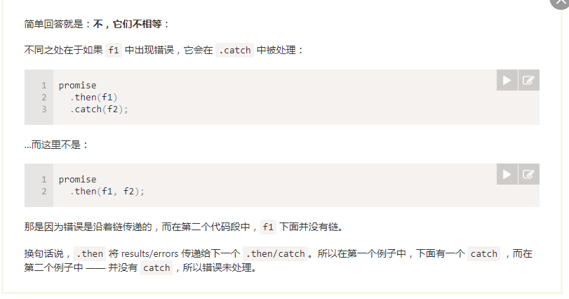

then最多需要有两个参数：Promise 的成功和失败情况的回调

上面那个图，就是说因为promise的错误会随着链传递，promise出错，第一个和第二个都会被处理，但是第一个比第二个多能处理一种情况，就是then中的f1出错。

捕获所有错误最简单的方法是在链的末端加上 `.catch`

这意味着被 rejected 的 promise，因此控制权移交最近的错误处理程序。

#### 重新抛出错误

未被处理的错误，会被js引擎当做一个全局错误，可以使用其他方法（unhandledrejection）来捕获

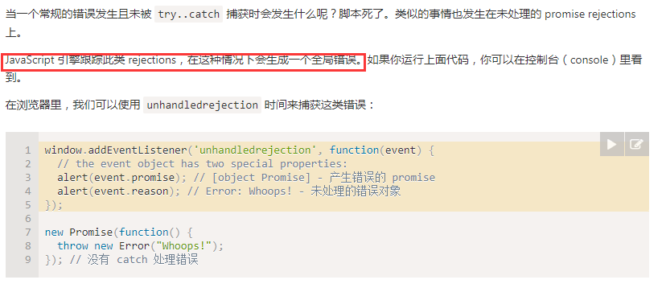

