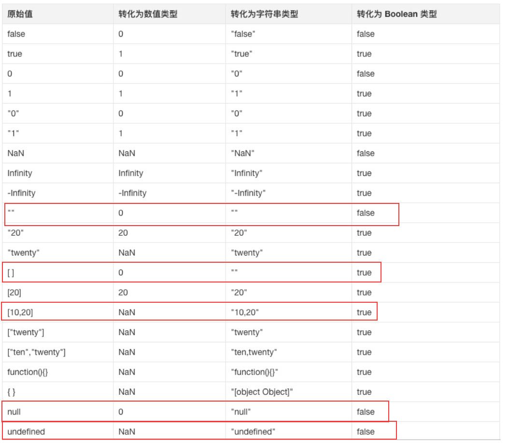
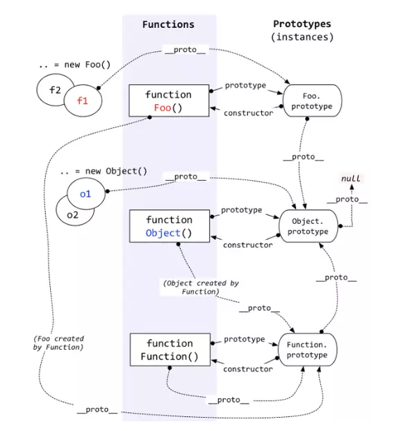
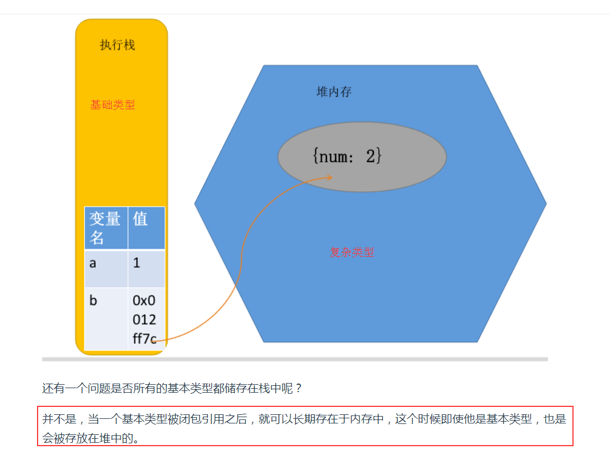

# js基础

变量升vaScript引擎的工作方式是，先解析代码，获取所有被声明的变量，然后再一行一行地运行。这造成的结果，就是所有的变量的声明语句，都会被提升到代码的头部，这就叫做变量提升（hoisting）。

---

### 闭包是什么

MDN的解释：闭包是函数和声明该函数的词法环境的组合。

按照我的理解就是：闭包 =『函数』和『函数体内可访问的变量总和』

未拓展

闭包的作用，创建私有变量

----

## JavaScript的作用域链理解吗？

原理在js执行机制

就是分为词法作用域和执行上下文

词法作用域是声明时就确定，变量的查询就是在执行上下文的基础上查询词法作用域

寻找变量：从当前作用域（词法作用域）下的执行上下文（运行时决定的）中找。一个区域一个上下文

----

## ES6模块与CommonJS模块有什么区别？

[https://es6.ruanyifeng.com/#docs/module-loader#ES6-%E6%A8%A1%E5%9D%97%E4%B8%8E-CommonJS-%E6%A8%A1%E5%9D%97%E7%9A%84%E5%B7%AE%E5%BC%82](https://es6.ruanyifeng.com/#docs/module-loader#ES6-模块与-CommonJS-模块的差异)

通俗易懂

- CommonJS 模块输出的是一个值的拷贝，ES6 模块输出的是值的引用。
- CommonJS 模块是运行时加载，ES6 模块是编译时输出接口。


```javascript
var mod = require('./lib');

console.log(mod.counter);  // 3
mod.incCounter();
console.log(mod.counter); // 3
```

Commonjs引入的那个模块，输出的值发生变化。引入的地方不会发生变化，还是原来的值这是因为`mod.counter`是一个原始类型的值，会被缓存。除非写成一个函数，才能得到内部变动后的值。

ES6 模块的运行机制与 CommonJS 不一样。JS 引擎对脚本静态分析的时候，遇到模块加载命令`import`，就会生成一个只读引用。等到脚本真正执行时，再根据这个只读引用，到被加载的那个模块里面去取值。换句话说，ES6 的`import`有点像 Unix 系统的“符号连接”，原始值变了，`import`加载的值也会跟着变。因此，ES6 模块是动态引用，并且不会缓存值，模块里面的变量绑定其所在的模块

---

类型转换



----

js类型转换

等于在之前的文档中详细 

先转化为字符串再转化为数字进行比较或计算

===在之前的笔记中有，在笔试题中进行提升

先来看一条在js里的隐式的rule，js在进行加法运算的时候， 会先推测两个操作数是不是number。
如果是，则直接相加得出结果。
如果其中有一个操作数为string，则将另一个操作数隐式的转换为string，然后进行字符串拼接得出结果。
如果操作数为对象或者是数组这种复杂的数据类型，那么就将两个操作数都转换为字符串，进行拼接
如果操作数是像boolean这种的简单数据类型，那么就将操作数转换为number相加得出结果

**为什么{}+[]等于 0**

再来看第二个{} + []，这也是两个复杂数据结构相加的例子，看样子与第一个没有什么差别，按理说也应该是[object Object]，但是你相加的时候你会发现， 得出的答案是 0！

这是为什么呢？

**原因是有的js解释器会将开头的 {} 看作一个代码块**，而不是一个js对象，于是真正参与运算的是+[]，就是将[]转换为number，于是得出答案0

----



原型链：所有对象或函数，他们的原型链上都有Object.prototype和Function.prototype

---

## 如何判断是否是数组？

es6中加入了新的判断方法

```js
if（Array.isArray(value)）{
    return true;
}
```

在考虑兼容性的情况下可以用toString的方法

```js
if(!Array.isArray){
    Array.isArray = function(arg){
        return Object.prototype.toString.call(arg)==='[object Array]'
    }

}
```

---

## async/await是什么？

async 函数，就是 Generator 函数的语法糖，它建立在Promises上，并且与所有现有的基于Promise的API兼容。

1. Async—声明一个异步函数(async function someName(){...})

- 自动将常规函数转换成Promise，返回值也是一个Promise对象
- 只有async函数内部的异步操作执行完，才会执行then方法指定的回调函数
- 异步函数内部可以使用await

1. Await—暂停异步的功能执行(var result = await someAsyncCall()😉

- 放置在Promise调用之前，await强制其他代码等待，直到Promise完成并返回结果
- 只能与Promise一起使用，不适用与回调
- 只能在async函数内部使用

## async/await相比于Promise的优势？

- 代码读起来更加同步，Promise虽然摆脱了回调地狱，但是then的链式调用也会带来额外的阅读负担
- Promise传递中间值非常麻烦，而async/await几乎是同步的写法，非常优雅
- 错误处理友好，async/await可以用成熟的try/catch，Promise的错误捕获非常冗余
- 调试友好，Promise的调试很差，由于没有代码块，你不能在一个返回表达式的箭头函数中设置断点，如果你在一个.then代码块中使用调试器的步进(step-over)功能，调试器并不会进入后续的.then代码块，因为调试器只能跟踪同步代码的『每一步』。

----

## JavaScript的基本类型和复杂类型是储存在哪里的？

基本类型储存在栈中，但是一旦被闭包引用则成为常住内存，会储存在内存堆中。

复杂类型会储存在内存堆中。

> 原理解析请移步[JavaScript内存管理](https://www.cxymsg.com/guide/jsBasic.html#memory.html)

## 讲讲JavaScript垃圾回收是怎么做的？

此过程比较复杂，请看详细解析。

> 原理解析请移步[JavaScript内存管理](https://www.cxymsg.com/guide/jsBasic.html#memory.html)

---

感觉自己js和css基础打的挺好，感谢之前看来很多尚硅谷的视频还有看了很多js的教程和书籍

接下来就是深挖基础知识和项目优化，找出亮点

----

# js原理详解

## Event Loop

在`JavaScript`中，任务被分为两种，一种宏任务（`MacroTask`）也叫`Task`，一种叫微任务（`MicroTask`）。

### MacroTask（宏任务）

- `script`全部代码、`setTimeout`、`setInterval`、`setImmediate`（浏览器暂时不支持，只有IE10支持，具体可见[`MDN`](https://link.juejin.im/?target=https%3A%2F%2Fdeveloper.mozilla.org%2Fzh-CN%2Fdocs%2FWeb%2FAPI%2FWindow%2FsetImmediate)）、`I/O`、`UI Rendering`。

### MicroTask（微任务）

- `Process.nextTick（Node独有）`、`Promise`、`Object.observe(废弃)`、`MutationObserver`（具体使用方式查看[这里](https://link.juejin.im/?target=http%3A%2F%2Fjavascript.ruanyifeng.com%2Fdom%2Fmutationobserver.html)）

是将promise的回调操作放入异步队列中

## 浏览器中的Event Loop

`Javascript` 有一个 `main thread` 主线程和 `call-stack` 调用栈(执行栈)，所有的任务都会被放到调用栈等待主线程执行。

### JS调用栈

JS调用栈采用的是后进先出的规则，当函数执行的时候，会被添加到栈的顶部，当执行栈执行完成后，就会从栈顶移出，直到栈内被清空。

### 同步任务和异步任务

`Javascript`单线程任务被分为**同步任务**和**异步任务**，同步任务会在调用栈中按照顺序等待主线程依次执行，异步任务会在异步任务有了结果后，将注册的回调函数放入任务队列中等待主线程空闲的时候（调用栈被清空），被读取到栈内等待主线程的执行。

### 事件循环的进程模型

- 选择当前要执行的任务队列，选择任务队列中最先进入的任务，如果任务队列为空即`null`，则执行跳转到微任务（`MicroTask`）的执行步骤。
- 将事件循环中的任务设置为已选择任务。
- 执行任务。
- 将事件循环中当前运行任务设置为null。
- 将已经运行完成的任务从任务队列中删除。
- microtasks步骤：进入microtask检查点。
- 更新界面渲染。
- 返回第一步。

### 执行进入microtask检查点时，用户代理会执行以下步骤：

- 设置microtask检查点标志为true。
- 当事件循环`microtask`执行不为空时：选择一个最先进入的`microtask`队列的`microtask`，将事件循环的`microtask`设置为已选择的`microtask`，运行`microtask`，将已经执行完成的`microtask`为`null`，移出`microtask`中的`microtask`。
- 清理IndexDB事务
- 设置进入microtask检查点的标志为false。

上述可能不太好理解，下图是我做的一张图片。
执行栈在执行完**同步任务**后，查看**执行栈**是否为空，如果执行栈为空，就会去检查**微任务**(`microTask`)队列是否为空，如果为空的话，就执行`Task`（宏任务），否则就一次性执行完所有微任务。

每次单个**宏任务**执行完毕后，检查**微任务**(`microTask`)队列是否为空，如果不为空的话，会按照**先入先**出的规则全部执行完**微任务**(`microTask`)后，设置**微任务**(`microTask`)队列为`null`，然后再执行**宏任务**，如此循环


就是同步任务放执行堆栈中，先执行同步任务，当执行栈是空的时候，则执行微任务，然后在执行宏任务

----

node的没学

---

看完这个之后，看es6这本书，算法那本书

刷题，扣到细节也知道，能说清楚

项目进行学习，react也可以多学习下

-------

JS内存管理



既然复杂类型被存放在内存堆中，执行栈的函数是如何使用内存堆的复杂类型？

实际上，执行栈的函数上下文会保存一个内存堆对应复杂类型对象的内存地址，通过引用来使用复杂类型对象。


**因为闭包被放在堆栈内存中，所以才能一直可以使用，知道内层函数引用消失，就会被js内存回收**

---

内存回收

深入浅出nodejs mdn内存管理

[深入浅出Node.js](https://book.douban.com/subject/25768396/)

[MDN内存管理](https://developer.mozilla.org/zh-CN/docs/Web/JavaScript/Memory_Management)

看不懂，看文章也看不懂（需要看基础入门）

new关键字做了什么。自己实现js那些内置函数，不会

自己手动实现一个事件监听，

我们仿照Node中[Event API](http://nodejs.cn/api/events.html)实现一个简单的Event库,他是**发布订阅模式**的典型应用

这个不会，没有自己动手写过

---

