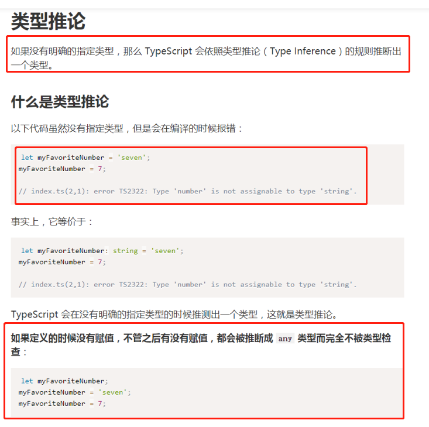
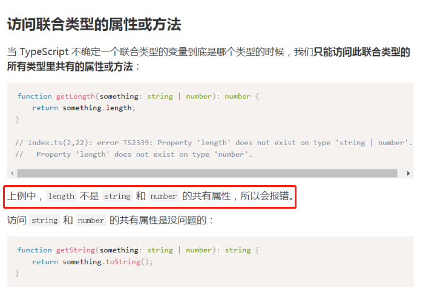

# ts入门教程

## 基础

## 原始数据类型

为js基础类型来设置编译校验

使用 `string` 定义字符串类型：

```ts
let myName: string = 'Tom';
let myAge: number = 25;

// 模板字符串
let sentence: string = `Hello, my name is ${myName}.
I'll be ${myAge + 1} years old next month.`;
```

>  注意
>
> 1.使用构造函数创建的基础类型检验不通过，他是对象使用构造函数 `Boolean` 创造的对象**不是**布尔值
>
> 2，void用于表示函数无返回值
>
> 3，`undefined` 和 `null` 是所有类型的子类型。也就是说 `undefined` 类型的变量，可以赋值给 `number` 类型的变量：

JavaScript 没有空值（Void）的概念，在 TypeScript 中，可以用 `void` 表示没有任何返回值的函数：

```ts
function alertName(): void {
    alert('My name is Tom');
}
```

声明一个 `void` 类型的变量没有什么用，因为你只能将它赋值为 `undefined` 和 `null`：

```ts
let unusable: void = undefined;
```

## Null 和 Undefined

在 TypeScript 中，可以使用 `null` 和 `undefined` 来定义这两个原始数据类型：

```ts
let u: undefined = undefined;
let n: null = null;
```

与 `void` 的区别是，`undefined` 和 `null` 是所有类型的子类型。也就是说 `undefined` 类型的变量，可以赋值给 `number` 类型的变量：

```ts
// 这样不会报错
let num: number = undefined;
// 这样也不会报错
let u: undefined;
let num: number = u;
```

而 `void` 类型的变量不能赋值给 `number` 类型的变量：

---

### 任意值

**声明一个变量为任意值之后，对它的任何操作，返回的内容的类型都是任意值**

普通类型，在被定义的时候，如果后续被赋予了不对的类型的值是报错的。

如果是any，则不会

```ts
let myFavoriteNumber: any = 'seven';
```

并且人一直上访问任何属性和方法也是可以的

**变量如果在声明的时候，未指定其类型，那么它会被识别为任意值类型**：

```ts
let something;
something = 'seven';
something = 7;

something.setName('Tom');
```

### 类型推论



### 联合类型

联合类型的变量在被赋值的时候，会根据类型推论的规则推断出一个类型：

```ts
let myFavoriteNumber: string | number;
myFavoriteNumber = 'seven';
console.log(myFavoriteNumber.length); // 5
myFavoriteNumber = 7;
console.log(myFavoriteNumber.length); // 编译时报错

// index.ts(5,30): error TS2339: Property 'length' does not exist on type 'number'.
```



### 对象的类型--接口

```ts
interface Person {
    name: string;
    age?: number;
    [propName: string]: string | number;
}

let tom: Person = {
    name: 'Tom',
    age: 25,
    gender: 'male'
};
```

1，不能比定义的多和少

2，只能有一个任意的属性

3，    readonly id: number;只读属性

### 数组的类型

## 「类型 + 方括号」表示法

最简单的方法是使用「类型 + 方括号」来表示数组：

```ts
let fibonacci: number[] = [1, 1, 2, 3, 5];
```

数组的项中**不允许**出现其他的类型：

```ts
let fibonacci: number[] = [1, '1', 2, 3, 5];

// Type 'string' is not assignable to type 'number'.
```

数组的一些方法的参数也会根据数组在定义时约定的类型进行限制：

```ts
let fibonacci: number[] = [1, 1, 2, 3, 5];
fibonacci.push('8');
```

###  函数的类型

函数表达式

如果要我们现在写一个对函数表达式（Function Expression）的定义，可能会写成这样：

```ts
let mySum = function (x: number, y: number): number {
    return x + y;
};
```

这是可以通过编译的，不过事实上，上面的代码只对等号右侧的匿名函数进行了类型定义，而等号左边的 `mySum`，是通过赋值操作进行类型推论而推断出来的。如果需要我们手动给 `mySum` 添加类型，则应该是这样：

```ts
let mySum: (x: number, y: number) => number = function (x: number, y: number): number {
    return x + y;
};
```

注意不要混淆了 TypeScript 中的 `=>` 和 ES6 中的 `=>`。

在 TypeScript 的类型定义中，`=>` 用来表示函数的定义，左边是输入类型，需要用括号括起来，右边是输出类型。

### 类型的断言

此时可以使用类型断言，将 `animal` 断言成 `Fish`：

```ts
interface Cat {
    name: string;
    run(): void;
}
interface Fish {
    name: string;
    swim(): void;
}

function isFish(animal: Cat | Fish) {
    if (typeof (animal as Fish).swim === 'function') {
        return true;
    }
    return false;
}
```

这样就可以解决访问 `animal.swim` 时报错的问题了。

需要注意的是，类型断言只能够「欺骗」TypeScript 编译器，无法避免运行时的错误，反而滥用类型断言可能会导致运行时错误：

我们确实需要在还不确定类型的时候就**访问其中一个类型特有的属性**或方法

- 联合类型可以被断言为其中一个类型
- 父类可以被断言为子类
- 任何类型都可以被断言为 any
- any 可以被断言为任何类型
  - 任何类型都可以被断言为 any
  - any 可以被断言为任何类型

### 申明文件

- [`declare var`](https://ts.xcatliu.com/basics/declaration-files.html#declare-var) 声明全局变量
- [`declare function`](https://ts.xcatliu.com/basics/declaration-files.html#declare-function) 声明全局方法
- [`declare class`](https://ts.xcatliu.com/basics/declaration-files.html#declare-class) 声明全局类
- [`declare enum`](https://ts.xcatliu.com/basics/declaration-files.html#declare-enum) 声明全局枚举类型
- [`declare namespace`](https://ts.xcatliu.com/basics/declaration-files.html#declare-namespace) 声明（含有子属性的）全局对象
- [`interface` 和 `type`](https://ts.xcatliu.com/basics/declaration-files.html#interface-he-type) 声明全局类型

```ts
declare var jQuery: (selector: string) => any;
```

### 内置对象

ECMAScript 标准提供的内置对象有：

`Boolean`、`Error`、`Date`、`RegExp` 等。

我们可以在 TypeScript 中将变量定义为这些类型：

```ts
let b: Boolean = new Boolean(1);
let e: Error = new Error('Error occurred');
let d: Date = new Date();
let r: RegExp = /[a-z]/;
```

DOM 和 BOM 提供的内置对象有：

`Document`、`HTMLElement`、`Event`、`NodeList` 等。

TypeScript 中会经常用到这些类型：

```ts
let body: HTMLElement = document.body;
let allDiv: NodeList = document.querySelectorAll('div');
document.addEventListener('click', function(e: MouseEvent) {
  // Do something
});
```

## 进阶

### 类型别名

```ts
type Name = string;
type NameResolver = () => string;
type NameOrResolver = Name | NameResolver;
function getName(n: NameOrResolver): Name {
    if (typeof n === 'string') {
        return n;
    } else {
        return n();
    }
}
```

上例中，我们使用 `type` 创建类型别名。

类型别名常用于联合类型。

### 字符串字面量类型

字符串字面量类型用来约束取值只能是某几个字符串中的一个。

```ts
'click' | 'scroll' | 'mousemove';
function handleEvent(ele: Element, event: EventNames) {
    // do something
}

handleEvent(document.getElementById('hello'), 'scroll');  // 没问题
handleEvent(document.getElementById('world'), 'dblclick'); // 报错，event 不能为 'dblclick'

// index.ts(7,47): error TS2345: Argument of type '"dblclick"' is not assignable to parameter of type 'EventNames'.
```

上例中，我们使用 `type` 定了一个字符串字面量类型 `EventNames`，它只能取三种字符串中的一种。

### 元组

数组合并了相同类型的对象，而元组（Tuple）合并了不同类型的对象。

当赋值或访问一个已知索引的元素时，会得到正确的类型：

```ts
let tom: [string, number];
tom[0] = 'Tom';
tom[1] = 25;

tom[0].slice(1);
tom[1].toFixed(2);
```

### 枚举

```ts
enum Days {Sun, Mon, Tue, Wed, Thu, Fri, Sat};
```

枚举成员会被赋值为从 `0` 开始递增的数字，同时也会对枚举值到枚举名进行反向映射：

```ts
enum Days {Sun, Mon, Tue, Wed, Thu, Fri, Sat};

console.log(Days["Sun"] === 0); // true
console.log(Days["Mon"] === 1); // true
console.log(Days["Tue"] === 2); // true
console.log(Days["Sat"] === 6); // true

console.log(Days[0] === "Sun"); // true
console.log(Days[1] === "Mon"); // true
console.log(Days[2] === "Tue"); // true
console.log(Days[6] === "Sat"); // true
```

事实上，上面的例子会被编译为：

```js
var Days;
(function (Days) {
    Days[Days["Sun"] = 0] = "Sun";
    Days[Days["Mon"] = 1] = "Mon";
    Days[Days["Tue"] = 2] = "Tue";
    Days[Days["Wed"] = 3] = "Wed";
    Days[Days["Thu"] = 4] = "Thu";
    Days[Days["Fri"] = 5] = "Fri";
    Days[Days["Sat"] = 6] = "Sat";
})(Days || (Days = {}));
```

### 类

当构造函数修饰为 `protected` 时，该类只允许被继承：

当构造函数修饰为 `private` 时，该类不允许被继承或者实例化


需要注意的是，TypeScript 编译之后的代码中，并没有限制 `private` 属性在外部的可访问性。

上面的例子编译后的代码是：

使用 `private` 修饰的属性或方法，在子类中也是不允许访问的

而如果是用 `protected` 修饰，则允许在子类中访问：

首先，抽象类是不允许被实例化的：

### 类和接口

## 类实现接口

实现（implements）是面向对象中的一个重要概念。一般来讲，一个类只能继承自另一个类，有时候不同类之间可以有一些共有的特性，这时候就可以把特性提取成接口（interfaces），用 `implements` 关键字来实现。这个特性大大提高了面向对象的灵活性。

举例来说，门是一个类，防盗门是门的子类。如果防盗门有一个报警器的功能，我们可以简单的给防盗门添加一个报警方法。这时候如果有另一个类，车，也有报警器的功能，就可以考虑把报警器提取出来，作为一个接口，防盗门和车都去实现它：

```ts
interface Alarm {
    alert(): void;
}

class Door {
}

class SecurityDoor extends Door implements Alarm {
    alert() {
        console.log('SecurityDoor alert');
    }
}

class Car implements Alarm {
    alert() {
        console.log('Car alert');
    }
}
```

一个类可以实现多个接口：

## 接口继承接口

接口与接口之间可以是继承关系：

```ts
interface Alarm {
    alert(): void;
}

interface LightableAlarm extends Alarm {
    lightOn(): void;
    lightOff(): void;
}
```

这很好理解，`LightableAlarm` 继承了 `Alarm`，除了拥有 `alert` 方法之外，还拥有两个新方法 `lightOn` 和 `lightOff`。

## 接口继承类

常见的面向对象语言中，接口是不能继承类的，但是在 TypeScript 中却是可以的

为什么 TypeScript 会支持接口继承类呢？

实际上，当我们在声明 `class Point` 时，除了会创建一个名为 `Point` 的类之外，同时也创建了一个名为 `Point` 的类型（实例的类型）。

所以我们既可以将 `Point` 当做一个类来用（使用 `new Point` 创建它的实例）：

```ts
class Point {
    x: number;
    y: number;
    constructor(x: number, y: number) {
        this.x = x;
        this.y = y;
    }
}

const p = new Point(1, 2);
```

也可以将 `Point` 当做一个类型来用（使用 `: Point` 表示参数的类型）：

```ts
class Point {
    x: number;
    y: number;
    constructor(x: number, y: number) {
        this.x = x;
        this.y = y;
    }
}

function printPoint(p: Point) {
    console.log(p.x, p.y);
}

printPoint(new Point(1, 2));
```

### 泛型

泛型（Generics）是指在定义函数、接口或类的时候，不预先指定具体的类型，而在使用的时候再指定类型的一种特性

申明时不明确类型，运行的时候指明

```ts
function createArray<T>(length: number, value: T): Array<T> {
    let result: T[] = [];
    for (let i = 0; i < length; i++) {
        result[i] = value;
    }
    return result;
}

createArray<string>(3, 'x'); // ['x', 'x', 'x']
```

上例中，我们在函数名后添加了 ``，其中 `T` 用来指代任意输入的类型，在后面的输入 `value: T` 和输出 `Array` 中即可使用了。

接着在调用的时候，可以指定它具体的类型为 `string`。当然，也可以不手动指定，而让类型推论自动推算出来：

```ts
function createArray<T>(length: number, value: T): Array<T> {
    let result: T[] = [];
    for (let i = 0; i < length; i++) {
        result[i] = value;
    }
    return result;
}

createArray(3, 'x'); // ['x', 'x', 'x']
```

## 多个类型参数

定义泛型的时候，可以一次定义多个类型参数：

```ts
function swap<T, U>(tuple: [T, U]): [U, T] {
    return [tuple[1], tuple[0]];
}
```

### 申明合并

如果定义了两个相同名字的函数、接口或类，那么它们会合并成一个类型：

## 函数的合并

[之前学习过](https://ts.xcatliu.com/basics/type-of-function.md#重载)，我们可以使用重载定义多个函数类型：

```ts
function reverse(x: number): number;
function reverse(x: string): string;
function reverse(x: number | string): number | string {
    if (typeof x === 'number') {
        return Number(x.toString().split('').reverse().join(''));
    } else if (typeof x === 'string') {
        return x.split('').reverse().join('');
    }
}
```

## 接口的合并

接口中的属性在合并时会简单的合并到一个接口中：

```ts
interface Alarm {
    price: number;
}
interface Alarm {
    weight: number;
}
```

相当于：

```ts
interface Alarm {
    price: number;
    weight: number;
}
```

注意，**合并的属性的类型必须是唯一的**：

```ts
interface Alarm {
    price: number;
}
interface Alarm {
    price: number;  // 虽然重复了，但是类型都是 `number`，所以不会报错
    weight: number;
}
interface Alarm {
    price: number;
}
interface Alarm {
    price: string;  // 类型不一致，会报错
    weight: number;
}
```

## 工程

### 代码检查

因为 TypeScript 关注的重心是类型的检查，而不是代码风格