第一章：课程简介 (5讲)

01 | 课程介绍免费
02 | 内容综述免费
03 | Node.js是什么？免费
04 | Node.js可以用来做什么？免费

搜索引擎，首屏优化 ssr

05 | 课程实战项目介绍免费
第二章：技术预研篇 (20讲)

06 | 什么是技术预研？

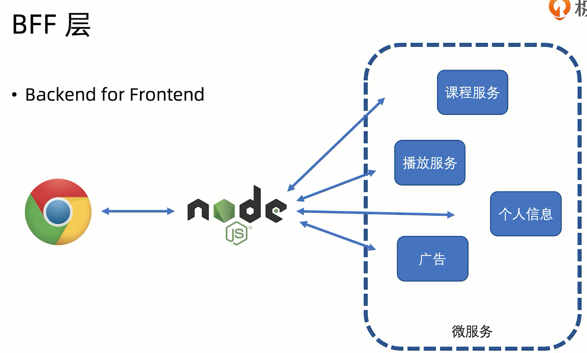

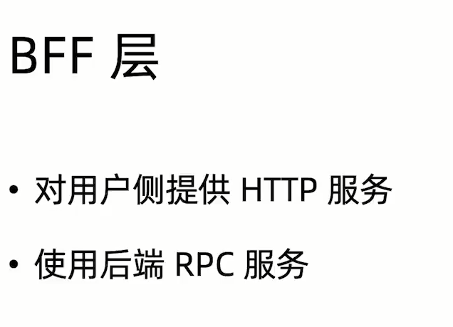

07 | Node.js开发环境安装

08 | 第一个Node.js程序：石头剪刀布游戏
09 | 模块：CommonJS规范  

以前唯一的加载模块方式   <script>

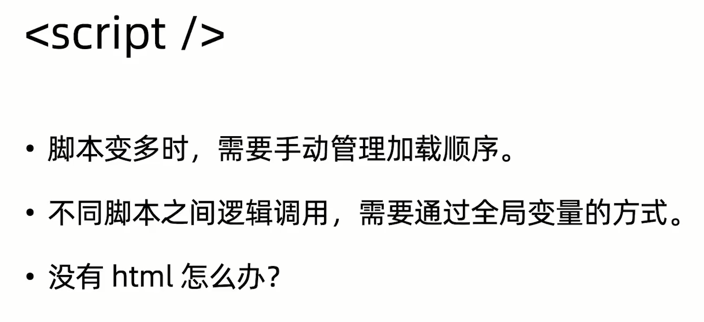

重要问题： commonjs中exports和require的变量是不是同一个变量，

答案是：改变require对应的变量，能改变exports的

exports被修改了，会覆盖之前的

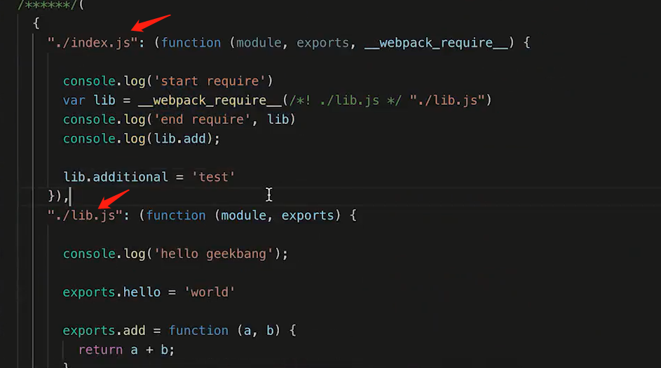

webpack会打包到一个对象中，

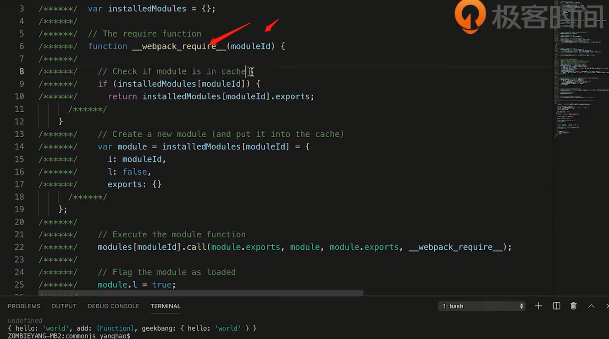

所以为啥是同一个值，因为上一个文件的exports，会变成下一个文件的函数的参数。参数是地址传递

10 | 模块：使用模块规范改造石头剪刀布游戏
11 | 模块：npm

todo： npm的原理和作用？

12 | 模块：Node.js内置模块

os eventemit 等

内置模块有两种获取数据的方式，一种是左边通过v8来，bing来拿到，一种是直接通过服务器拿到

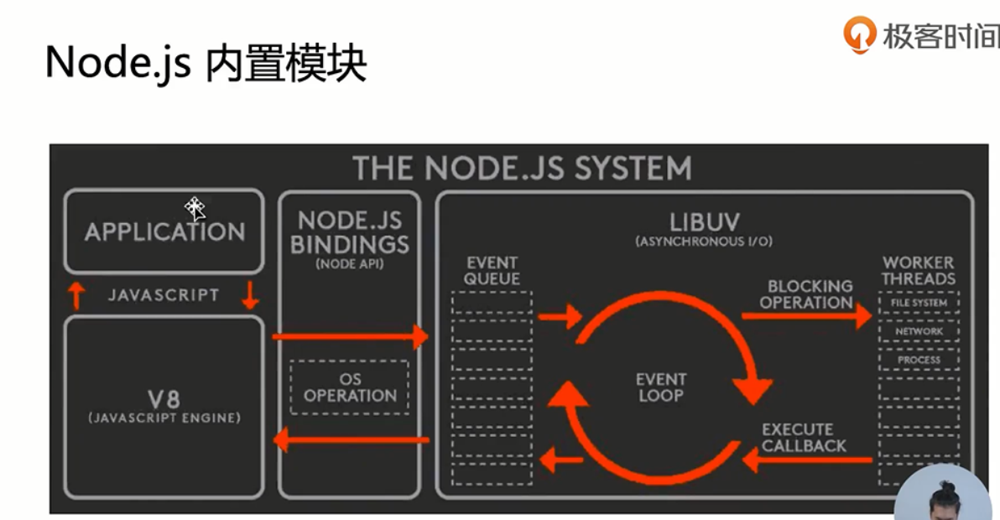

#### 13 | 异步：非阻塞I/O

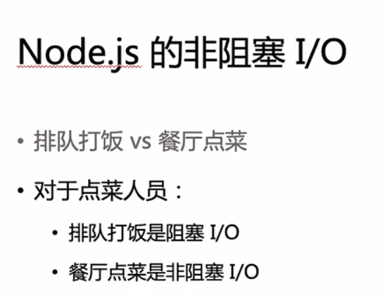

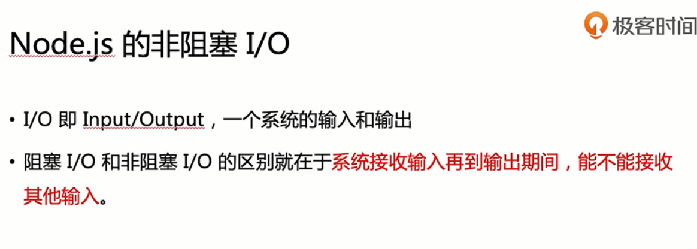

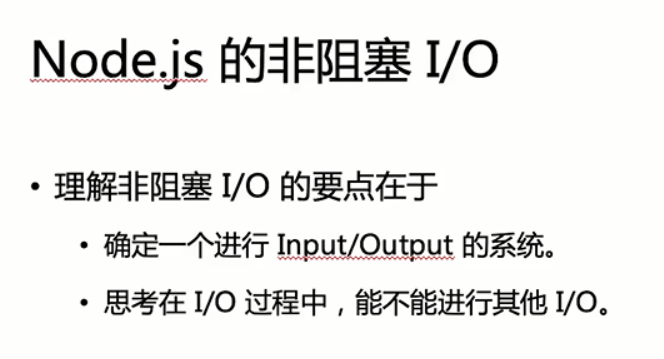

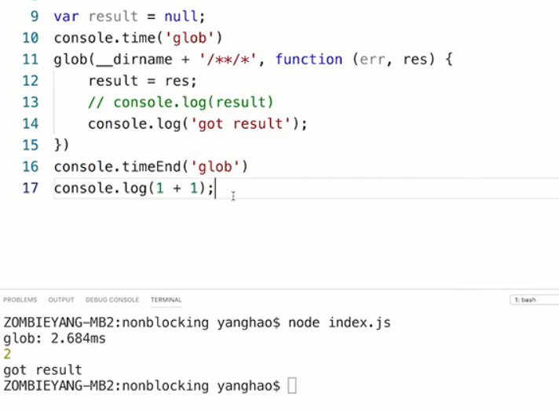

非阻塞

14 | 异步：异步编程之callback

node中的异步函数结果返回是使用callback，然后使用的是

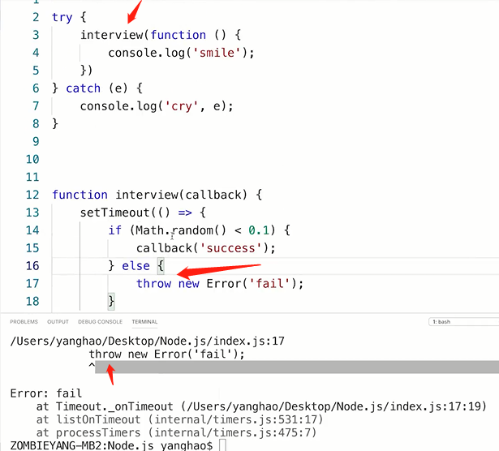

为什么try catch没有捕获 ，异步操作

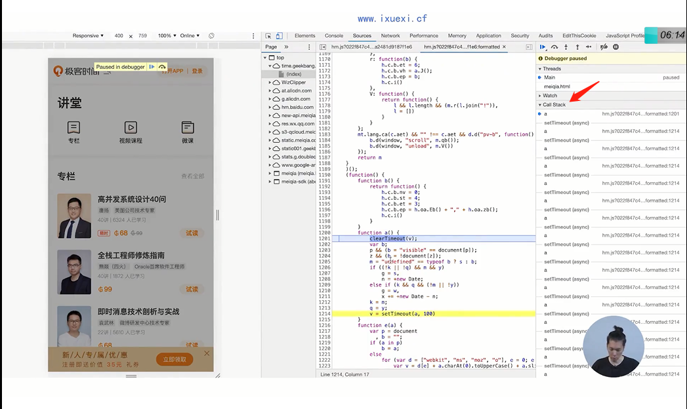

调用栈

要在try catch中的调用栈里面的错误才会被捕获

try catch定义的函数中，调用栈在try catch以上的函数，抛出的错误，都会被try catch捕获到

但是js中异步是和事件循环有关，异步操作是下一个循环，每次循环都是一个新的调用栈

问题，事件循环如何分次

#### 15 | 异步：事件循环

每一个事件循环都是一个全新的调用栈

没有回答对应的问题

#### 16 | 异步：异步编程之Promise

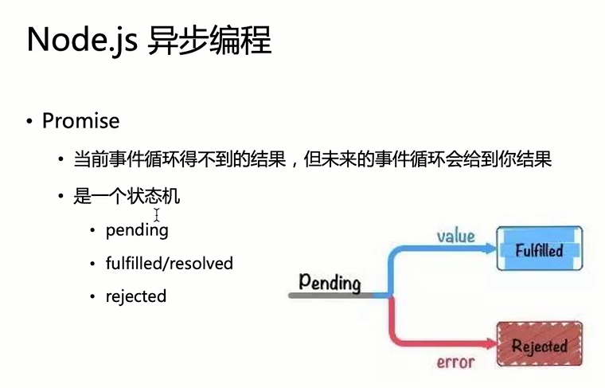

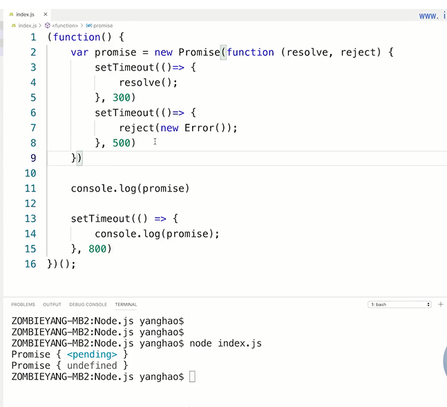

状态只能是pending-》reject ，resolve

因为内置的resolve和reject函数会判断

会执行，但是不会改变状态

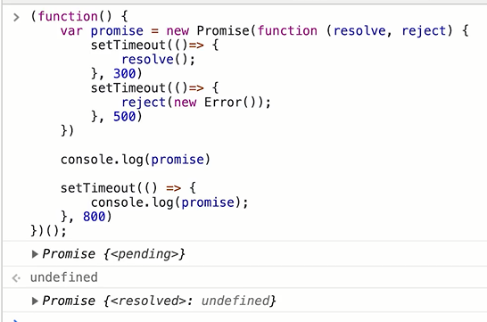

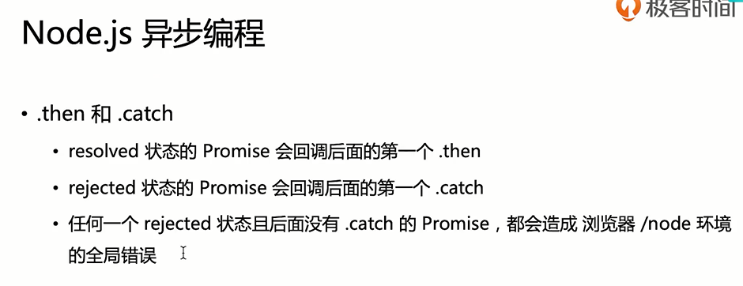

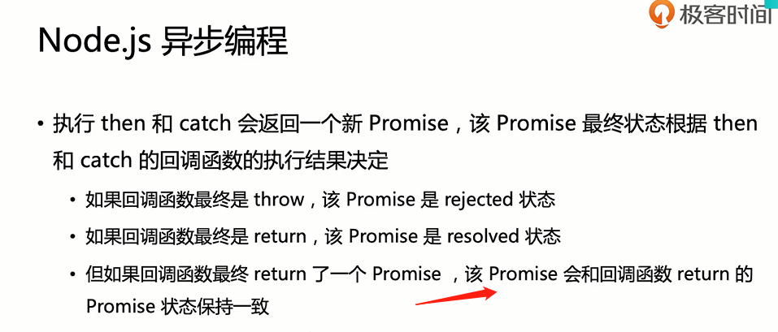

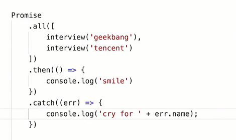

all  catch只能知道当前第一个错误的信息

#### 17 | 异步：异步编程之async/await

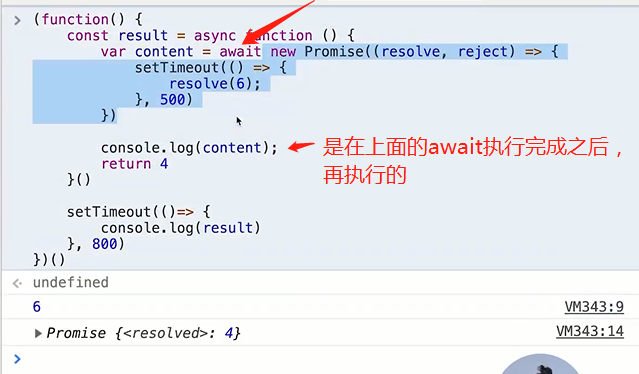

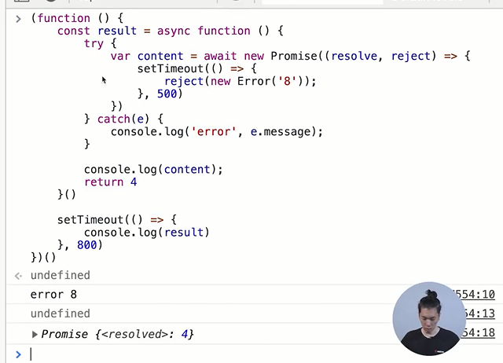

await可以将错误抛到被包裹的try catch

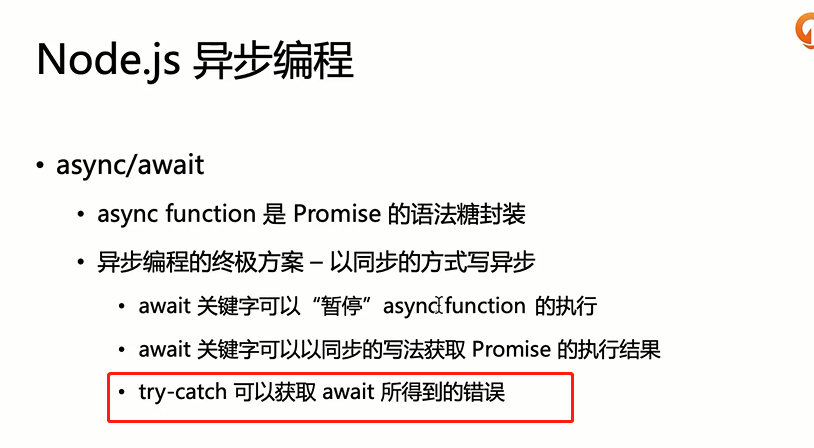

？？？？ 

所以await后面的同步语句，会在await后面的异步事件完成之后再执行。

做到异步行为，同步编程

**async是一个 promise语法糖，然后await是 generator中终止操作**

18 | HTTP：什么是HTTP服务器？
19 | HTTP：简单实现一个HTTP服务器
20 | HTTP：实现网页版石头剪刀布
21 | HTTP：用express优化石头剪刀布游戏
22 | HTTP：用koa优化石头剪刀布游戏

4个小时，7点前1个小时，8点到11点三个小时。14节

#### 23 | RPC 调用：什么是RPC调用？

#### 24 | RPC调用：Node.js Buffer编解码二进制数据包
#### 25 | RPC 调用：Node.js net建立多路复用的RPC通道

第三章： 项目开发篇 (11讲)

26 | 项目启动：整体需求分析
27 | 项目启动：极客时间App下载页开发
28 | 课程详情页：极客时间详情页需求解构
29 | 课程详情页：将ES6模版字符串改造成模板引擎
30 | 课程详情页：极客时间详情页需求实现
31 | 课程播放页：极客时间播放页需求解构
32 | 课程播放页：GraphQL API服务
33 | 课程播放页：极客时间播放页需求实现
34 | 课程列表页：极客时间列表页需求解构
35 | 课程列表页：用 Vue/React 进行服务端渲染
36 | 课程列表页：极客时间列表页需求实现
第四章：性能调优篇 (10讲)


#### 37 | 性能工具：HTTP服务的性能测试

了解

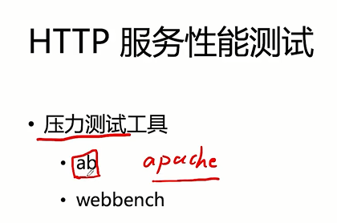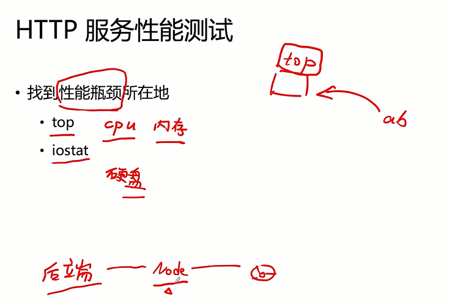

#### 38 | 性能工具：Node.js性能分析工具

了解

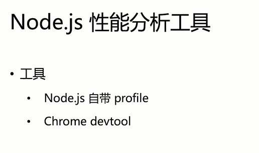

#### 39 | 代码优化：JavaScript代码性能优化

了解

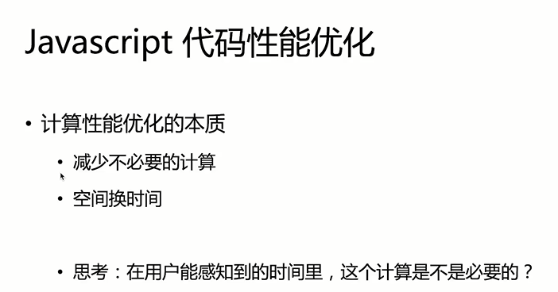

#### 40 | 代码优化：内存管理优化

了解

#### 41 | 代码优化：Node.js C++插件

了解

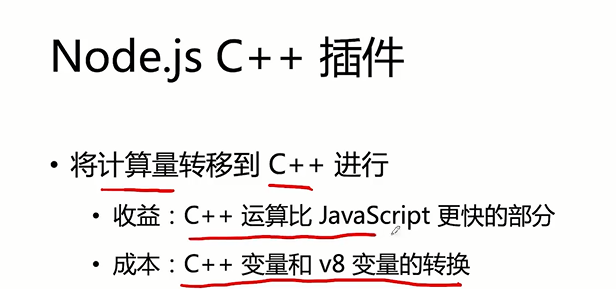

#### 42 | 多进程优化：Node.js子进程与线程

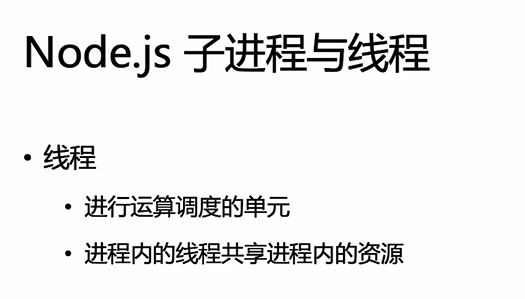

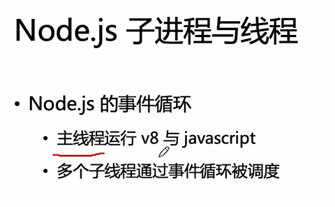

晚上来学，重点学。感觉就主要学了下异步+子进程

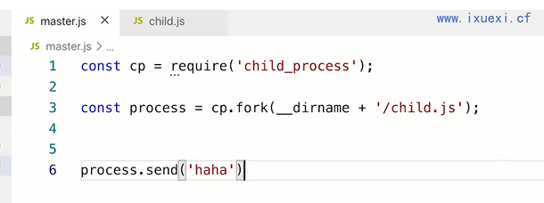

创建了一个子进程，父进程向子进程接受消息

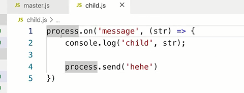

子线程 worker thread：计算，对io没有帮助，使用异步io

#### 43 | 多进程优化：Node.js cluster模块实战与源码解读

为了网络服务特别实现的：

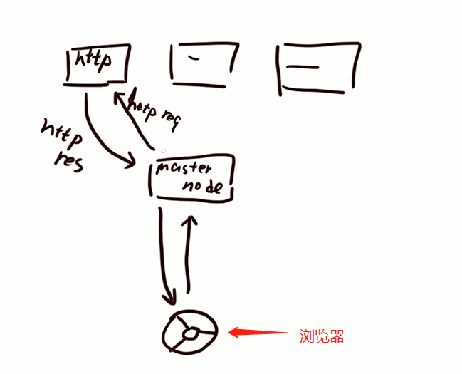

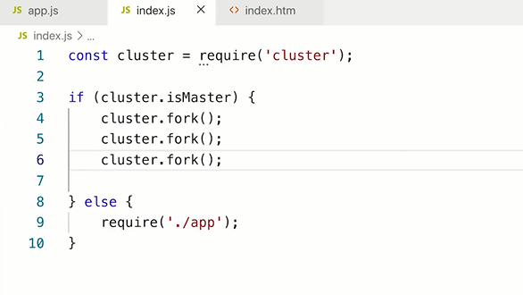

帮助我们使用多核的服务器，将http分发到几个子进程中进行处理，提高了多核能力，多个进程监听同一个端口

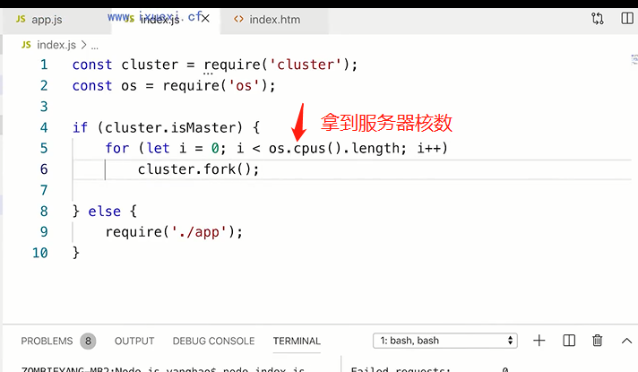

一般是总核数/2

为什么能同时监听一个端口，操作系统中一个端口只能被监听一次

为什么cluster能做到？？

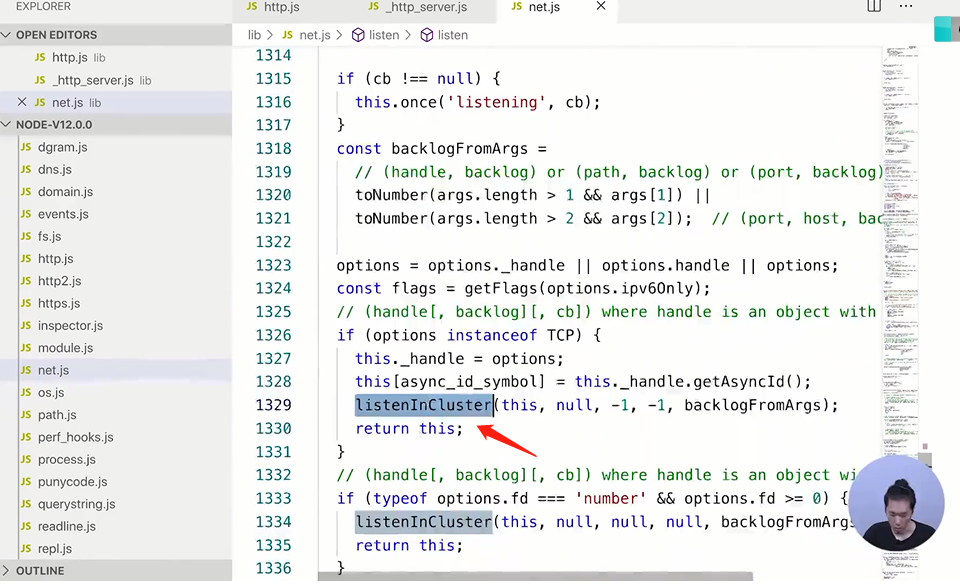

端口号是主进程进行监听，给子进程发送消息（发送tcp链接的句柄handle

维护一个新的子进程池，有新的链接进来就用一个子进程来处理，如果没有空闲的子进程，就先把这个链接存起来

轮番执行

#### 44 | 多进程优化：进程守护与管理

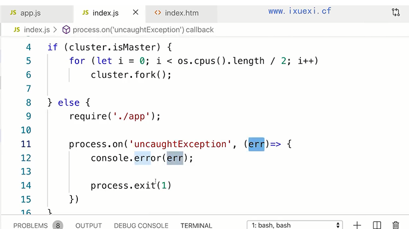

出现未捕捉的错误时，上报

子进程退出了，隔一段时间重新fork一个

对内存进行监控

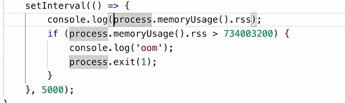

#### 45 | 架构优化：动静分离

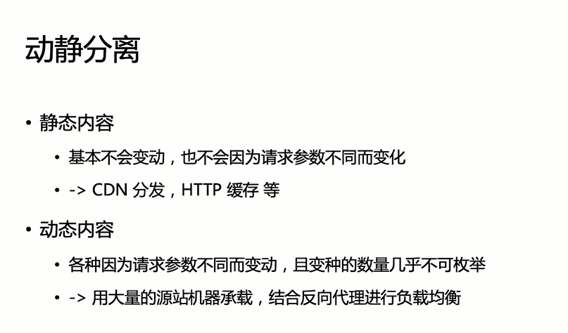

cdn：缓存原理

#### 46 | 架构优化：反向代理与缓存服务

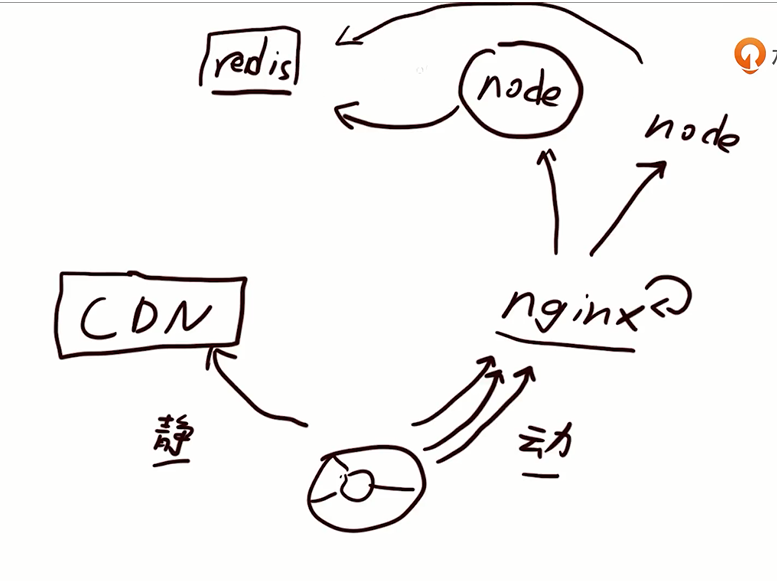

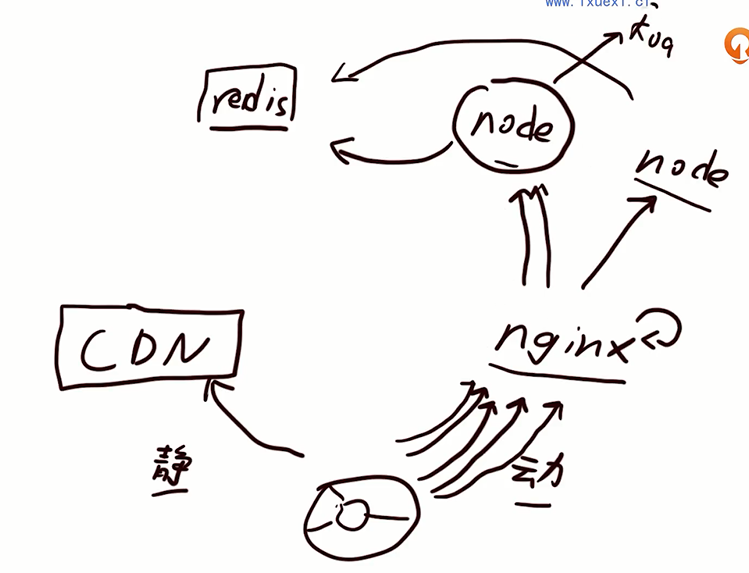

koa

第五章：框架和工程化篇 (11讲)


#### 47 | 概念：框架设计和工程化
#### 48 | 概念：设计模式
49 | 概念：Serverless
50 | 服务端框架搭建：koaless
51 | 服务端框架搭建：屏蔽请求细节
52 | 服务端框架搭建：完成服务端框架
53 | 云函数式工程实现：服务端代码
54 | 云函数式工程实现：工具端代码
55 | 加餐：调试 Node.js 源码
56 | 结课测试&结束语
57 | 彩蛋：这是一个严肃的课程

（只看16节

很多没看，再找找node相关的课程来好好看看学学+文章+重点知识点