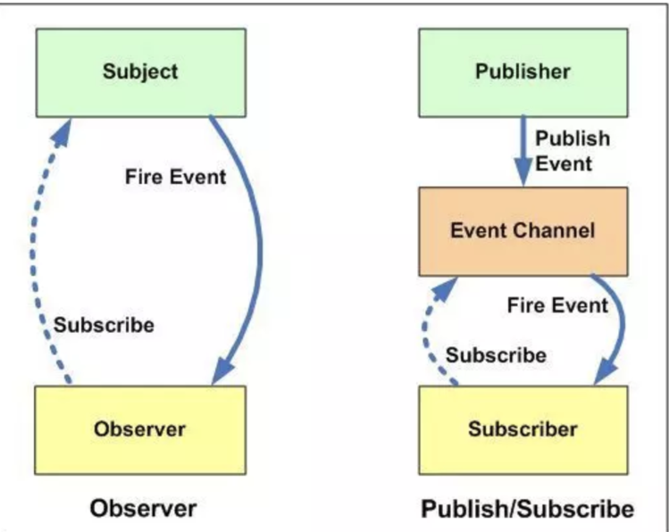

### 第 1 题：（滴滴、饿了么）写 React / Vue 项目时为什么要在列表组件中写 key，其作用是什么？

问题： react中的diff流程

vue中是如何使用了key

> react中的diff流程

对于同一层级的一组子节点，通过分配唯一唯一id进行区分（key值） 在Web UI的场景下，基于以上三个点，React对tree diff、component diff、element diff进行优化，将普适diff的复杂度降低到一个数量级，保证了整体UI界面的构建性能！

树，组件，元素

> tree diff

基于策略一，React的做法是把dom tree分层级，对于两个dom tree只比较同一层次的节点，忽略Dom中节点跨层级移动操作，只对同一个父节点下的所有的子节点进行比较。如果对比发现该父节点不存在则直接删除该节点下所有子节点，不会做进一步比较，这样只需要对dom tree进行一次遍历就完成了两个tree的比较。
 ==那么对于跨层级的dom操作是怎么进行处理的呢？==下面通过一个图例进行阐述


两个tree进行对比，右边的新tree发现A节点已经没有了，则会直接销毁A以及下面的子节点B、C；在D节点上面发现多了一个A节点，则会重新创建一个新的A节点以及相应的子节点。
 具体的操作顺序：create A → create B → creact C → delete A。

和极客时间中的视频讲解一样，放弃跨层的操作，只考虑当前层有没有，一次遍历，on复杂

> component diff

React应用是基于组件构建的，对于组件的比较优化侧重于以下几点：
 \1. 同一类型组件遵从tree diff比较v-dom树 2. 不通类型组件，先将该组件归类为dirty component，替换下整个组件下的所有子节点 3. 同一类型组件Virtual Dom没有变化，React允许开发者使用shouldComponentUpdate（）来判断该组件是否进行diff，运用得当可以节省diff计算时间，提升性能


如上图，当组件D → 组件G时，diff判断为不同类型的组件，虽然它们的结构相似甚至一样，diff仍然不会比较二者结构，会直接销毁D及其子节点，然后新建一个G相关的子tree，这显然会影响性能，官方虽然认定这种情况极少出现，但是开发中的这种现象造成的影响是非常大的。

也没什么 ，就把组件当成一个子树，然后用tree的方法一样，不过不同类型会直接删除

同你类型无变化，会调用钩子函数

>  element diff

重点在这里： 同一层的节点对比如何对比

删除，移动，插入。这三种操作

对于同一节点顺序变化了，不再是一次遍历直接删除，然后添加新的，而是支持key

React对这一现象做出了一个高效的策略：允许开发者对同一层级的同组子节点添加唯一key值进行区分。意义就是代码上的一小步，性能上的一大步，甚至是翻天覆地的变化！

==重点来了，React通过key是如何进行element管理的呢？为何如此高效？==


就是如果新集合中的B比旧集合中B前，就不移动，新a比旧a后，所以a移动

不存在就等于新增，index++

当完成新集合所有节点中的差异对比后，对旧集合进行遍历，判读旧集合中是否存在新集合中不存在的节点，此时发现D节点符合判断，执行删除D节点的操作，diff操作完成。（最后遍历之后，把不要的节点删除）

不足


这种情况本来只要移动d，但是却移动了abc

在开发过程中，同层级的节点添加唯一**key值可以极大提升性能**，**尽量减少将最后一个节点移动到列表首部的操作**，当节点达到一定的数量以后或者操作过于频繁，在一定程度上会影响React的渲染性能。比如大量节点拖拽排序的问题。

react中diff会根据**通过key值判断两个对比集合中是否存在相同的节点**

对原来进行优化，减少顺序变化，而不用一直删除新增。（默认的treediff会这样）

>  问题2： vue中diff  过程，key扮演了什么作用

diff算法是一种优化手段，将前后两个模块进行差异对比，修补(更新)差异的过程叫做patch(打补丁)、

两个节点都有子节点，而且它们不一样，这样我们会调用`updateChildren`函数比较子节点，这是diff

的核心？？？？


#### patchVnode的规则

1.如果新旧VNode都是静态的，同时它们的key相同（代表同一节点），那么只需要替换elm以及componentInstance即可（原地复用）。

2.新老节点均有children子节点且不同，则对子节点进行diff操作，调用updateChildren，这个**updateChildren也是diff的核心**。

3.如果只有新节点存在子节点，先清空老节点DOM的文本内容，然后为当前DOM节点加入子节点。

4.如果只有老节点有子节点，直接删除老节点的子节点。

5.当新老节点都无子节点的时候，只是文本的替换。

当都有子节点，如何进行diff

（react就直接分成组件diff tree diff 元素diff vue不分成这个，直接一次遍历，判断当前节点是否相同，子节点有无来判断）

当然也会存在**四个变量无法互相匹配**，分为两种情况

- 如果新旧子节点**都存在key**，那么会根据旧节点的key生成一张hash表，用`S`的key与hash表做匹配，匹配成功就判断`S`和匹配节点是否为`sameNode`，如果是，就在真实dom中将成功的节点移到最前面，否则，将`S`生成对应的节点插入到dom中对应的`oldS`位置，`oldS`和`S`指针向中间移动。
- 如果没有key,则直接将`S`生成新的节点插入`真实DOM`  （这里可以解释为什么设置key会让diff更高效


oldS和S，E比较；oldE和S，E比较，得出`oldS`和`S`匹配的结论，于是a节点应该按照新节点的顺序放置在第一个。此时旧节点的a节点也在第一个，故而位置不动；

四个指针，分别和新vnode前后对比，后也是和新vnode前后对比

所以key在react和vue中，都是用来判断是否是同一个节点

### 第 7 题：ES5/ES6 的继承除了写法以外还有什么区别？

解析：[第 7 题](https://github.com/Advanced-Frontend/Daily-Interview-Question/issues/20)

这道题我会哈哈哈哈

1，类继承，a继承b做不到

2，super（）和call不一样

无法继承原生的一些方法，内置的arrray，无法继承

`class` 声明会提升，但不会初始化赋值。`Foo` 进入暂时性死区，类似于 `let`、`const` 声明变量。

`class` 的所有方法（包括静态方法和实例方法）都没有原型对象 prototype，所以也没有`[[construct]]`，不能使用 `new` 来调用。

`class` 的所有方法（包括静态方法和实例方法）都是不可枚举的。

`class` 声明内部会启用严格模式。

`smallHero11.__proto__ === Hero` , 子类可以直接通过 **proto** 寻址到父类

git上答案参差不齐，还是相信自己之前看的文章

ES5 的继承，实质是先创造子类的实例对象this，然后再将父类的方法添加到this上面（Parent.apply(this)）。ES6 的继承机制完全不同，实质是先将父类实例对象的属性和方法，加到this上面（所以必须先调用super方法），然后再用子类的构造函数修改this。
Source:阮一峰,ES6

todo： 手写继承

### 第 8 题：setTimeout、Promise、Async/Await 的区别

解析：[第 8 题](https://github.com/Advanced-Frontend/Daily-Interview-Question/issues/33)

```js

async function async1() {
    console.log('async1 start')
    await async2()
    console.log('async1 end')
}
async function async2() {
    console.log('async2')
}
console.log('script start')
setTimeout(function () {
    console.log('settimeout')
})
async1()
new Promise(function (resolve) {
    console.log('promise1')
    resolve()
}).then(function () {
    console.log('promise2')
})
console.log('script end')
/**
 * script start
 * async1 start
 * async2
 * async1 end  (错了，await里面执行完了才能走后面的，要了解await原理)
 * 
 * promise1
 * 
 * script end
 * settimeout
 * promise2
 * 
 * script start
async1 start
async2
promise1
script end
async1 end  （await后面的语句，就是promise中的then）
promise2
settimeout （最后顺序错了，就要问了，宏任务和微任务的优先级问题）
在执行上下文栈的同步任务执行完后；
首先执行Microtask队列，按照队列先进先出的原则，一次执行完所有Microtask队列任务；
然后执行Macrotask/Task队列，一次执行一个，一个执行完后，检测 Microtask是否为空；
为空则执行下一个Macrotask/Task；
不为空则执行Microtask
（当同步任务完成之后，把微任务清空，然后看是执行宏任务，做完一个宏任务之后，判断微任务是否为空，不为空清空（就是把宏任务产生的微任务清空，这样的确保证了微任务的优先级））
**/
```

> 问题： await和async

async 函数是什么？一句话，它就是 Generator 函数的语法糖

一比较就会发现，`async`函数就是将 Generator 函数的星号（`*`）替换成`async`，将`yield`替换成`await`，仅此而已。

Generator 原理： 代码分割，分割成多个子函数，然后自调用，然后就维护上下文（单向链表


### 第 9 题：（头条、微医）Async/Await 如何通过同步的方式实现异步

解析：[第 9 题](https://github.com/Advanced-Frontend/Daily-Interview-Question/issues/156)

当 `await` 后面跟的是 Promise 对象时，才会异步执行，其它类型的数据会同步执行

执行 `const res = readFile();` 返回的仍然是个 Promise 对象，上面代码中的 `return 'done';` 会直接被下面 `then` 函数接收到

```js
/**
 * 普通 xhr 请求封装
 * @param  {String} url 请求地址
 * @return {void}   void
 */
function call(url) {
  const xhr = new XMLHttpRequest()
  xhr.onreadystatechange = function () {
    if (xhr.readyState == 4) {
      if ((xhr.status >= 200 && xhr.status < 300) || xhr.status == 304) {
        const res = JSON.parse(xhr.responseText)

        // 3. 请求成功, 将请求结果赋值给 result 变量, 并进入下一个状态
        g.next(res)
      } else {
        console.log(`error: ${xhr.status}`)
      }
    }
  }
  xhr.open('get', url, true)
  xhr.send(null)
}

function* fetchData() {
  // 2. 发送 xhr 请求
  const result = yield call('https://www.vue-js.com/api/v1/topics') 
  
  // 4. 打印出请求结果
  console.log(result)
}

const g = fetchData()

// 1. 开始遍历 generator 函数
g.next()
```


### 第 10 题：（头条）异步笔试题

> 请写出下面代码的运行结果

```
async function async1() {
    console.log('async1 start');
    await async2();
    console.log('async1 end');
}
async function async2() {
    console.log('async2');
}
console.log('script start');
setTimeout(function() {
    console.log('setTimeout');
}, 0)
async1();
new Promise(function(resolve) {
    console.log('promise1');
    resolve();
}).then(function() {
    console.log('promise2');
});
console.log('script end');
```

解析：[第 10 题](https://github.com/Advanced-Frontend/Daily-Interview-Question/issues/7)

### 第 11 题：（携程）算法手写题

> 已知如下数组：
>
> var arr = [ [1, 2, 2], [3, 4, 5, 5], [6, 7, 8, 9, [11, 12, [12, 13, [14] ] ] ], 10];
>
> 编写一个程序将数组扁平化去并除其中重复部分数据，最终得到一个升序且不重复的数组

解析：[第 11 题](https://github.com/Advanced-Frontend/Daily-Interview-Question/issues/8)

```js
Array.from(new Set(arr.flat(Infinity))).sort((a,b)=>{ return a-b})
```

```js
var arr = [ [1, 2, 2], [3, 4, 5, 5], [6, 7, 8, 9, [11, 12, [12, 13, [14] ] ] ], 10];
function flatten(arr) {

    while (arr.some(item => Array.isArray(item))) {
        arr = [].concat(...arr);
    }

    return arr;
}
Array.from(new Set(flatten(arr))).sort((a, b) => {
 return a - b
})
```


### 第 12 题：（滴滴、挖财、微医、海康）JS 异步解决方案的发展历程以及优缺点。

解析：[第 12 题](https://github.com/Advanced-Frontend/Daily-Interview-Question/issues/11)

### 第 13 题：（微医）Promise 构造函数是同步执行还是异步执行，那么 then 方法呢？

解析：[第 13 题](https://github.com/Advanced-Frontend/Daily-Interview-Question/issues/19)

Promise new的时候会立即执行里面的代码 then是微任务 会在本次任务执行完的时候执行 setTimeout是宏任务 会在下次任务执行的时候执行

### 第 14 题：（兑吧）情人节福利题，如何实现一个 new

解析：[第 14 题](https://github.com/Advanced-Frontend/Daily-Interview-Question/issues/12)

### 第 15 题：（网易）简单讲解一下http2的多路复用

解析：[第 15 题](https://github.com/Advanced-Frontend/Daily-Interview-Question/issues/14)

### 第 16 题：谈谈你对TCP三次握手和四次挥手的理解

解析：[第 16 题](https://github.com/Advanced-Frontend/Daily-Interview-Question/issues/15)

### 第 17 题：A、B 机器正常连接后，B 机器突然重启，问 A 此时处于 TCP 什么状态

> 如果A 与 B 建立了正常连接后，从未相互发过数据，这个时候 B 突然机器重启，问 A 此时处于 TCP 什么状态？如何消除服务器程序中的这个状态？（超纲题，了解即可）

解析：[第 17 题](https://github.com/Advanced-Frontend/Daily-Interview-Question/issues/21)

### 第 18 题：（微医）React 中 setState 什么时候是同步的，什么时候是异步的？

解析：[第 18 题](https://github.com/Advanced-Frontend/Daily-Interview-Question/issues/17)

HTTP2采用二进制格式传输，取代了HTTP1.x的文本格式，二进制格式解析更高效。
多路复用代替了HTTP1.x的序列和阻塞机制，所有的相同域名请求都通过同一个TCP连接并发完成。在HTTP1.x中，并发多个请求需要多个TCP连接，浏览器为了控制资源会有6-8个TCP连接都限制。
HTTP2中

- 同域名下所有通信都在单个连接上完成，消除了因多个 TCP 连接而带来的延时和内存消耗。
- 单个连接上可以并行交错的请求和响应，之间互不干扰

### 第 19 题：React setState 笔试题，下面的代码输出什么？

```react
class Example extends React.Component {
  constructor() {
    super();
    this.state = {
      val: 0
    };
  }
  
  componentDidMount() {
    this.setState({val: this.state.val + 1});
    console.log(this.state.val);    // 第 1 次 log

    this.setState({val: this.state.val + 1});
    console.log(this.state.val);    // 第 2 次 log

    setTimeout(() => {
      this.setState({val: this.state.val + 1});
      console.log(this.state.val);  // 第 3 次 log

      this.setState({val: this.state.val + 1});
      console.log(this.state.val);  // 第 4 次 log
    }, 0);
  }

  render() {
    return null;
  }
};
```

解析：[第 19 题](https://github.com/Advanced-Frontend/Daily-Interview-Question/issues/18)


### 第 20 题：介绍下 npm 模块安装机制，为什么输入 npm install 就可以自动安装对应的模块？

解析：[第 20 题](https://github.com/Advanced-Frontend/Daily-Interview-Question/issues/22)

####  npm 模块安装机制：

- 发出`npm install`命令
- 查询node_modules目录之中是否已经存在指定模块
  - 若存在，不再重新安装
  - 若不存在
    - npm 向 registry 查询模块压缩包的网址
    - 下载压缩包，存放在根目录下的`.npm`目录里
    - 解压压缩包到当前项目的`node_modules`目录


### 第 21 题：有以下 3 个判断数组的方法，请分别介绍它们之间的区别和优劣

> Object.prototype.toString.call() 、 instanceof 以及 Array.isArray()

解析：[第 21 题](https://github.com/Advanced-Frontend/Daily-Interview-Question/issues/23)

这种方法对于所有基本的数据类型都能进行判断，即使是 null 和 undefined 。

```
Object.prototype.toString.call('An') // "[object String]"
Object.prototype.toString.call(1) // "[object Number]"
Object.prototype.toString.call(Symbol(1)) // "[object Symbol]"
Object.prototype.toString.call(null) // "[object Null]"
Object.prototype.toString.call(undefined) // "[object Undefined]"
Object.prototype.toString.call(function(){}) // "[object Function]"
Object.prototype.toString.call({name: 'An'}) // "[object Object]"
```

`Object.prototype.toString.call()` 常用于判断浏览器内置对象时。

`instanceof` 的内部机制是通过判断对象的原型链中是不是能找到类型的 `prototype`。

使用 `instanceof`判断一个对象是否为数组，`instanceof` 会判断这个对象的原型链上是否会找到对应的 `Array` 的原型，找到返回 `true`，否则返回 `false`。

```
[]  instanceof Array; // true
```

但 `instanceof` 只能用来判断对象类型，原始类型不可以。并且所有对象类型 instanceof Object 都是 true。

instanceof 与 isArray

当检测Array实例时，`Array.isArray` 优于 `instanceof` ，因为 `Array.isArray` 可以检测出 `iframes`

```js
var iframe = document.createElement('iframe');
document.body.appendChild(iframe);
xArray = window.frames[window.frames.length-1].Array;
var arr = new xArray(1,2,3); // [1,2,3]

// Correctly checking for Array
Array.isArray(arr);  // true
Object.prototype.toString.call(arr); // true
// Considered harmful, because doesn't work though iframes
arr instanceof Array; // false
```

### 第 22 题：介绍下重绘和回流（Repaint & Reflow），以及如何进行优化

解析：[第 22 题](https://github.com/Advanced-Frontend/Daily-Interview-Question/issues/24)

#### 5. 减少重绘与回流

1. CSS

   - **使用 `transform` 替代 `top`**

   - **使用 `visibility` 替换 `display: none`** ，因为前者只会引起重绘，后者会引发回流（改变了布局

   - **避免使用`table`布局**，可能很小的一个小改动会造成整个 `table` 的重新布局。

   - **尽可能在`DOM`树的最末端改变`class`**，回流是不可避免的，但可以减少其影响。尽可能在DOM树的最末端改变class，可以限制了回流的范围，使其影响尽可能少的节点。

   - **避免设置多层内联样式**，CSS 选择符**从右往左**匹配查找，避免节点层级过多。

     ```
     <div>
       <a> <span></span> </a>
     </div>
     <style>
       span {
         color: red;
       }
       div > a > span {
         color: red;
       }
     </style>
     ```

     对于第一种设置样式的方式来说，浏览器只需要找到页面中所有的 `span` 标签然后设置颜色，但是对于第二种设置样式的方式来说，浏览器首先需要找到所有的 `span` 标签，然后找到 `span` 标签上的 `a` 标签，最后再去找到 `div` 标签，然后给符合这种条件的 `span` 标签设置颜色，这样的递归过程就很复杂。所以我们应该尽可能的避免写**过于具体**的 CSS 选择器，然后对于 HTML 来说也尽量少的添加无意义标签，保证**层级扁平**。

   - **将动画效果应用到`position`属性为`absolute`或`fixed`的元素上**，避免影响其他元素的布局，这样只是一个重绘，而不是回流，同时，控制动画速度可以选择 `requestAnimationFrame`，详见[探讨 requestAnimationFrame](https://github.com/LuNaHaiJiao/blog/issues/30)。

   - **避免使用`CSS`表达式**，可能会引发回流。

   - **将频繁重绘或者回流的节点设置为图层**，图层能够阻止该节点的渲染行为影响别的节点，例如`will-change`、`video`、`iframe`等标签，浏览器会自动将该节点变为图层。

   - **CSS3 硬件加速（GPU加速）**，使用css3硬件加速，可以让`transform`、`opacity`、`filters`这些动画不会引起回流重绘 。但是对于动画的其它属性，比如`background-color`这些，还是会引起回流重绘的，不过它还是可以提升这些动画的性能。

2. JavaScript

   - **避免频繁操作样式**，最好一次性重写`style`属性，或者将样式列表定义为`class`并一次性更改`class`属性。

   - **避免频繁操作`DOM`**，创建一个`documentFragment`，在它上面应用所有`DOM操作`，最后再把它添加到文档中。

   - **避免频繁读取会引发回流/重绘的属性**，如果确实需要多次使用，就用一个变量缓存起来。

   - **对具有复杂动画的元素使用绝对定位**，使它脱离文档流，否则会引起父元素及后续元素频繁回流。

     

### 第 23 题：介绍下观察者模式和订阅-发布模式的区别，各自适用于什么场景

解析：[第 23 题](https://github.com/Advanced-Frontend/Daily-Interview-Question/issues/25)

**观察者模式中主体和观察者是互相感知的，发布-订阅模式是借助第三方来实现调度的，发布者和订阅者之间互不感知**



总的来说，发布-订阅模式适合更复杂的场景。

在「一对多」的场景下，发布者的某次更新只想通知它的部分订阅者？

在「多对一」或者「多对多」场景下。一个订阅者依赖于多个发布者，某个发布者更新后是否需要通知订阅者？还是等所有发布者都更新完毕再通知订阅者？

### 第 24 题：聊聊 Redux 和 Vuex 的设计思想

解析：[第 24 题](https://github.com/Advanced-Frontend/Daily-Interview-Question/issues/45)

### 共同点

首先两者都是处理全局状态的工具库，大致实现思想都是：全局state保存状态---->dispatch(action)
------>reducer(vuex里的mutation)----> 生成newState; 整个状态为同步操作；

### 区别

**最大的区别在于处理异步的不同**，vuex里面多了一步commit操作，在action之后commit(mutation)之前处理异步，而redux里面则是通过中间件处理

### 第 25 题：说说浏览器和 Node 事件循环的区别

解析：[第 25 题](https://github.com/Advanced-Frontend/Daily-Interview-Question/issues/26)

Node 10以前：

- 执行完一个阶段的所有任务
- 执行完nextTick队列里面的内容
- 然后执行完微任务队列的内容

Node 11以后：
和浏览器的行为统一了，都是每执行一个宏任务就执行完微任务队列。

### 第 26 题：介绍模块化发展历程

可从IIFE、AMD、CMD、CommonJS、UMD、webpack(require.ensure)、ES Module、`<script type="module">` 这几个角度考虑。

解析：[第 26 题](https://github.com/Advanced-Frontend/Daily-Interview-Question/issues/28)

模块化主要是用来抽离公共代码，隔离作用域，避免变量冲突等。

**IIFE**： 使用自执行函数来编写模块化，特点：**在一个单独的函数作用域中执行代码，避免变量冲突**。

```
(function(){
  return {
	data:[]
  }
})()
```

**AMD**： 使用requireJS 来编写模块化，特点：**依赖必须提前声明好**。

```
define('./index.js',function(code){
	// code 就是index.js 返回的内容
})
```

**CMD**： 使用seaJS 来编写模块化，特点：**支持动态引入依赖文件**。

```
define(function(require, exports, module) {  
  var indexCode = require('./index.js');
});
```

**CommonJS**： nodejs 中自带的模块化。

```
var fs = require('fs');
```

**UMD**：兼容AMD，CommonJS 模块化语法。

**webpack(require.ensure)**：webpack 2.x 版本中的代码分割。

**ES Modules**： ES6 引入的模块化，支持import 来引入另一个 js 。

```
import a from 'a';
```

### 第 27 题：全局作用域中，用 const 和 let 声明的变量不在 window 上，那到底在哪里？如何去获取？。

解析：[第 27 题](https://github.com/Advanced-Frontend/Daily-Interview-Question/issues/30)

class、let定义的即便是全局对象，但不是顶层对象的属性，在window自然获取不到，只能去定义变量的块级作用域里获取

### 第 28 题：cookie 和 token 都存放在 header 中，为什么不会劫持 token？

解析：[第 28 题](https://github.com/Advanced-Frontend/Daily-Interview-Question/issues/31)

只是说： cookie会自动携带上，而token需要设置header才可。

上面的两种攻击方式，如果被xss攻击了，不管是token还是cookie，都能被拿到，所以对于xss攻击来说，cookie和token没有什么区别。但是对于csrf来说就有区别了。

以上面的csrf攻击为例：

- cookie：用户点击了链接，cookie未失效，导致发起请求后后端以为是用户正常操作，于是进行扣款操作。
- token：用户点击链接，由于浏览器不会自动带上token，所以即使发了请求，后端的token验证不会通过，所以不会进行扣款操作。

这是个人理解的为什么只劫持cookie不劫持token的原因。

### 第 29 题：聊聊 Vue 的双向数据绑定，Model 如何改变 View，View 又是如何改变 Model 的

解析：[第 29 题](https://github.com/Advanced-Frontend/Daily-Interview-Question/issues/34)

### 第 30 题：两个数组合并成一个数组

请把两个数组 ['A1', 'A2', 'B1', 'B2', 'C1', 'C2', 'D1', 'D2'] 和 ['A', 'B', 'C', 'D']，合并为 ['A1', 'A2', 'A', 'B1', 'B2', 'B', 'C1', 'C2', 'C', 'D1', 'D2', 'D']。

解析： [第 30 题](https://github.com/Advanced-Frontend/Daily-Interview-Question/issues/39)

```js
const arr1 = ['A1', 'A2', 'B1', 'B2', 'C1', 'C2', 'D1', 'D2']
const arr2 = ['A', 'B', 'C', 'D']
const ret = []
let tmp = arr2[0]
let j = 0
for (let i=0;i<arr1.length;i++) {
  if (tmp === arr1[i].charAt(0)){
    ret.push(arr1[i])
  }else {
    ret.push(tmp)
    ret.push(arr1[i])
    tmp=arr2[++j]
  }
   if(i===arr1.length-1){
      ret.push(tmp)
    }
}
console.log(ret)
```

