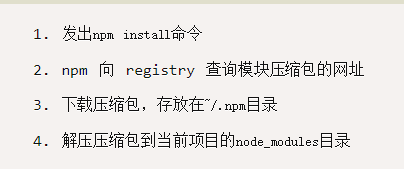

## 10-17

## （算法题）求多个数组之间的交集 +  递归

```js
  let testJson = [
  {
      id:'2',
      name:'b',
      children:null
    },
    {
      id: '1',
      name: 'a',
      children:[
        {
          id:'1-1',
          name: 'a',
          children:null
        }
      ]
    },
  ]
  function dg(arg) {
    arg.forEach(element => {
        if(element.children != null){
          dg(element.children)
        }else{
          return delete element.children
        }
    })
    return arg
    // if (arg  instanceof Array) {
    //   for(let i = 0; i<arg.length; i++) dg(arg[i]);
    // } else {
    //   !arg.children ? delete arg.children : dg(arg.children)
    // }
  }
  dg(testJson);
  console.log(testJson)

```

```
  let [g, ...h] = [1, 2, 3] // 数组拆分 g=1, h=[2, 3]
  function getMix(...arr){
  return arr.reduce((rst, ele, i) => {
    return rst.concat(ele) // 并集
    // return rst.filter(item => ele.includes(item)); // 交集
  });
}
  console.log(getMix([1],[1,2],[1,3]))
  // 核心思想：通过reduce来实现遍历返回，每次遍历可以拿到上次的结果（交集的结果）
```

## 介绍下 npm 模块安装机制，为什么输入 npm install 就可以自动安装对应的模块？

https://github.com/Advanced-Frontend/Daily-Interview-Question/issues/22

http://www.ruanyifeng.com/blog/2016/01/npm-install.html



## Http 状态码 301 和 302 的应用场景分别是什么

[`301 Moved Permanently`](https://developer.mozilla.org/zh-CN/docs/Web/HTTP/Status/301)

被请求的资源已永久移动到新位置，并且将来任何对此资源的引用都应该使用本响应返回的若干个 URI 之一。如果可能，拥有链接编辑功能的客户端应当自动把请求的地址修改为从服务器反馈回来的地址。除非额外指定，否则这个响应也是可缓存的。

[`302 Found`](https://developer.mozilla.org/zh-CN/docs/Web/HTTP/Status/302)

请求的资源现在临时从不同的 URI 响应请求。由于这样的重定向是临时的，客户端应当继续向原有地址发送以后的请求。只有在Cache-Control或Expires中进行了指定的情况下，这个响应才是可缓存的。

https://developer.mozilla.org/zh-CN/docs/Web/HTTP/Status

---

## vue 渲染大量数据时应该怎么优化？

- 1.异步渲染组件
- 2.使用vue的v-if 最多显示上中（可视区域）下三屏 避免出现大量的dom节点
- 3.或者使用分页（体验可能不如上面那么好“无限加载的也要考虑dom过多的情况”）
- .SPA + SSR处理 bigpipe （服务器渲染组件总比浏览器强，毕竟那么多核的CPU也不是花瓶）这是什么
- 按需加载局部数据, 虚拟列表，无限下拉刷新
- js运行异步处理:
  分割任务，实现时间切片处理, 类似react fiber, 每次执行记录时间, 超过一定执行时间则settimeout或requestAnimation推迟到下一个时间片,一般一个时间片为16ms
- 大量纯展示的数据,不需要追踪变化的 用object.freeze冻结

## 介绍下重绘和回流（Repaint & Reflow），以及如何进行优化

https://github.com/Advanced-Frontend/Daily-Interview-Question/issues/24

可将的分为三部分：1，重绘和回流是什么  2，浏览器提供的一些方法为了保证函数返回的是正确的值会强行重绘计算出值，3，那些行为可以减少重绘和回流

重绘： 就是重新渲染一些样式  回流：布局发生改变，位置

---

