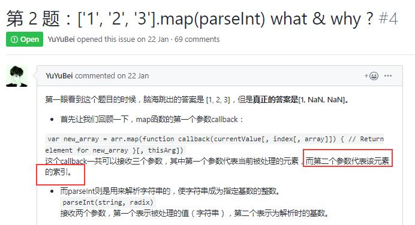

# 壹题

2019-9-2  暂时不做算法题

## 第二题



## 第三题   什么是防抖和节流？有什么区别？如何实现？

拓展：npm包防抖节流，防抖节流的应用场景

### 什么是防抖和节流

节流代码

lastExec为最近一次函数执行的时间，elapsed为当前时间-上次执行时间，delay表示总的节流时间

防抖函数原理：在事件被触发n秒后再执行回调，如果在这n秒内又被触发，则重新计时。

```js
const debounce = (fn, delay) => {
  let timer = null;
  return (...args) => {
    clearTimeout(timer);
    timer = setTimeout(() => {
      fn.apply(this, args);
    }, delay);
  };
};
```

防抖函数原理:规定在一个单位时间内，只能触发一次函数。如果这个单位时间内触发多次函数，只有一次生效。

手写简化版:

```js
// 节流函数
const throttle = (fn, delay = 500) => {
  let flag = true;
  return (...args) => {
    if (!flag) return;
    flag = false;
    setTimeout(() => {
      fn.apply(this, args);
      flag = true;
    }, delay);
  };
};
```

-----

## 第四题 介绍下 Set、Map、WeakSet 和 WeakMap 的区别？ 

https://github.com/Advanced-Frontend/Daily-Interview-Question/issues/6

Set 对象允许你储存任何类型的唯一值，无论是原始值或者是对象引用。

向 Set 加入值的时候，不会发生类型转换，所以`5`和`"5"`是两个不同的值。Set 内部判断两个值是否不同，使用的算法叫做“Same-value-zero equality”，它类似于**精确相等**运算符（`===`），主要的区别是**`NaN`等于自身，而精确相等运算符认为`NaN`不等于自身。**

```js
// 去重数组的重复对象
let arr = [1, 2, 3, 2, 1, 1]
[... new Set(arr)]	// [1, 2, 3]
let set = new Set([1, 2, 3, 2, 1])
console.log(set.length)	// undefined
console.log(set.size)	// 3
let set = new Set()
set.add(1).add(2).add(1)

set.has(1)	// true
set.has(3)	// false
set.delete(1)	
set.has(1)	// false
Array.from 方法可以将 Set 结构转为数组

const items = new Set([1, 2, 3, 2])
const array = Array.from(items)
console.log(array)	// [1, 2, 3]
// 或
const arr = [...items]
console.log(arr)	// [1, 2, 3]
因此，Set 很容易实现交集（Intersect）、并集（Union）、差集（Difference）

let set1 = new Set([1, 2, 3])
let set2 = new Set([4, 3, 2])

let intersect = new Set([...set1].filter(value => set2.has(value)))
let union = new Set([...set1, ...set2])
let difference = new Set([...set1].filter(value => !set2.has(value)))

console.log(intersect)	// Set {2, 3}
console.log(union)		// Set {1, 2, 3, 4}
console.log(difference)	// Set {1}
```

WeakSet 对象允许你将**弱引用对象**储存在一个集合中

WeakSet 与 Set 的区别：

- WeakSet **只能储存对象引用**，不能存放值，而 Set 对象都可以
- WeakSet 对象中储存的对象值**都是被弱引用的**，即垃圾回收机制不考虑 WeakSet 对该对象的应用，如果没有其他的变量或属性引用这个对象值，则这个对象将会被垃圾回收掉（不考虑该对象还存在于 WeakSet 中），所以，WeakSet 对象里有多少个成员元素，取决于垃圾回收机制有没有运行，运行前后成员个数可能不一致，遍历结束之后，有的成员可能取不到了（被垃圾回收了），WeakSet 对象是无法被遍历的（ES6 规定 WeakSet 不可遍历），也没有办法拿到它包含的所有元素

 字典（Map）

集合 与 字典 的区别：

- 共同点：集合、字典 可以储存不重复的值

- 不同点：集合 是以 [value, value]的形式储存元素，字典 是以 [key, value] 的形式储存

  注意，只有对同一个对象的引用，Map 结构才将其视为同一个键。这一点要非常小心。

  ```
  const map = new Map();
  
  map.set(['a'], 555);
  map.get(['a']) // undefined
  ```

  上面代码的`set`和`get`方法，表面是针对同一个键，但实际上这是两个值，内存地址是不一样的，因此`get`方法无法读取该键，返回`undefined`。

  由上可知，Map 的键实际上是跟内存地址绑定的，只要内存地址不一样，就视为两个键。这就解决了同名属性碰撞（clash）的问题，我们扩展别人的库的时候，如果使用对象作为键名，就不用担心自己的属性与原作者的属性同名。

  如果 Map 的键是一个简单类型的值（数字、字符串、布尔值），则只要两个值严格相等，Map 将其视为一个键，比如`0`和`-0`就是一个键，布尔值`true`和字符串`true`则是两个不同的键。另外，`undefined`和`null`也是两个不同的键。虽然`NaN`不严格相等于自身，但 Map 将其视为同一个键。


- Set

  - 成员唯一、无序且不重复
  - [value, value]，键值与键名是一致的（或者说只有键值，没有键名）
  - 可以遍历，方法有：add、delete、has

- WeakSet

  - 成员都是对象
  - 成员都是弱引用，可以被垃圾回收机制回收，可以用来保存DOM节点，不容易造成内存泄漏
  - 不能遍历，方法有add、delete、has

- Map

  - 本质上是键值对的集合，类似集合
  - 可以遍历，方法很多可以跟各种数据格式转换

- WeakMap

  - 只接受对象作为键名（null除外），不接受其他类型的值作为键名

  - 键名是弱引用，键值可以是任意的，键名所指向的对象可以被垃圾回收，此时键名是无效的

  - 不能遍历，方法有get、set、has、delete

    但当以一个DOM节点作为对象 data 的键，对象会被自动转化为字符串[Object HTMLCollection]，所以说，Object 结构提供了 **字符串-值** 对应，Map则提供了 **值-值** 的对应

    拓展：迭代器和生成器https://www.cnblogs.com/xiaohuochai/p/7253466.html

---

## 9-3 setTimeout、Promise、Async/Await 的区别

