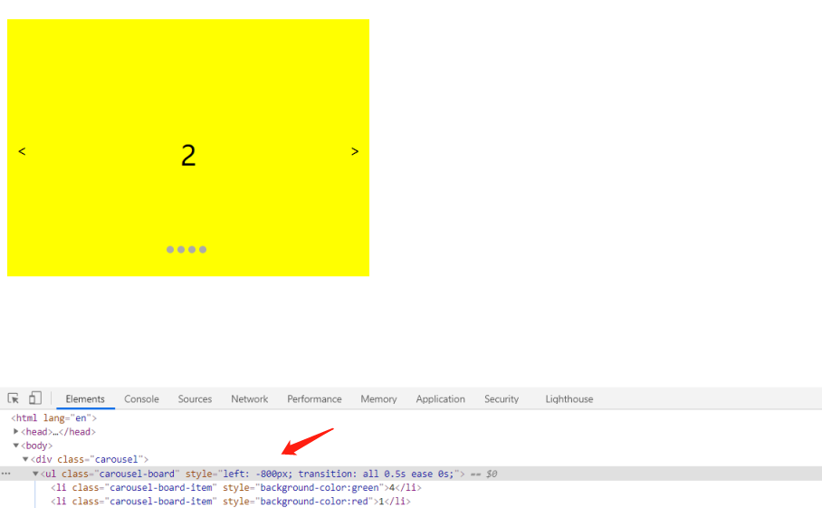

# 如何实现骨架屏，说说你的思路

1.如果是首屏可以在index.html中手写骨架屏样式
2.如果是其他页面，可以让UI做一个小的SVG图
3.可以使用组件库中的骨架屏组件
4.可以使用饿了么团队开源的根据页面样式生成骨架屏的工具[还可配置生效路

Etag 是一个文件变换就要重新生成的一个值，如果用hash来计算达不到效率
不过http也没有明确指出它的计算方式吧
不过在nginx里面，是由Last-Modified和content-length的十六进制组合而成

## 实现一个 Dialog 类，Dialog可以创建 dialog 对话框，对话框支持可拖拽

```js
    class Dialog {
      constructor(text) {
        this.lastX = 0
        this.lastY = 0
        this.x
        this.y
        this.text = text || ''
        this.isMoving = false
        this.dialog
      }
      open() {
        // 遮盖层
        const model = document.createElement('div')
        model.id='model'
        model.style = `
        position:absolute;
        top:0;
        left:0;
        bottom:0;
        right:0;
        background-color:rgba(0,0,0,.3);
        display:flex;
        justify-content: center;
        align-items: center;`
        model.addEventListener('click',this.close.bind(this))
        document.body.appendChild(model)
        this.dialog = document.createElement('div')
        this.dialog.style = `
        padding:20px;
        background-color:white`
        this.dialog.innerText = this.text
        this.dialog.addEventListener('click',e=>{e.stopPropagation()})
        this.dialog.addEventListener('mousedown', this.handleMousedown.bind(this))
        document.addEventListener('mousemove', this.handleMousemove.bind(this))
        document.addEventListener('mouseup', this.handleMouseup.bind(this))
        model.appendChild(this.dialog)
      }
      close() {
        this.dialog.removeEventListener('mousedown',this.handleMousedown)
        document.removeEventListener('mousemove', this.handleMousemove)
        document.removeEventListener('mouseup',this.handleMouseup)
        document.body.removeChild(document.querySelector('#model')) 
      }
      handleMousedown(e) {
        this.isMoving = true
        this.x = e.clientX
        this.y = e.clientY
      }
      handleMousemove(e) {
        if (this.isMoving) {
          this.dialog.style.transform = `translate(${e.clientX - this.x + this.lastX}px,${e.clientY - this.y + this.lastY}px)`
        }
      }
      handleMouseup(e) {
        this.lastX = e.clientX - this.x + this.lastX
        this.lastY = e.clientY - this.y + this.lastY
        this.isMoving = false
      }
    }
    let dialog = new Dialog('Hello')
    dialog.open()
```

就是在可移动的正方形中，在移动的弹窗外面加一个遮盖层

前端：

1. 限制按钮，表单提交次数，防抖
2. 增加图片验证码，类似12306

后端：

1. ip，user_agent，referer
2. 用户唯一标示
3. 简单验证码
4. 手机号验证码
5. api key，rsa加密认证，ca认证（后端与后端之间调用）
6. ip黑名单（一般是刷的频率太大，达到ddos水平了或者确认为恶意调用）

```
let panter = new RegExp(关键词, 'g')
该行字符串.replace(panter, '<b style="color: #2D7BFF">' + 关键词 + '</b>')
```

----

# 在输入框中如何判断输入的是一个正确的网址

```js
function isUrl(url) {
	const a = document.createElement('a')
	a.href = url
	return [
		/^(http|https):$/.test(a.protocol),
		a.host,
		a.pathname !== url,
		a.pathname !== `/${url}`,
	].find(x => !x) === undefined
}
```

```js
function isUrl(url) {
       try {
           new URL(url);
           return true;
       }catch(err){
     return false;
}}
```

| [`*`](https://developer.mozilla.org/zh-CN/docs/Web/JavaScript/Guide/Regular_Expressions#special-asterisk) | 匹配前一个表达式 0 次或多次。等价于 `{0,}`。例如，`/bo*/` 会匹配 "A ghost boooooed" 中的 'booooo' 和 "A bird warbled" 中的 'b'，但是在 "A goat grunted" 中不会匹配任何内容。 |
| ------------------------------------------------------------ | ------------------------------------------------------------ |
| [`+`](https://developer.mozilla.org/zh-CN/docs/Web/JavaScript/Guide/Regular_Expressions#special-plus) | 匹配前面一个表达式 1 次或者多次。等价于 `{1,}`。例如，`/a+/` 会匹配 "candy" 中的 'a' 和 "caaaaaaandy" 中所有的 'a'，但是在 "cndy" 中不会匹配任何内容。 |
| [`?`](https://developer.mozilla.org/zh-CN/docs/Web/JavaScript/Guide/Regular_Expressions#special-questionmark) | 匹配前面一个表达式 0 次或者 1 次。等价于 `{0,1}`。例如，`/e?le?/` 匹配 "angel" 中的 'el'、"angle" 中的 'le' 以及 "oslo' 中的 'l'。 |

# 如何设计实现无缝轮播



要想要下一个li出现，就是把bordleft负值，负的更

有个board.style.transition = "0.5s";

```js
<html lang="en">
<head>
	<meta charset="UTF-8">
  <title>Drag and Drop</title>
  <style ype="text/css">
    body {
        box-sizing: border-box;
    }
    .carousel {
        position: relative;
        width: 400px;
        height: 300px;
        overflow: hidden;
    }
    .carousel-board {
        position: relative;
        list-style: none;
        width: 5000px;
        height: 300px;
        padding: 0;
        left: 0;
        /* transition: left 0.5s linear; */
    }
    .carousel-board-item {
        float: left;
        width: 400px;
        height: 300px;
        line-height: 300px;
        text-align: center;
        font-size: 30px;
    }
    .carousel-btn {
        position: absolute;
        z-index: 100;
        cursor: pointer;
    }
    .carousel-prev {
        top: 50%;
        left: 10px;
    }
    .carousel-next {
        top: 50%;
        right: 10px;
    }
    .carousel-dots {
        padding: 0;
        /* width: 100px; */
        list-style: none;
        position: absolute;
        bottom: 10px;
        left: 50%;
        margin-left: -24px;
        z-index: 100;
    }
    .carousel-dots li {
        float: left;
        width: 8px;
        height: 8px;
        background-color: #aaa;
        margin-right: 4px;
        border-radius: 4px;
        cursor: pointer;
    }
</style>
</head>
<body>
  <div class="carousel">
    <ul class="carousel-board">
        <li class="carousel-board-item" style="background-color:green">4</li>
        <li class="carousel-board-item" style="background-color:red">1</li>
        <li class="carousel-board-item" style="background-color:yellow">2</li>
        <li class="carousel-board-item" style="background-color:blue">3</li>
        <li class="carousel-board-item" style="background-color:green">4</li>
        <li class="carousel-board-item" style="background-color:red">1</li>
    </ul>
    <span class="carousel-btn carousel-prev"><</span>
    <span class="carousel-btn carousel-next">></span>
    <ul class="carousel-dots">
        <li date-index="1"></li>
        <li date-index="2"></li>
        <li date-index="3"></li>
        <li date-index="4"></li>
    </ul>
</div>
  <script type="text/javascript">
(function () {
    let prev = document.getElementsByClassName("carousel-prev")[0];
    let next = document.getElementsByClassName("carousel-next")[0];
    let board = document.getElementsByClassName("carousel-board")[0];
    let panels = Array.from(document.getElementsByClassName('carousel-board-item'));
    board.style.left = "-400px";
    let index = 1; //设置默认的index值
    prev.addEventListener("click", function () {
        index++
        console.log(index);
        animate(-400);
        //关键点 如果当前在 1fake 的位置
        if (index === panels.length - 1) {
            setTimeout(() => {
                //去掉动画
                board.style.transition = "0s";
                let distance = 4 * 400
                //默默的左移board至 1
                debugger
                board.style.left = -400 + "px"
            }, 600)
            index = 1;
        }
    })
    next.addEventListener("click", () => {
        index--
        console.log(index);
        animate(400);
        //关键点 如果当前在 4fake 的位置
        if (index === 0) {
            setTimeout(() => {
                // 去掉动画
                board.style.transition = "0s";
                let distance = -4 * 400
                //默默的右移board 至 4
                board.style.left = -1600+ "px"
            }, 600)
            index = 4;
        }
    })

    function animate(width = 400) {
        board.style.transition = "0.5s";
        board.style.left || (board.style.left = 0)
        debugger
        board.style.left = parseInt(board.style.left) + width + "px";
    }
})()
  </script>
</body>
</html>
```

