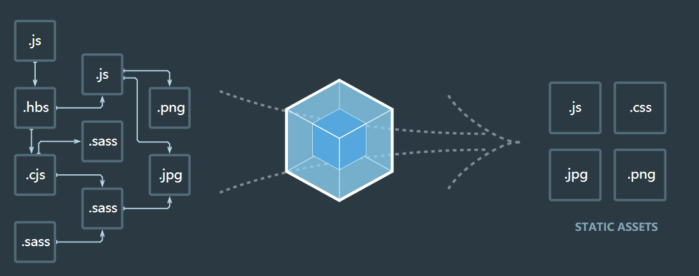
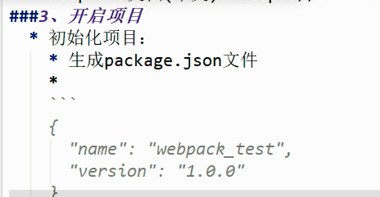
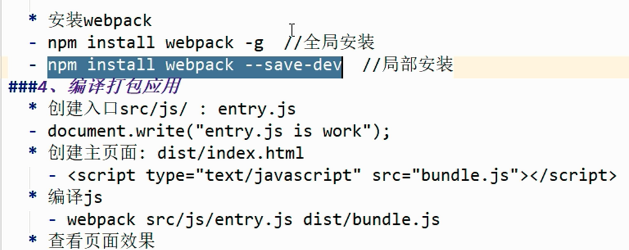
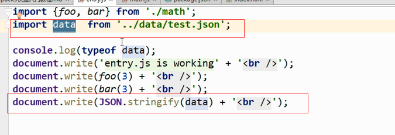
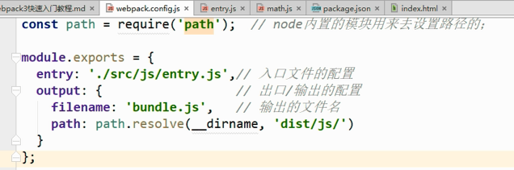
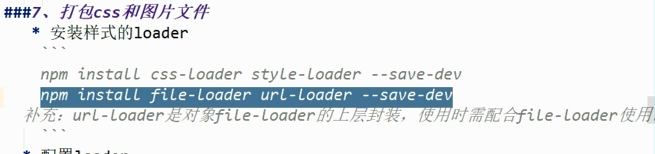
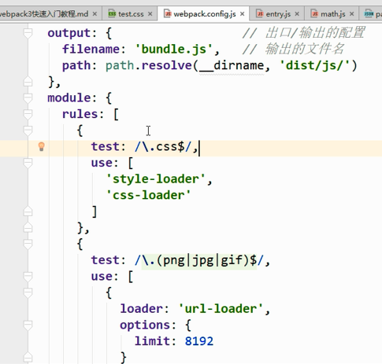
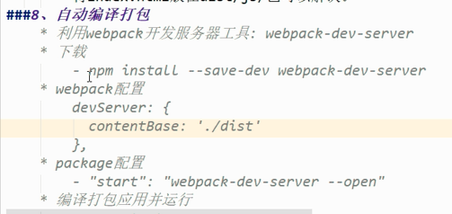
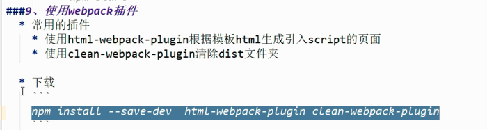
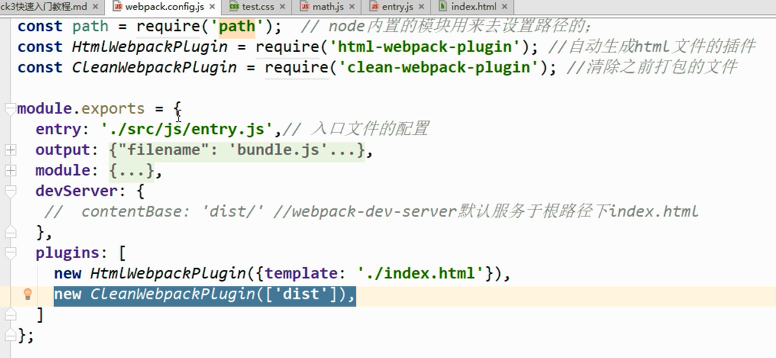

# webpack

webpack介绍

loader就是去加载webpack不能加载的模块，并且webpack

为什么全局安装了之后需要局部安装

因为项目中用的webpack版本和你本地全局安装的版本不一样

webpack支持三中模块规范化（es6，commonjs，amd）

webpack引用json模块时：直接引入json文件且需要加文件后缀。使用变量来接受json模块返回的对象。并且会自动将json字符串转化为js原生对象

### webpack_config配置文件的说明

path中`(__dirname，‘dist/js’)`表示输出的路径为：`__dirname`当前文件夹下的'dist/js/'文件夹下。

webpack.config.js

### webpack打包css文件

1，安装编译样式的loader

2，再webpack.config.js中添加编译css和图片的json对象

问题：style-loader，和css-loader是干嘛的

css-loader负责加载css文件

style-loder负责将css应用到对应的页面中

## 热加载实现

## 插件的使用

