#　webpack4.0 慕课


1，webpack是什么

由于面向过程编程会导致代码越来越长，采用面向对象（在js中，什么是面向对象）

通过script标签来引入不同模块会产生一些问题： 引入顺序，增加多个http请求


我们使用es moudule模块引入方式更好，但是浏览器不认识，所以使用webpack来翻译文件。

~~（里面用到了npm   还有es moudule  es5中语法，但是浏览器不认识，所以这是js熟悉度问题）~~

**es moudule规定了导入的文件必须要有export**

创建一个项目: npm init


##### 2.2 webpack是个模块打包工具


**webpack能识别任何一种模块引入方式**


阅读英文文档：因为是最新的 阅读这方面关于模块化的概念

课后作业： https://webpack.js.org/api/module-methods/#es6-recommended module模块下的api

#### 2.3搭建webpack环境

npm init：创建一个node规范的包文件

> 如果npm包安装不了，可以试着使用手机热点安装
>
> 全局安装webpack存在的问题：要跑两个webpack版本不同的项目，一个是3，一个是4，但是全局安装4，3的就跑步起来，所以**webpack应该局部安装**，
>
> 全局卸载webpack: npm uninstall webpack -g
>
> 局部安装npm install webpack webpack-cli -D
>
> 局部安装后在项目中运行webpack ： npx webpack -v
>
> **npx会在当前项目中的node_module中找到该命令，直接webpack -v会在 全局的nodejs中寻找**
>
> 查看一个包的信息是否存在 npm info webpack

#### 2.4 webpack配置文件

webpack有默认的配置文件，如果想自己来写就在根目录中添加一个webpack.config.json

默认配置文件为webpack.config.js文件，用其他文件的话

npx webpack --config filename


讲了三种运行webpack的方法

webpack-cli就是帮助我们在命令行中运行webpack命令

```
  "scripts": {
    "bundle": "webpack" //虽然运行npm run bundle 但是写在scripts里面的语句会默认去当前依赖中找webpack去执行
  },
```

```
const path = require('path'); // 引入node path核心模块

module.exports = {
  entry: './index.js', 
  output: {
    path: path.resolve(__dirname, 'dist'), // __dirname为当前webpack.config.js文件所在的目录下，
    filename: 'bundle.js'
  }
};
```

webpack配置文件

#### 2-5 浅谈webpack打包知识点

mode: '' 有两种模式，一种是生产代码会压缩，一种是开发代码（不会压缩


图片写错了是entry，后面接触复杂打包去理解


#### 3-1 loader是什么

webpack有很多loader和插件，学不完，但是如果开发中遇到很复杂很难的业务场景，应该在群里直接问，会有同事对这个领域的配置很熟悉


**file-loader虽然知道可以打包图片**

**其实他是将图片搬到dist文件下，并返回文件地址**。所以不只是图片，**如果你想搬运文件并获得文件地址**就可以用这个loader完成

loader是什么：打包方案


有些代码还是比较陌生的

**webpack只能识别js**

**loader就是打包不同的文件，重点关注，import出来的东西是什么，可以怎么用**

#### 3-2 使用loader打包静态资源

##### 图片


让打包成的文件的名字，和原始的一直

[ext]为file-loader的占位符


**url-loader：也能打包图片文件，但是打包方式，是把图片变成base64形式，对于大文件不友好，小文件能减少http请求**


添加了limit，超过会使用file-loader的方式打包，其他是base64

##### 样式

 编程就是一堆规则，难度在于规则的理解和量

css-loader：分析几个css文件的关系，打包成一个css文件

style-loader： 将css文件挂在到html中的head里面


**重要规则： webpack中loader是有先后顺序，从下到上一依次**

**css需要默认加一些前缀，有loader会自动帮忙做这个：postcss-loader有个配置文件如下**


为css-loader添加配置项

 

> 这个配置的意思，就是: 当你的sass文件又使用import来引入sass文件，理应当说，css文件里面的引入引出任务是css-loader来做，就不会回头在走sass-loader。这个配置就是告诉webpack，**当使用import引入是，也要使用前面两个loader来处理**

**让当前 文件下的css文件样式只作用于当前文件，而不是全局，css模块化**


很麻烦，比理解的要复杂

##### 打包字体文件


不知道图标的实现原理，这四个文件的作用

asset manage 静态资源管理

以上的loader在文档上都有

#### 使用plugins让打包更便捷


可以为这个html设定一个模板

plugins 是一个生命钩子函数，插件会在特定的打包时间为我们做一些工作


生命钩子

打包，将dist文件删除功能: clean-webpack-plugin(并非官方推荐，文档上没有，找其他文档别慌) 打包之前执行

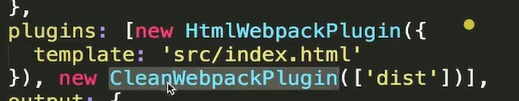

1：20：40 3-6节  

一个半小时（1：50）

剩（2个小时） 32*20 /6      11个小时   13个小时（周一到周六学完）

---

#### 3.6 Entry 与 Output 的基础配置

业务场景，想打包两次

output中的name对应着entry中的key


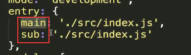

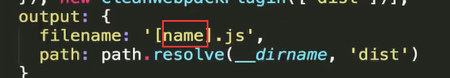

业务场景：留一个html给后端做入口文件， 引入打包的js文件（静态资源）想放到cdn上面，的时候，我们该如何配置webpack呢。

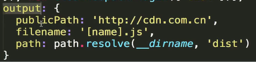


作业：output上面的配置参数

#### SourceMap 的配置

当我们代码出错了，页面报错了，只会告诉我们打包后的文件哪里出错了。并不会说那个代码里的哪行有错

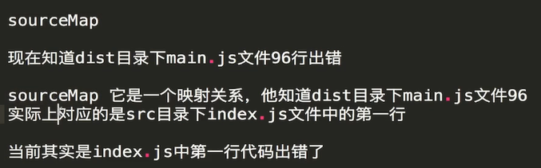

devtool就是sourcemap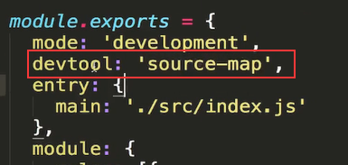

inline-source-map的作用，就是比source-map是把影射关系放在一个文件里，而inline是变成一个base64的url放在打包好的js文件里面

webpack是默认开启source-map  加了cheap只会精确到行不会列

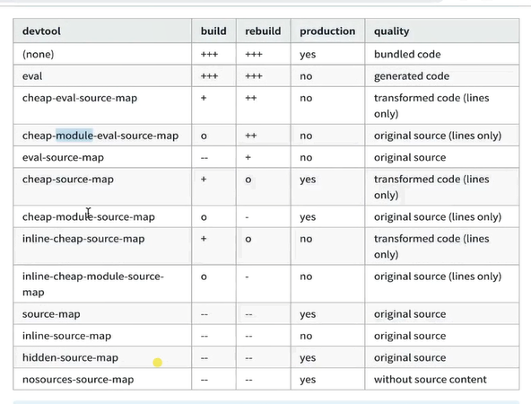

这些配置可以自由组合：cheap只管业务代码，加上module也会管模块代码

eval模式，就是将报错信息使用eval的形式添加到文件中，是最快的，但可能不全

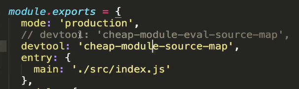

最佳实践开发为注释的一行，生产让信息更全面，使用不注释的那一行

#### 3-8 使用 WebpackDevServer 提升开发效率，并且开启一个本地服务器

当源代码发生变化，就会重新打包。**webpackdevserver**是现在业界用的最多的!!!

比watch，会帮忙重新刷新浏览器，open会自动帮忙打开，**并让开一个web服务器**，通过http协议打开而不是file协议

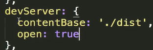

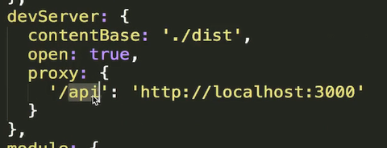

为什么现在脚手架都支持跨域，都是使用了这个代理。还有很多关于这个的配置项看文档

如何实现这个脚手架中的内容：核心就是用node来监听文件变化然后重启服务器。需要一个http服务器。可以借助express

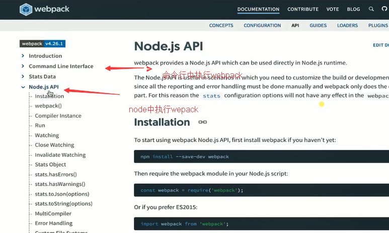

#### 3-9 hot moudle replacement

**webpack-dev-serve 会把打包的dist文件放到电脑内存里面，这样提高我们的打包速度**

> 修改了webpack配置文件，应该重启

修改了css文件，不重新刷新页面

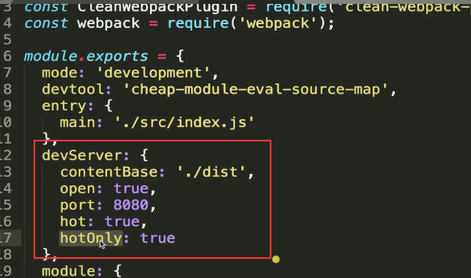

**这边的hotOnly会让html失效的时候不重新刷新页面**

这里面的hot没讲清楚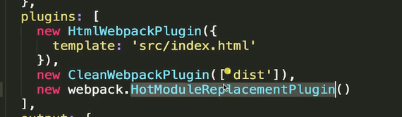

css不用写这段代码，原因就是css-loader帮忙写了这段代码

vue-loader也内置了这段代码，所以也不用自己添

**hotonly 没配，如果html发生变化了会重新刷新页面**

babel可以将es6代码抓换成es5。在babel官网中选择环境的教程安装

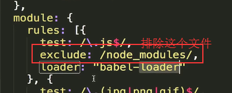

babel只是做语法的转换，还有一些全是的变量和函数是没有。这部分工作就是polyfill的工作。polyfill的使用也在babel官网中。

如何按需加载es6的语言？

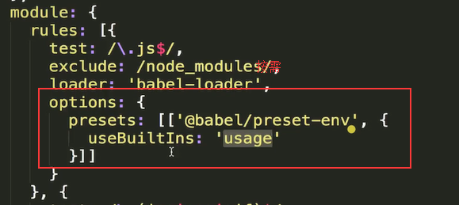

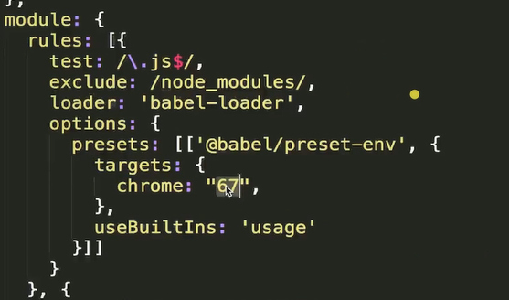

如果是需要打包支持浏览器67以上，看看怎么打包

**babel中的原理很庞大。如果很了解babel，就会知道框架语法是怎么转换成浏览器认识的语法。**

   polyfill会污染全局环境，而plugin-transform-runtime会使用闭包的方式？帮组组件引入polyfill


babel中的配置项太多可单独放在.babelrc中

#### 配置react代码的打包

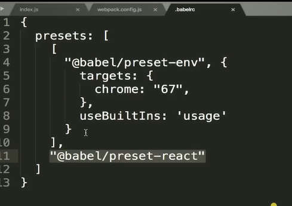


转换顺序也是从上到下，先转换react代码再转换es6代码

### 第4章 Webpack 的高级概念  

本章接第三章内容，继续讲解 Webpack 中难度更大的知识点，包含了 Tree Shaking，Code Spliting，打包环境区分，缓存，shimming 等内容，帮助你继续扩展 Webpack 的基础知识面

#### tree shaking

引入什么打包什么，把一棵树上的东西全部摇晃掉

tree shaking只支持esmodule方式引入（improt），因为es是静态引入，而commondjs是动态引入

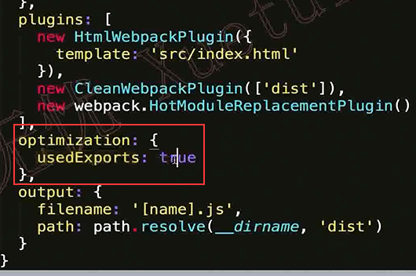


在package，json里面开启这个，就是说明，每次打包都是使用treeshaking打包

**如何在现有项目中使用**？

**babel 中polly-fill里面就是给window绑定全局方法**。**是不是导出任何内容**引入的时候。当要引入这个的时候在package.json中的sideEffects中添加这个文件，说明treeshaking的时候不要管这个文件。

**因为引入css文件并不会导入如何东西，treeshaking会去掉**

正常情况下，可以添加这些比如所有的css文件，引入的时候不要用treeshaking

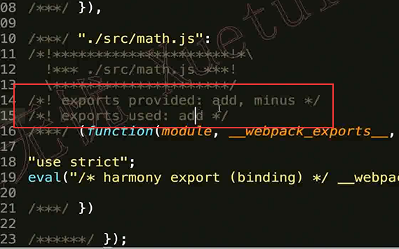

在开发环境，方便调试，都会打包出来，但是如果是生产环境，就不会打包出来

#### develiment和production模式的区分打包

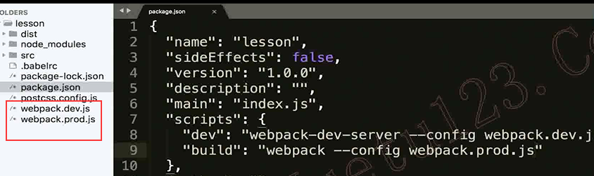

按环境分成两个配置文件

开发打包的文件都在内存里面不会生成dist文件

问题：两个环境中的配置文件有很多重复  

webpack-merge

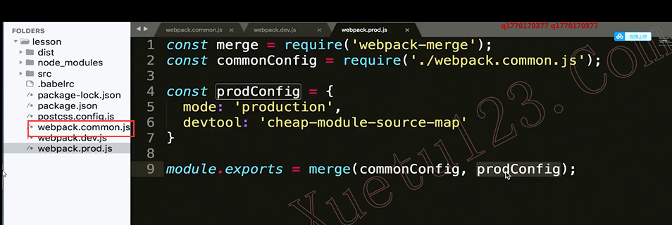

#### 4-3 code splitting

代码分割

**代码分离是 webpack 中最引人注目的特性之一。此特性能够把代码分离到不同的 bundle 中，然后可以按需加载或并行加载这些文件**。代码分离可以用于获取更小的 bundle，以及控制资源加载优先级，如果使用合理，会极大影响加载时间。

关于文档中多次提到webpack代码分割的包，在浏览器中webpack runtime的包会自动异步加载代码分割的包，那么在react和vue应用中，如果这些代码分割包在页面初始化也会自动异步加载，那不是分包的作用不大？原因其实是我们上面例子执行了import()或require.ensure，而在应用中，写法是当请求路由的时候才执行import()或require.ensure，然后再异步加载，webpack遇到import()或require.ensure的配置的时候只会进行代码切割，这种思路就是按需加载的基础。

https://juejin.im/post/5c8339ca51882501351d4b82

https://juejin.im/post/5b304f1f51882574c72f19b0

30节(一天6节)，周六周日做面试题和笔试题

先保证我的视频能学完，再保证工作，why，先支付自己

晚上早点睡，早上早点起（11点睡，七点钟起床）睡饱了才能高效学习，高效工作，高效放松

3-8

webpack打包和代码分割的关系

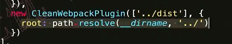

**在使用cleanwebpack来清理文件夹的时候**，设置这个插件的根目录是上一层。就实现**了webpack操作上一级目录的功能**  lodash

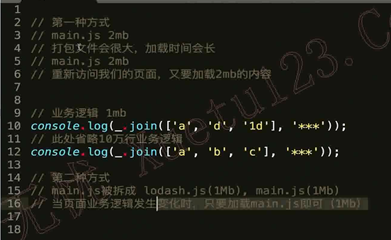

分开引入在html中，库文件不会发生变化，然后就会在客户浏览器中生产缓存，业务代码发生变化，就是发请求修改。

使用代码分割提高用户体验性

webpack自带的插件会帮我们智能的做代码分割

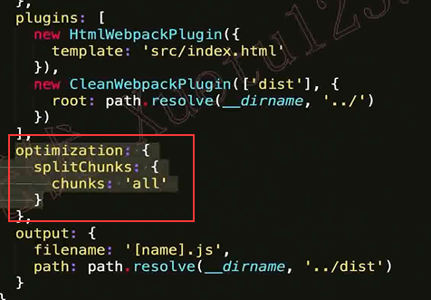

开启这个

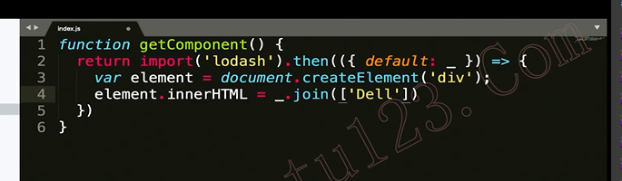

异步加载


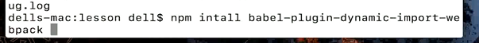

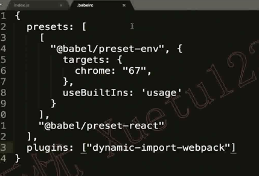

转义异步代码

1，配置webpack，会帮忙分析同步代码中的代码分割

1，不配置，使用异步的方式加载，webpack也会做代码分割

代码分割是个概念，优化方式，

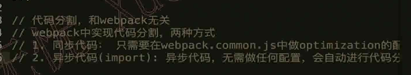

#### 4-5 treeshaking

和上面学的一模一样，

**optimization配置，splitchucks插件**

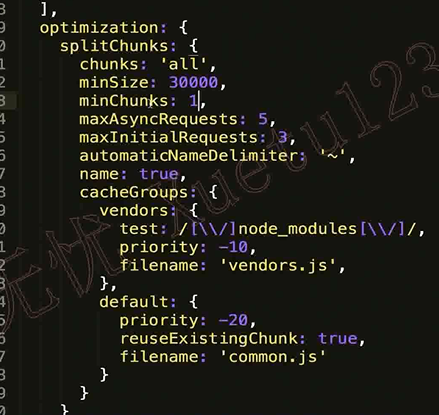

同步的代码走cacheGroups

**cacheGroups叫做缓存组：符合上面的条件时，就会把他们打包到一起生成一个文件。**

**现在图片中有两个组：vendors和default**

minChunks中用到多少次的时候使用代码分割

明天4-9 5-2 怕明天没时间，今天先提前学了，（一定要周五前学完，然后周六日，面试提和学习资料

priority字段的作用是：当一个库文件同事满足多个组的时候，那个优先级越高，就打包到那个组中

reuseExistingChunk：表示之前打包过，再次被引用不需要再次打包了

#### 4-7 lazy loading和chunk是什么

**懒加载就是通过import异步加载模块**

chunk：代码分割中，生成了多少个文件，我们都叫他chunk

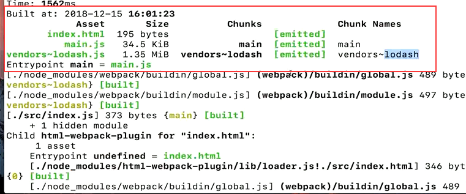

 **minchunk： 到底生成的chunk文件中最少多少个用到了这个库文件**

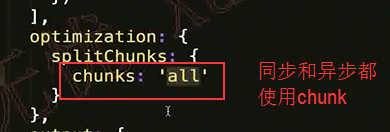


#### 4-9  css代码分割

MinCssExtractPlugin插件完成（不支持热更新，线上环境上打包使用

webpack打包会把css打包到js

 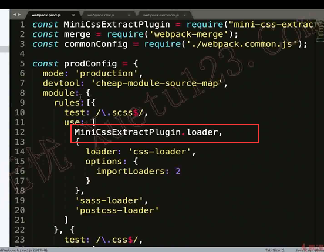

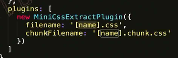

直接引用和间接引用同上

4-9-5-2


这两个有什么区别

入口文件打包的文件会走filename配置名字

其他库文件，是入口文件异步加载引用的文件，则使用chunkfilename配置文件名（ 间接引用。


代码压缩插件optimize-css-assets-webpack-plugin

将所有的css打包到一个文件下去，分组就用cachgroups

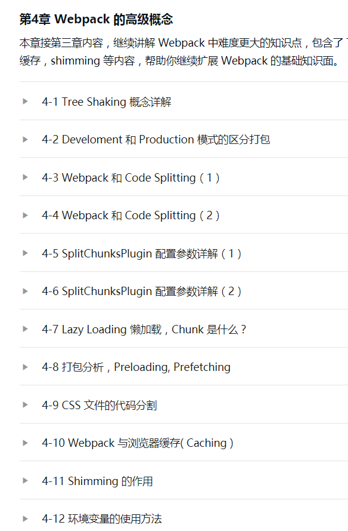

#### 4-10 没有这节课

可以通过webpack官网了解

**现在学习shimming: 打包的兼容性问题**

shim 预置依赖

`webpack` compiler 能够识别遵循 ES2015 模块语法、CommonJS 或 AMD 规范编写的模块。然而，一些 third party(第三方库) 可能会引用一些全局依赖（例如 `jQuery` 中的 `$`）。因此这些 library 也可能会创建一些需要导出的全局变量。这些 "broken modules(不符合规范的模块)" 就是 *shim(预置依赖)* 发挥作用的地方。

> **我们不推荐使用全局依赖！**webpack 背后的整个理念是使前端开发更加模块化。也就是说，需要编写具有良好的封闭性(well contained)、不依赖于隐含依赖（例如，全局变量）的彼此隔离的模块。请只在必要的时候才使用这些特性。

*shim* 另外一个极其有用的使用场景就是：当你希望 [polyfill](https://en.wikipedia.org/wiki/Polyfill_(programming) 扩展浏览器能力，来支持到更多用户时。在这种情况下，你可能只是想要将这些 polyfills 提供给需要修补(patch)的浏览器（也就是实现按需加载）。

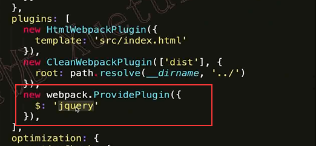

**一个模块中使用了$字符串，那webpack就会自动帮你引入jquery这个模块**

当使用的这模块里面没有使用import方式引入，就可以用这个兼容，加载对应的模块

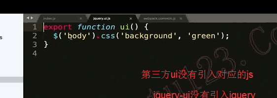


_join对应lodash中的join方法

每一个 模块中的this，都指向window

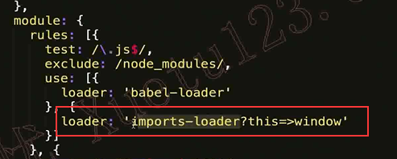

就是去改变webpack原始的一些行为

以上就是webpack官网文档上那些东西

#### 环境变量的使用

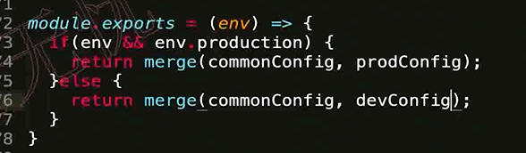

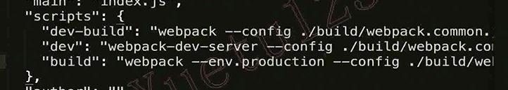

这个参数有很多中写法 ---env producion

### 第5章 Webpack 实战配置案例讲解

本章通过库文件打包，PWA项目打包，TypeScript打包支持等实战常见 Webpack 配置案例，带大家了解最新前端工程化常识，并在实例实现的过程中，巩固前三章节的基础知识点。同时章节末尾进行了 Webpack 打包性能优化的内容，帮助同学们了解如何在打包速度过慢时进行合理的打包过程优化

#### library打包

打包一个库文件，一般引入库的方式

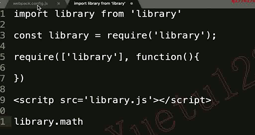

支持多种方式的引入

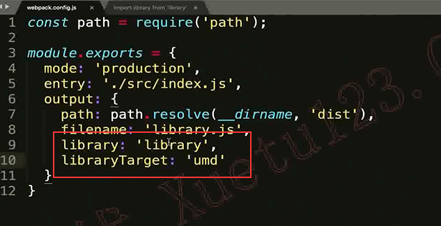

library：'library'    就是在导入的地方创建一个全局变量。让页面可以使用

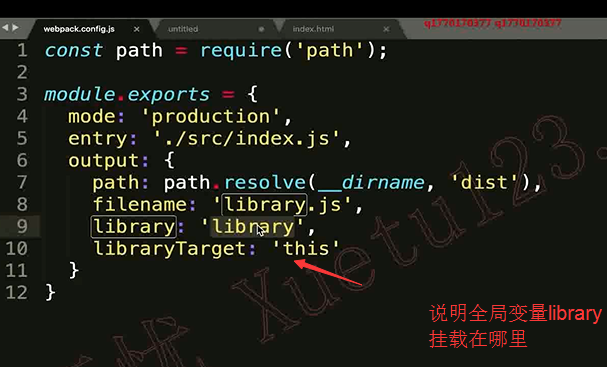

打包库文件的时候，别人使用这个库文件，同时又使用了我们库使用的模块。这个时候如何打包 

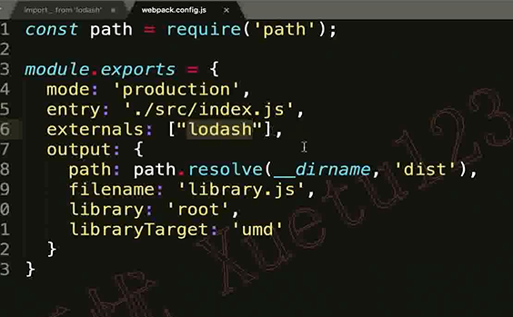

忽略这个，所以别人使用我们这个库需要引入对应的库。防止打包两次 

这边只讲了三个配置文件

配置一个库，node，需要很多复杂的配置文件


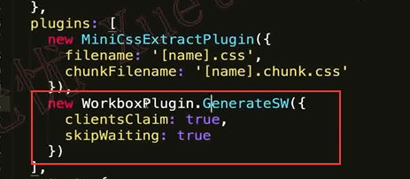

####  ts的打包配置

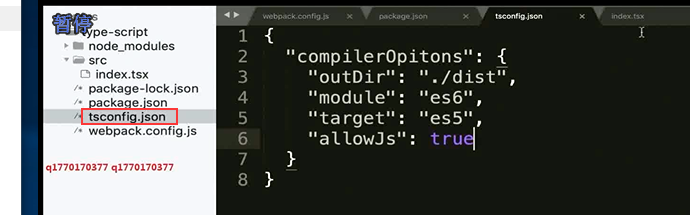

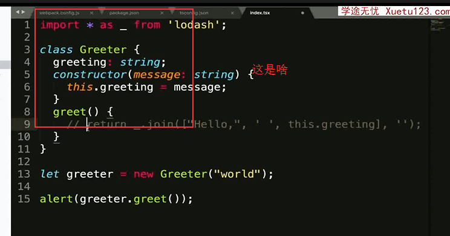

安装对应库的ts校验提示文件，这个时候安装他们的对应文件（用到搜索

#### （实用）使用webpackdevserver实现请求转发

  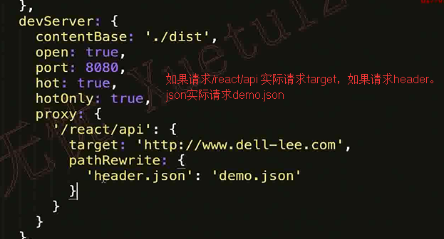

devserver，是开发环境下的转发。（proxy是方便开发）

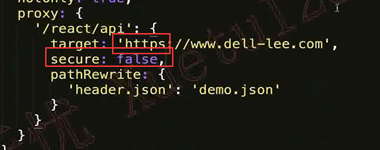

访问https方法

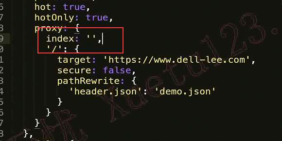

代理根目录

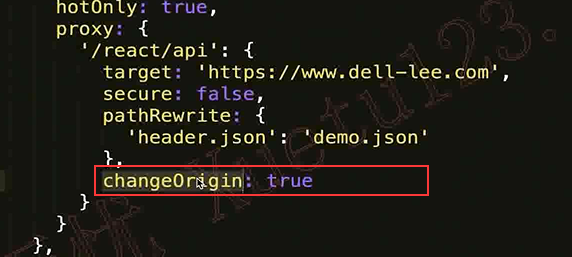

突破服务器origin的限制。里面的配置很多，详见文档

这些东西都不够底层，都是api，需要了解底层原理

 #### 单页应用


在做单页面应用的时候。路径是/为根目录是，都会去访问打包后的index.html。然后就会引入我们打包后的main.js。切换路由就会是单页 

引申 vue-loader的原理是什么


true等价于上面的配置

#### eslint在webpack的配置


把webpack集成eslint，保证


  

#### 如何提升webpack打包速度

1. 跟上技术的迭代（node npm yarn
2. 在尽可能少的模块上应用loader
3. plugin尽可能精简并确保可靠（没用的就不要用，官方插件速度快
4. resolve参数合理配置参数越多就会进行多次文件查找，一般逻辑文件js这些不用。其他都加后缀。 文件夹下默认找文件，按需要配置，但不要配太多为文件夹起别名，vue中@也是一个别名

5-3-5-8（9）学完了

### 第6章 Webpack 底层原理及脚手架工具分析

本章首先讲解如何自己实现 Webpack 中的 Loader 和 Plugin 的扩展。在了解 Webpack 扩展机制后，近一步深入 Webpack 底层，通过编码，实现了类似 Webpack 的简单打包工具，在此过程中，让同学们能够真正理解打包过程中的各种复杂概念及底层原理


 #### 如何编写一个loader

loader就是一个函数，并且不能是箭头函数，因为webpack会给这个函数绑定this。如果是箭头函数，就无法使用wbepack提供的一些方法。

**loader的this是什么**

```js
const options = loaderUtils.getOptions(this)
  return source.replace('dell', options.name);
```

可以看出有很多的配置，还有内置的一些方法，关于翻译文件的


没有成功，

一般都用loader-utils来开发loader，可以方便拿到很多信息

> 没搜到，打印下

**plugin为啥要用那种方式写**

一般都是`new Plugin()`这种形式使用

compiler和compilcation
> 看到这里可能会问compiler是啥，compilation又是啥？、

- **Compiler 对象包含了 Webpack 环境所有的的配置信息**，包含 options，loaders，plugins 这些信息，这个对象在 Webpack 启动时候被实例化，它是全局唯一的，可以简单地把它理解为 Webpack 实例；
- **Compilation 对象包含了当前的模块资源、编译生成资源、变化的文件等**。**当 Webpack 以开发模式运行时，每当检测到一个文件变化，一次新的 Compilation 将被创建**。Compilation 对象也提供了很多事件回调供插件做扩展。通过 Compilation 也能读取到 Compiler 对象。

#### Compiler 和 Compilation 的区别在于：

Compiler 代表了整个 Webpack 从启动到关闭的生命周期，而 Compilation 只是代表了一次新的编译。

深入了解下loader和plugin


官网文档中，api处，有关于loader所有的API，有所有的this中可以用的变量


讲的不好，没有结合实际的业务场景来将如何做一个loader。只是在讲理论，使用loader中的api的变量

异步loader

****

实际业务场景

对代码添加try  catch捕获异常，但是别人的库没有，这个需求就需要自己写loader。source是js代码


多语言


所以实际上的vvue多语言也是这种方式吗，不是 是js，全局方法

源代码需要做一些填充就可以自己编写loader

#### 如何编写一个plugin

plugin是使用发布订阅模式实现

案例：在打包完成之后在dist文件夹下生成一个版本文件


有很多时刻，同步和异步时刻钩子写法

  


调试文件


 打开node调试

编写node插件的时候 就是这样调试的

#### bundler源码编写（模块分析

bundler类似weback小的工具，打包工具

 

高亮工具，让输出的东西高亮

babel生成抽象语法树。

生成抽象语法树之后，就很好的把我们的js代码生成js对象

 


6-4 7-2


#### bundler源码编写 （dependencies graph）

依赖图谱


 

遍历所有文件的依赖，递归遍历生成依赖图谱

##### bundler源码编写（生成代码）

网页中代码都应该放在闭包里面执行，避免污染全局环境？？？？


eval形式生成代码

### 第7章 Create-React-App 和 Vue-Cli 3.0脚手架工具配置分析 

最后一章增加了对 Create-React-App 和 Vue-Cli 3.0 两个前端脚手架工具中 Webpack 配置内容的分析，帮助同学了解不同脚手架工具设计的出发点，和配置的技巧。

 #### 通过CreateReactApp深入学习webpack配置

react 架构工具的配置


build文件，

env.js引入全局变量和打包环境， 处理打包变量，给全局变量赋值

build.js文件调用env.js处理参数和全局变量，引入webpack.config.js来得到配置项


用户是否配了sourcemap。默认是false。这就是为什么我们项目报错不友好的原因

可以在build.js中添加这个变量

可以 参考这些插件和配置在自己的webpack项目中


####  Vue CLI 3 的配置方法及课程总结

 vue架构工具的配置

 没有暴露出封装的webpack配置文件。而是使用 用户自定义文件对原webpack配置文件进行变更。vue.config.js

就是对原webpack封装下，简单化

react中更灵活，学习要求更高，vue更好入门

configwebpack 支持我们写原生的webpcak配置（merge融合）


vue-cli将配置转化为webpack语法的工具源码

**现在就是打基础，项目亮点**

---

1，上传打包后的文件到服务器

2，生成版本号打包上传到对应的服务器

ftp很复杂，咋办，找个简单有用的，搁置了，试一试，抄下他的配置

，不一定要实现功能，但是要有一个实际写plugin的过程，记录下来

好浪费时间，直接开始做，怎么简单怎么来

会写插件了，相应的，对打包过程打包原理要能答的很好

发布到npm

---

