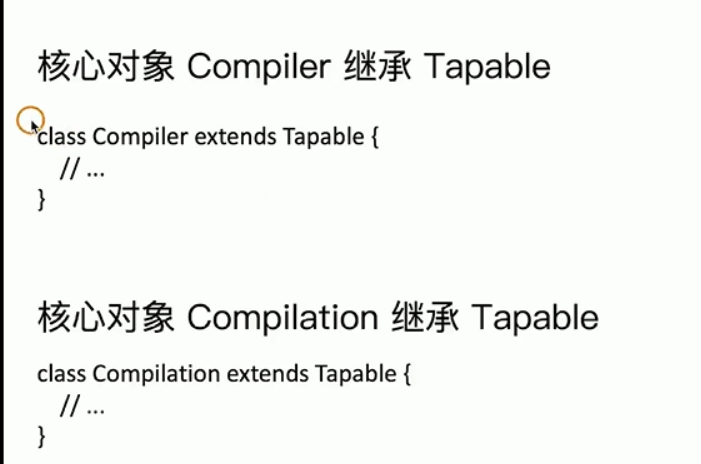
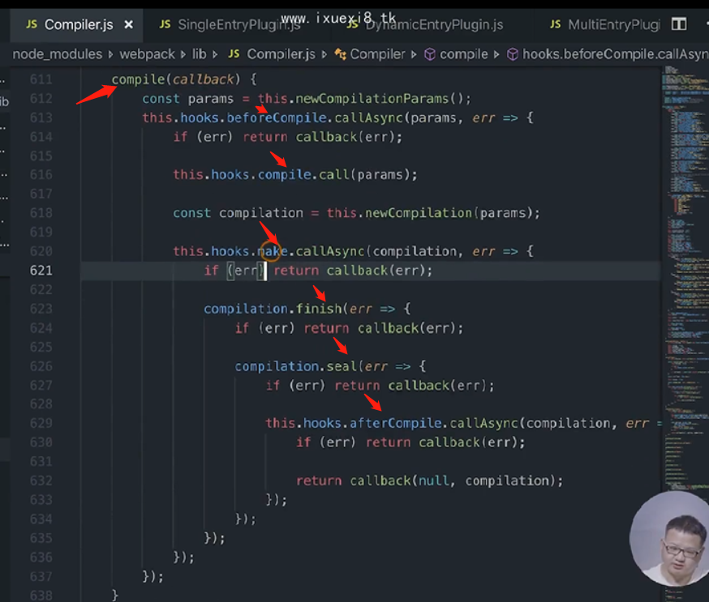

## webpack原理

1，要看的章节

2，之前遇到的webpack相关的面试题

3，看不懂的地方，找出什么地方看不懂，找专门的资料

tree-shaking 是基于什么实现的？
静态语法分析是怎样的一个过程？
tree-shaking 一开始是哪个工具提出实现的呢？
加载顺序
webpack 的分包了解吗
你们项目是用 webpack 还是 rollup？为什么？

(说明下面的知识不够解释上面的问题，可能还是需要再看资料)

## webpack启动过程分析

0

bin目录下：看自己的依赖包中的package.json中的script

用了node中的进程

实际调用了cli，（只能装一个cli，装那个都可以运行）

暂时不找了vue-cli-serve依赖是现有项目中用的

### webpack-cli源码阅读

每种语句都是一个包，没到到对应的包就会提示要不要安装

之后node中实战下多进程多线程帮助理解

对命令行信息进行解析

options：把命令行中的参数+配置文件中的参数转换成webpack能识别的参数

不断判断是否有这个['dev']属性，不同的属性给option添加不同的属性

问题：在哪里分析了webpack的配置文件中的参数，给到option

### Tapable插件架构与Hooks设计

webpack中两个核心对象：compiler和compilation都是继承了Tapable这个对象的。

熔断钩子，就是遇到return就会返回

流水钩子，就是上一个插件的结果可以传递给下一个插件

最多参数是三个

所以得到的就是，tapable实际就是事件触发机制，然后定义了很多触发处理事件的方法，有同步异步，熔断流水。针对不同类型，就对监听事件进行不同处理。

不同的钩子，可以自己起钩子名字。tapable是提供了不同的类型钩子供我们使用

### Tapable是如何和webpack进行关联起来的？

wepack怎么使用tapable的

插件是个类，并有一个方法是apply方法，传的参数是compiler

插件就是对事件进行监听

在run中，执行三个hook

看下webpack引用默认plugins的类是怎么做的

new WebpackOptionsApply().process(options,compiler)

根据环境引用了很多 插件

引入了很多插件，问题是：**这些插件里面用了那些hooks**

问题：webpack有哪些hook

### webpack流程篇：准备阶段

有一百多个hooks

done全部完成

beforerun

run

下面两个要重点说明下

compilation

thisCompilation： 一些插件内部有独立的complier过程，走的就是这个钩子

也就是说整个构建过程中，都有很多对应的钩子

compliation：模块打包编译优化

 先看第一部分，初始化

entry-option

触发了entryOption这个hooks

然后看看哪里监听了这个hooks

监听了entryOption，tap后面的是参数，表明是那个plugin监听了entryOption事件

beforerun，清理缓存

问题： hook中的参数是什么

12个，今天学完，

###  webpack流程篇：模块构建和chunk生成阶段

模块构建和chunk生成阶段  和 make阶段相关

**compiler内部会创建一个compilation对象**

 normal模块： 直接import或者require

context模块： 就是前面有路径的

拿到的是js文件

从make到seal做了那些事情

每三节休息一下

哪些监听了make事件

模块处理后会触发finishModules

buildMoudle

构建完成之后运行parser.parse方法

js依赖添加到依赖列表中，用了处理依赖的库

seal就是优化模块

这是优化的hooks

chunk生成

问题： es6中的动态引入？

###  webpack流程篇：文件生成

seal阶段 beforeChunk

1，优化

2，生成hash beforehash createhash afterhash

3，对内容进行生成 createasset

this.assets有什么作用

打包到dist文件夹下

###  动手编写一个简易的webpack(上)

看完就洗澡，准备下之后的学习计划，框架原理性面试题，webpack相关面试题也要准备下，算法，计算机网络，基础看输出的题目。在去云南前，把所有要看的都看完，所有要做的准备都做好云南回来，开始找内推面试

模块化演进

es6静态分析

cjs动态的

amd借鉴cjs浏览器端

**如果问到cjs或者amd的原理，就是看他被翻译成什么样的js代码**babel

抽象语法树

webpack打包机制

###  动手编写一个简易的webpack(下)

parser： 1，分析依赖 2，转换成ast 再转换成es5

分析依赖用的是babel-travse

拿到这一步之后，就需要用模块化来生成文件，针对对应的依赖和代码生成

问题：在这里怎么处理依赖数组，一个个添加进来吗？，先把依赖的添加进来，再运行下面的

index依赖了greeting

这种就是一直递归调用了require方法，当fn运行index的代码时候，执行到require greeting文件，就又会调用require方法，得到greeting的exports的输出，再继续执行index.j后续的代码，得到index.js文件的exports

###  loader的链式调用与执行顺序

###  使用loader-runner高效进行loader的调试

开发loader调试工具

###  更复杂的loader的开发用法

在异步中回调函数里面执行callback

###  实战开发一个自动合成雪碧图的loader

###  插件基本结构介绍

loader做不到的事情插件都可以做到

loader就是处理文件的一个js模块

插件就是监听wepackhooks的一个类

监听hooks

compiler和compliation都有hooks有什么区别

###  更复杂的插件开发场景

emit阶段生成文件

问题为什么这里监听事件没有用this.hooks

这里说写错了，应该是coompiler.hooks.emit.tap('filename',function)

其他依赖html-webpack-plugin的时候，就可以用 这个插件暴露出来的hooks编写插件的插件

###  实战开发一个压缩构建资源为zip包的插件

-----

## tree-shaking原理

还是不清楚，为啥可以判断代码不可用

## scopehoisting

立即执行函数

只引用一次就直接内联进来，多次就用闭包形式放在外面

问题： 闭包代码到底是啥样的