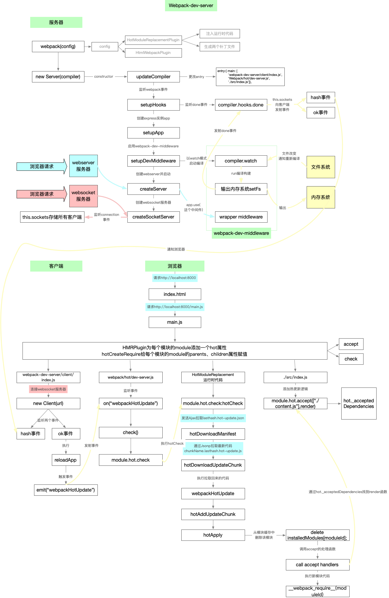

# HRM原理

看完这个之后，再准备下阿里社招面试，准备自己项目中写的，准备基础

看懂这个，就差不多，然后准备业务场景，产品问题

下班前搞定这个，然后晚上再细细准备

---

#### 5. 理解chunk和module的概念

chunk 就是若干 module 打成的包，一个 chunk 应该包括多个 module，一般来说最终会形成一个 file。而 js 以外的资源，webpack 会通过各种 loader 转化成一个 module，这个模块会被打包到某个 chunk 中，并不会形成一个单独的 chunk。

**Webpack watch**：使用监控模式开始启动webpack编译，在 webpack 的 watch 模式下，**文件系统中某一个文件发生修改，webpack 监听到文件变化，根据配置文件对模块重新编译打包**，每次编译都会产生一个**唯一的hash值**，

### HotModuleReplacementPlugin做了哪些事

1. 生成**两个补丁文件**

- manifest(JSON)

  ```
  上一次编译生成的hash.hot-update.json
  ```

  （如：b1f49e2fc76aae861d9f.hot-update.json）

  

- updated chunk (JavaScript)

  ```
  chunk名字.上一次编译生成的hash.hot-update.js
  ```

  （如main.b1f49e2fc76aae861d9f.hot-update.js）

  

  这里调用了一个全局的

  ```
  webpackHotUpdate
  ```

  函数，留心一下这个js的结构

- 是的这两个文件不是webpack生成的，而是这个插件生成的，你可在配置文件把HotModuleReplacementPlugin去掉试一试

1. **在chunk文件中注入HMR runtime运行时代码**：我们的热更新客户端主要逻辑（`拉取新模块代码`、`执行新模块代码`、`执行accept的回调实现局部更新`）都是这个插件 把函数 注入到我们的chunk文件中，而非webpack-dev-server，webpack-dev-server只是调用了这些函数


> 讲运行时的代码注入到编译好的文件里面，实现  `拉取新模块代码`、`执行新模块代码`、`执行accept的回调实现局部更新`
>
> 这些功能

### 3. 聊聊module.hot和module.hot.accept

**没错accept就是往`hot._acceptedDependencies`对象存入 局部更新回调函数**，_acceptedDependencies什么时候会用到呢？（**当模块文件改变的时候，我们会调用acceptedDependencies搜集的回调**）

## 二、总体流程

### 1. 整个流程分为客户端和服务端

### 2. 通过 `websocket` 建立起 浏览器端 和 服务器端 之间的通信


### 3. 服务端主要分为四个关键点

- 通过webpack创建compiler实例，webpack在watch模式下编译
  - compiler实例：监听本地文件的变化、文件改变自动编译、编译输出
  - 更改config中的entry属性：将lib/client/index.js、lib/client/hot/dev-server.js注入到打包输出的chunk文件中
  - 往compiler.hooks.done钩子（webpack编译完成后触发）注册事件：里面会向客户端发射`hash`和`ok`事件
- 调用webpack-dev-middleware：启动编译、设置文件为内存文件系统、里面有一个中间件负责返回编译的文件
- 创建webserver静态服务器：让浏览器可以请求编译生成的静态资源
- 创建websocket服务：建立本地服务和浏览器的双向通信；每当有新的编译，立马告知浏览器执行热更新逻辑

### 4. 客户端主要分为两个关键点

- 创建一个 websocket客户端 连接 websocket服务端，websocket客户端监听 `hash` 和 `ok` 事件
- 主要的热更新客户端实现逻辑，浏览器会接收服务器端推送的消息，如果需要热更新，浏览器发起http请求去服务器端获取新的模块资源解析并局部刷新页面（这本是HotModuleReplacementPlugin帮我们做了，他将HMR 运行时代码注入到chunk中了，但是我会带大家实现这个 `HMR runtime`）


这张图很全



一时不知道怎么总结

> 主要分为服务端，和客户端
>
> 服务端通过注入两个js文件，赋予客户端局部更新，拉去新的模块，执行新的模块的功能，同时监听compiler.hooks.done编译完成事件，通过websocket向客户端发送hash和ok事件
>
> 同时监听文件系统，监听文件是否有修改，有的话就重新编译，输出到内存系统，然后触发了编辑done钩子，然后发送hash或者ok事件
>
> 
>
> 客户端通过webpack-dev-server来监听hash和ok事件，ok事件就重新reload页面，
>
> 如上面代码所示，首先将 hash 值暂存到 currentHash 变量，当接收到 ok 消息后，对 App 进行 reload。如果配置了模块热更新，就调用 webpack/hot/emitter 将最新 hash 值发送给 webpack，然后将控制权交给 webpack 客户端代码。如果没有配置模块热更新，就直接调用 location.reload 方法刷新页面。
>
> hash事件
>
> 执行hotcheck: 通过ajax拉去lasthash.hot-update.json补丁文件，然后对比hotDownloadmanifexst文件，找出要更新的模块，然后通过jsonp更新代码
>
> 更新之后替换对应的模块，并执行对应的模块
>
> 如上面代码所示，首先将 hash 值暂存到 currentHash 变量，当接收到 ok 消息后，对 App 进行 reload。如果配置了模块热更新，就调用 webpack/hot/emitter 将最新 hash 值发送给 webpack，然后将控制权交给 webpack 客户端代码。如果没有配置模块热更新，就直接调用 location.reload 方法刷新页面。
>
> 
>
> 服务端webpack编译的时候，先通过修改entry，注入了webpack-dev-serve还有hotdev-server
>
> 然后监听了compiler.hooks.done编译完成事件
>
> 通过websocket和
>
> 

还要再看一遍

https://zhuanlan.zhihu.com/p/30669007

https://juejin.im/post/6844904020528594957#heading-2

这两个文件是干什么的呢？我们说利用websocket实现双向通信的，我们服务端会创建一个websocket服务器（第9步会讲），每当代码改动时会重新进行编译，生成新的编译文件，这时我们websocket服务端将通知浏览器，你快来拉取新的代码啦

那么一个websocket客户端，实现和服务端通信的逻辑，是不是也的有呢？于是webpack-dev-server给我们提供了客户端的代码，也就是上面的两个文件，为我们安插了一个间谍，悄悄地去拉新的代码、实现热更新

```js
  //先向客户端发送最新的hash值
            socket.emit("hash", this.currentHash);
            //再向客户端发送一个ok
            socket.emit("ok");
```

> /src/lib/client/index.js负责websocket客户端hash和ok事件的监听，ok**事件的回调只干了一件事`发射webpackHotUpdate事件`**
>
> /src/lib/client/hot/dev-server.js负责监听`webpackHotUpdate`，调用`hotCheck`开始拉取代码，实现局部更新
>
> 他们通过/src/lib/client/emitter.js的共用了一个EventEmitter实例

```js
window.webpackHotUpdate = (chunkID, moreModules) => {
    // 【9】热更新
    // 循环新拉来的模块
    Object.keys(moreModules).forEach(moduleID => {
        // 1、通过__webpack_require__.c 模块缓存可以找到旧模块
        let oldModule = __webpack_require__.c[moduleID];

        // 2、更新__webpack_require__.c，利用moduleID将新的拉来的模块覆盖原来的模块
        let newModule = __webpack_require__.c[moduleID] = {
            i: moduleID,
            l: false,
            exports: {},
            hot: hotCreateModule(moduleID),
            parents: oldModule.parents,
            children: oldModule.children
        };

        // 3、执行最新编译生成的模块代码
        moreModules[moduleID].call(newModule.exports, newModule, newModule.exports, __webpack_require__);
        newModule.l = true;

        // 这块请回顾下accept的原理
        // 4、让父模块中存储的_acceptedDependencies执行
        newModule.parents && newModule.parents.forEach(parentID => {
            let parentModule = __webpack_require__.c[parentID];
            parentModule.hot._acceptedDependencies[moduleID] && parentModule.hot._acceptedDependencies[moduleID]()
        });
    })
}
```

>  *// 以便当content.js模块改变时，他的父模块index.js通过_acceptedDependencies知道要干什么*
>
> 子模块改变了，通知父模块

基本上弄清楚了。ok

> hrm热更新原理：向entry中注入两个js，这两个js，一个负责在浏览器端和webpack服务端建立起websocet通信，接收到ok事件，通知浏览器端的webpack通过ajax拉去写有本次更新信息的json文件，然后通过json文件中的chunk通过jsonp的形式拉去模块代码，然后更新对应的模块
>
> 服务端这边就是监听文件变化重新打包。然后监听打包完成的done事件，发送hash和ok事件