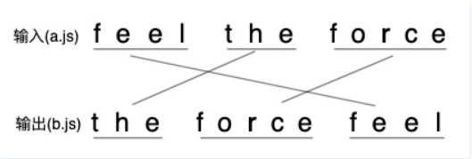
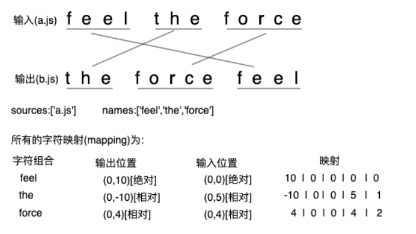

# source-map原理

**最终精准报错，代码所处的文件，还有行数，这是source-map的最重要作用**

假设现在有`a.js`，内容为`feel the force`，处理后为`b.js`，内容为`the force feel`



以`the`为例，它在输出中的位置是(0,0)，`a.js`是`sources`的第1个(这里只是举例)，输入中的位置是(0,5)，`the`是`names`的第2个(这里只是举例)。

那么映射关系为： 0 1 0 5 2

最后将 01052 表示为 Base64 VLQ 即可

改用相对位置

- 对于输出后的位置来说，到后边会发现它的列号特别大，为了避免这个问题，采用相对位置进行描述

相对位置是啥呢，看示意图：



第一次记录的输入位置和输出位置是绝对的，往后的输入位置和输出位置都是相对上一次的位置移动了多少，例如`the`的输出位置为(0,-10),因为`the`在`feel`的左边数10下才能到这个位置。

uglify-js生成SourceMap的整体流程如下

```text
生成AST => 压缩 => 调用addMapping方法，添加对应的映射mapping => 输出压缩后代码时调用toString方法生成SourceMap
```

暂且理解为，生成ast之后，变换中记录了行号