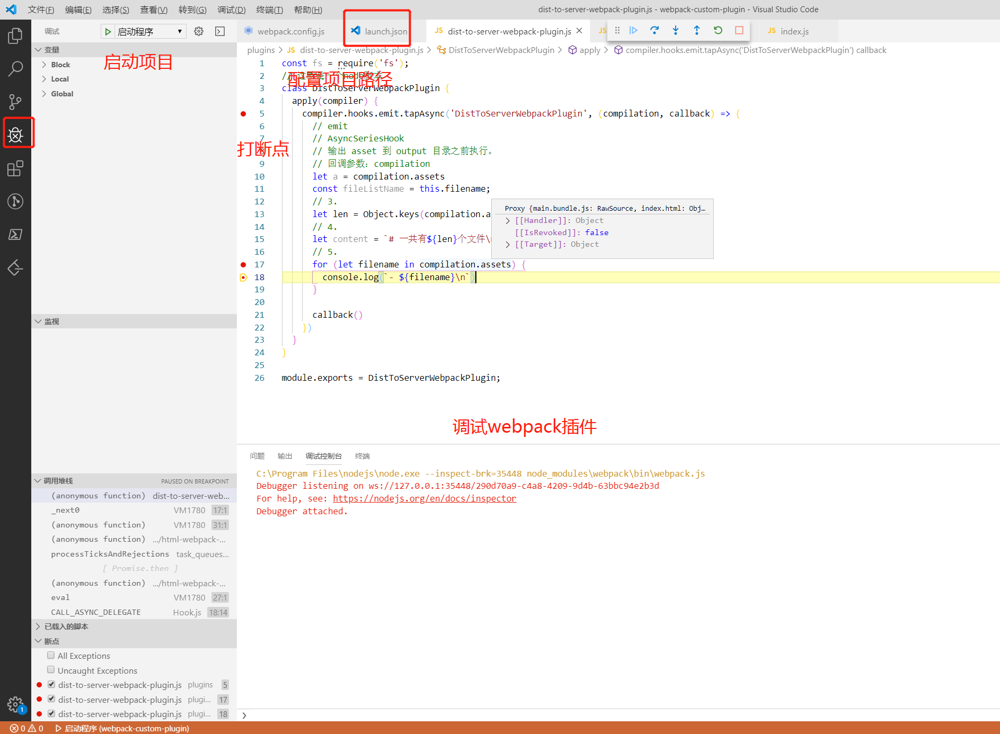

https://github.com/lcxfs1991/blog/issues/1  虾皮大佬写的plugin插件

---

写出一个plugin来可能真的会impress面试官

fs.writeFileSync：之后学习node的时候要好好学习下这个

调试webpack插件

---

找不到值得写的插件，好烦，都是一些没有意义的插件，那就学下webpack那个，为打包的文件添加版本号，ok

在打包完成之后在dist文件夹下生成一个版本文件：版本详细信息文件，可以的

compiler 内置了多少个hooks？？？那些hooks

然后看下webpack打包原理，webpack热更新原理，

插件生命周期，都背下理解下

 **晚上去看看那个webpack视频，写个版本文件**

----

----

监听done钩子，写个node  ftp

这个就是node应用了，之后可以锻炼写下node水平

---

webpack先放这，不管了。ok了

之后就学习 node ，晚上学下 electron

写node写的少，不知道怎么下手，所以要好好去想想，怎么入手

---

