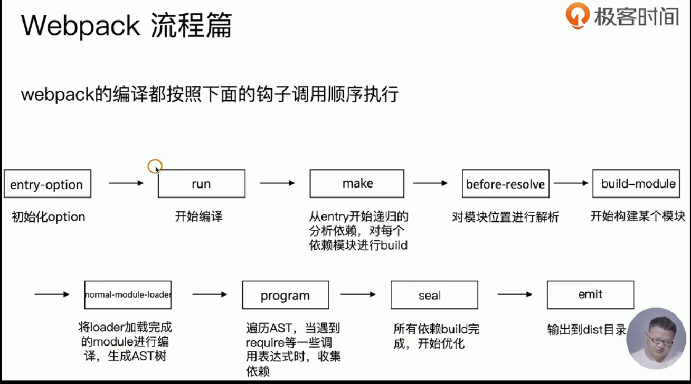
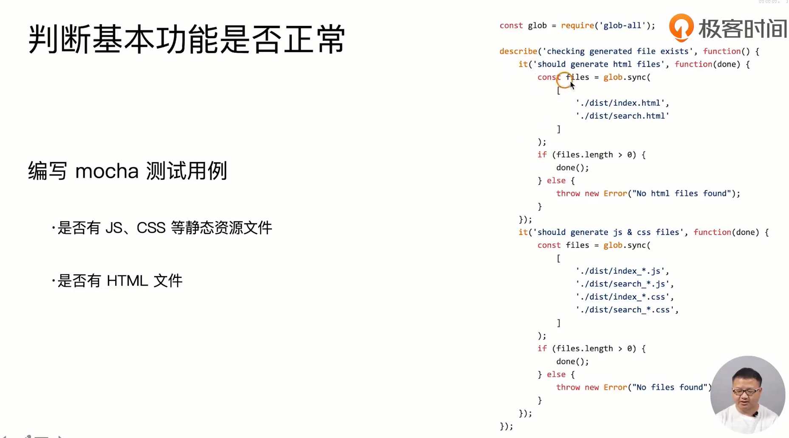
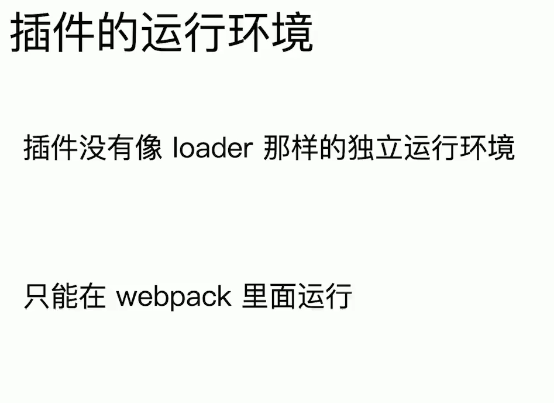

很简单
第二章：webpack基础用法 (12讲)

10 | webpack核心概念之entry免费

多入口就是多应用，目前都是单页应用 ，ssr是多个，sever一个 ，浏览器一个

11 | webpack核心概念之output免费


12 | webpack核心概念之loaders
13 | webpack核心概念之plugins
14 | webpack核心概念之mode
15 | 解析ECMASCript 6和React JSX
16 | 解析CSS、Less和Sass
17 | 解析图片和字体

url-loader打包图片，慕课网解说的更仔细

18 | webpack中的文件监听  （深入研究这个知识点，原理多去了解）


轮询判断文件时间是否变化

19 | webpack中的热更新及原理分析


20 | 文件指纹策略：chunkhash、contenthash和hash
21 | HTML 、CSS和JavaScript代码压缩
第三章：webpack进阶用法 (16讲)

22 | 自动清理构建目录产物
23 | PostCSS插件autoprefixer自动补齐CSS3前缀
24 | 移动端CSS px自动转换成rem
25 | 静态资源内联
26 | 多页面应用打包通用方案
27 | 使用sourcemap
**28 | 提取页面公共资源**

**29 | tree-shaking使用和原理**


uglify： 是在那个阶段，是loader还是全部翻译完成了。

答案：静态解析的时候处理的，就是在变成ast树的时候，shaking掉了


- 使用 ES2015 模块语法（即 `import` 和 `export`）。
- 在项目 `package.json` 文件中，添加一个 "sideEffects" 入口。
- 引入一个能够删除未引用代码(dead code)的压缩工具(minifier)（例如 `UglifyJSPlugin`）。


源码中 uglifyjsplugin 

const plugin = { name: this.constructor.name };

compiler.hooks.compilation.tap(plugin, (compilation) => {

compilation.hooks.optimizeChunkAssets.tapAsync(钩子触发资源压缩事件

> *Compilation*暴露了与`模块`和`依赖`有关的粒度更小的事件钩子，官方文档中的说法是模块会经历加载(loaded),封存(sealed),优化(optimized),分块(chunked),哈希(hashed)和重新创建(restored)这几个典型步骤，从上面的示例可以看到，*compilation*是*Compiler*生命周期中的一个步骤，使用`compilation`相关钩子的通用写法为:
>
> ```js
> compiler.hooks.compilation.tap('SomePlugin',function(compilation, callback){
>     compilation.hooks.someOtherHook.tap('SomeOtherPlugin',function(){
>         ....
>     })
> });
> ```



**再仔细看一遍这个webpack流程**  

**30 | Scope Hoisting使用和原理分析**


注意对比，打包前后的样子，

webpack会给模块加上一层包裹


每个模块中包裹的函数的那三个变量，第一个是mode是源代码后面两个import export  harmony是es6简称

mode为none，可以看到不压缩的打包代码

测试添加了scopehoisting之后，引入的模块被引用了多次，就用立即执行函数包裹起来，如果只引用了一次，则内联，直接把代码放进来，如果变量有冲突就重命名


31 | 代码分割和动态import


window[webpackjsonp]通过jsonp的方式把懒加载的脚本加载进来


（懒加载的实现原理？）动态的创建一个script标签，然后把这个标签（插入进来 jsonp的方式）


**懒加载的原理是什么？？？**


32 | 在webpack中使用ESLint


```json
  "lint-staged": {
    "linters": {
      "*.{js,vue}": [
        "npm run lint",
        "git add"
      ]
    },
    "ignore": []
  },
```

**确实是用的这种方式**，**在新的项目中用这个**


33 | webpack打包组件和基础库


34 | webpack实现SSR打包（上）


**为什么要给文件添加hash**？

**新项目果断用ssr**


35 | webpack实现SSR打包（下）

36 | 优化构建时命令行的显示日志


**37 | 构建异常和中断处理**


错误上报

第四章：编写可维护的webpack构建配置 (9讲)

38 | 构建配置包设计


抽成npm包这个


库包


**看下这个老师的代码**

根据上面的功能，把老师配的webpack都看一遍

错误捕获，就是打包构建错误的时候捕获 


39 | 功能模块设计和目录结构

40 | 使用ESLint规范构建脚本

41 | 冒烟测试介绍和实际运用




问题： glob-all有什么作用，为什么在这里拿来做测试用

> 能像shell命令一样，使用通配符来匹配文件。在这里用的glob-all，应该是支持同步写法的异步操作。是一个node包


mocha测试是有啥用


index如何进入template 用chdir方法


实际上就是在测试用例里面打包了一次


cwd当前目录


在打包脚本中添加这个mocha的测试用力文件，完成了冒烟测试确保打包出来一些重要文件都有

**42 | 单元测试和测试覆盖率**


写一个一个webpack打包所有的项目肯定可以，看是不能用vue-cli了


测试覆盖率

**43 | 持续集成和Travis CI**


只是一个测试集成包，有没有直接持续集成，直接发布的工具呢

ftp上传文件的包

**44 | 发布构建包到npm社区**


**45 | Git Commit规范和changelog生成**


**46 | 语义化版本（Semantic Versioning）规范格式**


第五章：webpack构建速度和体积优化策略 (12讲) **看过了**

47 | 初级分析：使用webpack内置的stats

48 | 速度分析：使用speed-measure-webpack-plugin

49 | 体积分析：使用webpack-bundle-analyzer

50 | 使用高版本的webpack和Node.js

51 | 多进程/多实例构建

52 | 多进程并行压缩代码

53 | 进一步分包：预编译资源模块

54 | 充分利用缓存提升二次构建速度

55 | 缩小构建目标

56 | 使用Tree Shaking擦除无用的JavaScript和CSS

57 | 使用webpack进行图片压缩

58 | 使用动态Polyfill服务

第六章：通过源代码掌握webpack打包原理 (9讲)  **看过了**

59 | webpack启动过程分析

60 | webpack-cli源码阅读

61 | Tapable插件架构与Hooks设计
62 | Tapable是如何和webpack进行关联起来的？
63 | webpack流程篇：准备阶段
64 | webpack流程篇：模块构建和chunk生成阶段
65 | webpack流程篇：文件生成
66 | 动手编写一个简易的webpack(上)
67 | 动手编写一个简易的webpack(下)
第七章：**编写loader和插件 (7讲)**   **重点看这个**

**68 | loader的链式调用与执行顺序**


函数组合方式


loader-runner


**69 | 使用loader-runner高效进行loader的调试**

**70 | 更复杂的loader的开发场**

**71 | 实战开发一个自动合成雪碧图的loader**


每一步是怎么写的，如何完成一个雪碧图，有实际意义的loader


**72 | 插件基本结构介绍**





**73 | 更复杂的插件开发场景**


**74 | 实战开发一个压缩构建资源为zip包的插件**


必须看完，坚持就是胜利


第八章：React全家桶和webpack开发商城项目 (10讲)  **也可以看下这个**  周末看

75 | 商城技术栈选型和整体架构
76 | 商城界面UI设计与模块拆分
77 | React全家桶环境搭建
78 | 数据库实体和表结构设计
79 | 登录注册模块开发
80 | 商品模块开发
81 | 订单模块开发
82 | 谈谈Web商城的性能优化策略
83 | 功能开发总结
84 | 玩转webpack & 结课测试
看过的人还看了

---

再看一遍，跟着弄，深入学习一遍

这些不够深入，要根据面试题，深入去准备

---


