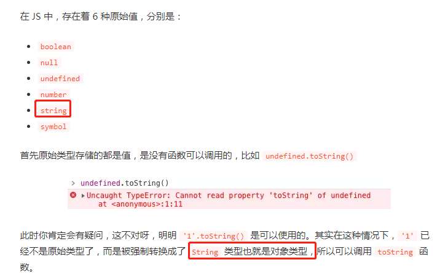

# 面试之道（1）

## js基础知识



做些基础面试题测试

isNaN(1/0) 为无穷大不为NaN

-----

#### == 的工作过程

```js
 [] == ![]  ---> true
![]    // 空数组转布尔，为true（因为为引用类型） 取非为false
[] == false    // 两者有一方为布尔，先将布尔转为数字，0 == []  再将[]转数字，为0 0 == 0为true
```


**空数组转布尔为true，引用类型转布尔为true**

**空数组转数字为0，**

----

#### 闭包

闭包的作用就是用来让我们间接访问函数里的变量     let有块级作用域

#### 浅拷贝

对象赋值，是地址赋值，如果不想改变一个，影响另一个就可以用浅拷贝

`Object.assign` 只会拷贝所有的属性值到新的对象中，如果属性值是对象的话，拷贝的是地址，所以并不是深拷贝

```
let a = {
age: 1
}
let b = { ...a }
```

如果不想改变对象属性中的对象，就要用深拷贝

**let** b = JSON.parse(JSON.stringify(a))   (会有很多问题)

```js
function deepClone(obj) {
  function isObject(o) {
    return (typeof o === 'object' || typeof o === 'function') && o !== null
  }

  if (!isObject(obj)) {
    throw new Error('非对象')
  }

  let isArray = Array.isArray(obj)
  let newObj = isArray ? [...obj] : { ...obj }
  Reflect.ownKeys(newObj).forEach(key => {
    newObj[key] = isObject(obj[key]) ? deepClone(obj[key]) : obj[key]
  })

  return newObj
}

let obj = {
  a: [1, 2, 3],
  b: {
    c: 2,
    d: 3
  }
}
let newObj = deepClone(obj)
newObj.b.c = 1
console.log(obj.b.c) // 2
```

---

**确保对象的属性能正确赋值，广义上讲，即确保对象的原生行为能够正常进行，这就是Reflect的作用**

#### var、let 及 const 区别

暂时性死区：

只要块级作用域内存在`let`命令，它所声明的变量就“绑定”（binding）这个区域，不再受外部的影响。

#### 原型继承和 Class 继承

